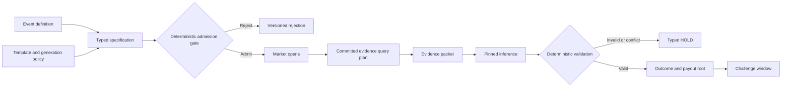

When a prediction market settles, the blockchain records an outcome and a payout. A replayable oracle adds the full judgment behind that payout: the exact rules, source documents, software environment, and intermediate result.

That makes many resolutions difficult to audit. A reviewer must reconstruct the question, locate the evidence, interpret both, and decide whether the resolver reached the right answer. Every proposer, challenger, voter, employee, or outside auditor repeats much of that work from scratch.

A **replayable oracle** preserves a different kind of record. It commits to:

- the market specification before trading;
- the required evidence sources and collection procedure;
- the evidence bytes used at resolution;
- the model, prompts, parsers, runtime, and decoding policy;
- the resulting judgment and payout calculation.

Anyone with a compatible machine can then rerun the declared procedure and compare outputs byte for byte.

The result: a judgment with exact, testable provenance.

> Given these committed rules, these committed evidence bytes, and this committed execution profile, the declared procedure produced this declared output.

This makes execution disputes cheap and decidable, turns evidence disputes into concrete packet challenges, and moves foreseeable ambiguity before trading. Prediction markets need a resolution record that identifies the contested issue: execution, evidence, or rules.

## Repeated judgment creates the scaling problem

Prediction markets currently use several resolution models.

Polymarket generally relies on UMA’s optimistic-oracle process. A participant proposes an outcome, a challenge period follows, and UMA’s dispute machinery handles a challenged proposal.

Kalshi resolves contracts through an internal process using the contract terms and designated sources. That provides institutional accountability, but it also requires operational capacity for market review and resolution.

These designs differ substantially, yet both depend on human attention at important points:

1. someone must understand the contract;
2. someone must collect or verify the evidence;
3. someone must interpret edge cases;
4. someone must notice and challenge an error;
5. someone must adjudicate the challenge.

Large markets often attract enough attention for this process to work well. Policing smaller or obscure markets takes the same effort even as open interest shrinks.

The bottleneck comes from **non-transferable work**. When one reviewer reads the rules and reaches a conclusion, the next reviewer must trust that conclusion or repeat a substantial portion of the work.

Replayable resolution makes that work transferable.

## The mechanism

A chain of content-addressed artifacts represents a replayable market. A cryptographic digest identifies each artifact, and every artifact names its parents. Changing a prompt, source document, model file, parser, runtime setting, or output changes the corresponding digest.

The pipeline has five stages.

### 1. Define the event

The genesis artifact identifies:

- the event and deadline;
- the possible outcomes;
- the designated sources;
- the required evidence fields;
- the treatment of foreseeable edge cases;
- the inference profile and template versions;
- the conditions that produce an outcome, a rejection, or a `HOLD`.

### 2. Compile a typed specification

A pinned language model converts the event definition into a machine-readable specification. The model identifies procedural branches buried in natural-language contracts.

The deterministic admission gate decides when the market opens; the model supplies a candidate specification.

### 3. Apply an admission gate

Ordinary code checks model-independent properties:

- unique outcome identifiers;
- outcomes map to valid payout vectors;
- complete required fields and edge-case policies;
- mutually exclusive declared outcomes where required;
- evidence requirements name concrete source classes;
- admission-policy compliance;
- unresolved contradictions produce a typed rejection with a recorded cause.

The gate enforces completeness over the event topology that the template defines. Any unclassified case follows an explicit `HOLD` path committed before the market opens.

### 4. Freeze the evidence

Before trading, the specification commits an evidence-acquisition plan: mandatory authoritative sources, permitted corroborating sources, endpoints and query parameters, expected record types, cutoff rules, retry schedules, normalization rules, and the conditions for source conflict or `HOLD`.

At resolution, independent collectors execute that plan and preserve the resulting evidence packet:

- raw response bytes and normalized records;
- source URL or endpoint identity and request parameters;
- retrieval time, event time, effective time, MIME type, and transport metadata;
- document identifiers, content digests, and parent commitments;
- collector identity and signature;
- explicit query-status records for source outages, absent results, or conflicts.

The gate tests completeness against the committed acquisition plan: every mandatory query produces a response, a qualifying query-status record, or a typed conflict. The protocol preserves source bytes as the evidentiary artifact.

### 5. Replay the judgment

The replay operator applies the committed inference profile to the committed specification and evidence packet. Deterministic code then validates the model’s structured result and converts the selected outcome into payouts.



The system uses a strict division of labor:

- language models identify and apply linguistic structure;
- deterministic code enforces bounded invariants;
- evidence collectors preserve source material;
- challengers contest omissions, authenticity, or specification defects;
- replay operators verify execution;
- an existing oracle or adjudicator handles the remaining typed challenges.

## Resolve foreseeable ambiguity before positions exist

Many settlement disputes begin as drafting problems.

Consider the phrase “signed into law.” It can mean at least two things:

- a literal presidential signature qualifies;
- enactment qualifies through signature, ten-day lapse, or veto override.

Those interpretations agree in the ordinary case and diverge in edge cases. A contract that leaves the choice open turns the ambiguity economically adversarial after positions exist.

A typed specification can require one of the following policies:

```text
SIGNATURE_REQUIRED
ENACTMENT_REQUIRED
REJECT_AMBIGUOUS_SPEC
```

The language model flags the procedural branch. The deterministic gate requires that the creator select a policy before admission.

This moves the ambiguity to the economically neutral point in the market lifecycle. Clarification before trading treats every future position equally. Clarification after trading redistributes value between existing positions.

Pre-admission review creates expected value whenever:

\[
C_{\text{pre}}
<
d_A \cdot P(A) \cdot C_{\text{post}}
\]

where:

- \(C_{\text{pre}}\): cost of admission checks and clarification;
- \(P(A)\): probability that realized evidence encounters an ambiguity;
- \(d_A\): probability that the admission process detects that ambiguity;
- \(C_{\text{post}}\): expected cost of resolving it after trading.

False rejections and delayed listings belong in \(C_{\text{pre}}\), making the admission policy directly measurable and tunable from production data.

## What deterministic inference actually requires

Portable deterministic inference requires a fully pinned execution profile in addition to temperature zero.

Two mechanisms create output variation.

### Sampling randomness

At nonzero temperature, decoding samples from a probability distribution. Disabling sampling removes this intentional source of randomness.

A deterministic profile therefore fixes settings such as:

- temperature;
- top-p and top-k behavior;
- random seed;
- tie-breaking behavior;
- speculative decoding;
- stopping rules.

### Numerical and runtime variation

Transformer inference performs large numbers of floating-point operations. Floating-point addition changes with operation order, so different reduction orders can produce slightly different logits. Several runtime choices affect those orders:

- batch composition;
- tensor shapes;
- kernel selection;
- attention backend;
- GPU architecture;
- tensor parallelism;
- compiler and framework versions;
- quantization implementation;
- concurrency and scheduling.

A tiny numerical difference usually has little effect, but greedy decoding applies an argmax at every token. A near tie lets a small perturbation select a different token, after which the autoregressive output diverges.

A replay profile must therefore pin substantially more than the model name. The prototype profile fixed:

- **Weights:** [`Qwen/Qwen3.6-27B-FP8`](https://huggingface.co/Qwen/Qwen3.6-27B-FP8) at one exact revision; an aggregate manifest fingerprint commits its 80-file, 30,890,040,900-byte snapshot.
- **Decoding:** temperature 0, top-p 1, seed 0, and speculative decoding disabled.
- **Batch and shape:** one concurrent request, chunked prefill of 4,096, context length of 32,768 tokens, and tensor parallelism of one.
- **Runtime:** SGLang commit `a358374ae`, an immutable container image, FlashAttention 3, PyTorch sampling, and deterministic-execution flags.
- **Application:** committed prompts, parsers, stopping rules, and structured-output schema.

The public bundle records the exact commitments.

### Cross-hardware replay

We executed the prototype on two independent Vast hosts with different NVIDIA accelerators:

| Operator | Accelerator | Role |
|---|---|---|
| A | NVIDIA H100 PCIe, 80 GB | Generate and resolve twice |
| B | NVIDIA H200, 141 GB | Independently repeat both requests twice |

Across those four executions, the generated text, resolution text, output-token commitments, and recorded top-log-probability commitments matched.

This certifies **one pinned profile on two NVIDIA GPU classes**. The same cross-machine replay test expands hardware support profile by profile.

A production design treats hardware compatibility as an allowlisted property:

1. certify a profile against specified hardware and runtime classes;
2. record the actual hardware class in every receipt;
3. admit replays from the certified set and route new hardware through validation;
4. preserve compatible runtime images for the life of affected markets;
5. migrate only through explicit profile versions.

Markets resolve under the profile committed at genesis. Explicit profile versions introduce new hardware and stronger models.

The primitive supports versioned models. `Qwen3.6-27B-FP8` serves as the first demonstrated profile. A stronger future Qwen checkpoint enters through the same artifact, cross-machine replay, admission, and semantic-accuracy gates. Better models can detect more edge cases, link richer evidence, reduce `HOLD` rates, and expand qualifying market classes while preserving the verification architecture.

## What an inference receipt proves

An inference receipt can commit to:

- genesis and evidence roots;
- ordered request inputs;
- prompt and parser versions;
- model file-manifest root;
- container and runtime versions;
- decoding and concurrency settings;
- raw response digest;
- parsed output digest;
- output-token sequence;
- hardware class;
- execution status.

A replay operator recomputes the request and compares the resulting commitments.

This closes the execution dispute:

> Did the committed procedure produce the committed output?

Committed controls govern rules and evidence. Operators manage templates and profiles like critical software:

- versioned test suites;
- adversarial fixtures;
- dual review for template changes;
- canary markets;
- challenge-rate monitoring;
- per-template exposure limits;
- rollback for prelaunch markets;
- immutable rules for markets already trading;
- explicit incident procedures;
- retirement schedules for aging profiles;
- adversarial packet tests that search for reproducible semantic errors before template admission.

This separation drives the mechanism: replay verifies faithful execution; the admission gate constrains the rules; the acquisition plan constrains the evidence; and the challenge system exposes artifact defects.

## Three different disputes

Three dispute classes clarify the design.

### D1: Execution

**Question:** Did the declared procedure produce this output?

Replay handles D1 directly. An available deterministic profile on certified hardware turns D1 into a decidable computation. A replay mismatch identifies a concrete fault in the request, runtime, model files, parser, or result.

One live honest replayer can detect an execution mismatch across every market using the profile.

### D2: Evidence

**Question:** Does the evidence packet satisfy the committed query plan for authenticity and completeness?

The evidence protocol makes this dispute precise. A challenge identifies:

- the packet root;
- the mandatory source or endpoint;
- the disputed or additional document;
- the bytes proposed for packet inclusion;
- a violated collection rule;
- a competing packet root built under the same acquisition plan.

The resolver diffs both packets against the frozen plan. A missing mandatory record, invalid negative record, stale retrieval, or source substitution becomes a machine-checkable protocol violation. Genuine source conflicts follow the market's precommitted conflict policy.

The collection layer uses:

- redundant independent collectors;
- source-specific collection adapters;
- timestamped archival copies;
- signed manifests;
- mandatory query-result status records;
- evidence freshness rules;
- public challenge periods;
- packet-differencing tools;
- an existing adjudicator handles contested completeness.

The network measures omission rates, challenge success, collector agreement, archive availability, and adjudication cost per template. Those metrics govern evidence-class admission and collector redundancy.

### D3: Meaning

**Question:** What do the market rules mean?

Admission checks reduce D3 disputes by forcing foreseeable choices before trading. Novel cases produce a typed `HOLD` with a precommitted consequence: delayed settlement, a fallback authority, market cancellation, or another bounded procedure.

The protocol therefore:

- decides D1 by replay;
- narrows and documents D2;
- reduces anticipated D3 before trading;
- sends contested D2 and D3 cases through an existing governance or adjudication mechanism.

## End-to-end replay of a Polymarket settlement

We exercised the complete pipeline against Polymarket’s settled “Who will Trump nominate as Fed Chair?” event.

The market distinguished a formal nomination submitted to the U.S. Senate from related events such as a press announcement, an acting appointment, or eventual confirmation. The evidence packet contained four observations:

| Observation | Treatment |
|---|---|
| White House announcement naming Kevin Warsh | Context; Senate receipt controls the formal trigger |
| Senate receipt of PN855-1 for Federal Reserve Chair | Qualifying event |
| Senate receipt of PN855-2 for Federal Reserve Governor | Different office |
| Senate confirmation of PN855-1 | Post-trigger; nomination already qualified |

The packet contains the category distinctions a real resolver must get right: announcement versus formal trigger, chair nomination versus governor nomination, and nomination versus confirmation.

The replayed judgment:

1. identified the Senate receipt for PN855-1 as the first qualifying event;
2. normalized “Kevin M. Warsh” to the committed `kevin-warsh` outcome;
3. rejected the wrong-office nomination as nonqualifying;
4. treated confirmation as unnecessary;
5. produced the categorical outcome that deterministic payout code consumed;
6. reproduced the payout vector recorded through the existing UMA adapter.

We ran each generation and resolution request twice on an H100 and twice on an H200. Every run produced byte-identical output.

The prototype used **$4.48** of metered rented-GPU credit for the recorded inference and verification runs. All-in production economics also include:

- designing templates;
- researching and collecting evidence;
- operating archives;
- monitoring replayers;
- maintaining certified profiles;
- responding to exceptions;
- conducting security review.

The [public proof bundle](https://github.com/postfiatorg/postfiatl1v2/tree/main/reports/replayable-oracle/warsh-v1) contains the artifacts, requests, responses, manifests, receipts, evidence, settlement comparison, and offline verifier.

### What the test establishes

The test establishes that:

- the artifact chain can represent a real market;
- the pipeline can distinguish several closely related official observations;
- the pinned profile reproduced across the tested machines;
- deterministic payout code can reproduce an existing settlement format;
- published artifacts support independent inspection.

## The economic model

The break-even model identifies exactly where replayable resolution creates economic leverage.

Let:

- \(N\): number of markets resolved;
- \(K\): number of maintained rule templates;
- \(h\): human cost per market under a target level of independent review;
- \(t\): review and maintenance cost per template;
- \(a\): recurring evidence acquisition and validation cost per market;
- \(i\): primary inference cost per market;
- \(r\): replay, monitoring, and receipt-verification cost per market;
- \(s\): routine semantic validation cost per market;
- \(o\): archival and operational cost per market;
- \(\varepsilon\): fraction of markets requiring exceptional human handling;
- \(x\): average human cost of handling an exception.

Define the recurring non-exception cost:

\[
b = a+i+r+s+o
\]

A human-first system providing comparable independent review has approximate cost:

\[
C_H = N h
\]

A replayable system has approximate cost:

\[
C_R = Kt + N(b+\varepsilon x)
\]

The model favors replay when:

\[
b+\varepsilon x+\frac{Kt}{N} < h
\]

For \(x>0\), the break-even exception rate equals:

\[
\varepsilon <
\frac{h-b-\frac{Kt}{N}}{x}
\]

The formula captures the whole operating stack and treats GPU time as one component of total cost. It also shows the two sources of leverage: templates amortize across many markets, while deterministic replay compresses recurring review into evidence acquisition, validation, and an exception queue.

### Sensitivity

For an illustrative catalog, set:

- \(h = \$100\);
- \(x = \$100\);
- amortized template cost \(Kt/N = \$2\).

The table reports the resulting cost ratios:

| Recurring non-exception cost \(b\) | \(\varepsilon=2\%\) | \(\varepsilon=5\%\) | \(\varepsilon=10\%\) | \(\varepsilon=20\%\) | \(\varepsilon=30\%\) |
|---:|---:|---:|---:|---:|---:|
| $5 | 11.1× | 8.3× | 5.9× | 3.7× | 2.7× |
| $20 | 4.2× | 3.7× | 3.1× | 2.4× | 1.9× |
| $40 | 2.3× | 2.1× | 1.9× | 1.6× | 1.4× |

Each cell reports \(C_H/C_R\). After accounting for evidence, operations, validation, exceptions, and template maintenance, the model produces multi-fold savings across a wide parameter range. A live catalog supplies the actual values for \(b\), \(\varepsilon\), \(x\), and \(Kt/N\); the inequality then determines which templates scale economically.

## Measure security at the template level

Let:

- \(u_R\): probability of an undetected semantic error under replay;
- \(L_R\): expected loss per undetected replay error;
- \(u_H\): corresponding probability under the comparison process;
- \(L_H\): its expected loss.

A risk-adjusted comparison adds expected error loss:

\[
C_R^{*}=C_R+Nu_RL_R
\]

\[
C_H^{*}=C_H+Nu_HL_H
\]

A template can affect many markets at once, so the protocol caps exposure by template version and tests each version prospectively before raising that cap. Production reporting includes:

- admission and rejection rates;
- exception and `HOLD` rates;
- evidence-collector disagreement;
- evidence omission challenges;
- semantic error rate on blinded cases;
- cross-machine replay success;
- profile availability;
- challenge frequency and success;
- time to finality;
- human minutes per ordinary and exceptional market;
- correlated incidents by template version;
- all-in cost per finalized judgment.

## Incentives in the long tail

Replay changes monitoring economics by reducing the cost of checking a resolution.

Let:

- \(S_i\): the largest value that a correction protects for a potential challenger in market \(i\);
- \(R_i\): the challenger’s expected net bond reward after loss risk, fees, capital cost, and operational friction;
- \(h_i\): the cost of understanding and challenging the market.

A financially motivated participant challenges when:

\[
S_i + R_i > h_i
\]

Conventional resolution keeps \(h_i\) high because each challenger must reconstruct the judgment. Replay collapses the execution component of \(h_i\) into automated recomputation and gives evidence challengers a packet diff that bounds the research task. More markets therefore satisfy the challenge inequality, including small markets beyond the economic reach of bespoke human review.

## What becomes transferable

The central advantage follows directly.

In a conventional process, verification forces a reviewer to repeat the underlying research and interpretation. In a replayable process, public commitments capture the execution trace and support direct recomputation.

That makes **execution verification** transferable:

- one operator can publish a replay receipt;
- another can rerun the same computation;
- machines detect a mismatch;
- monitoring can cover many markets continuously.

Concrete operating requirements:

- at least one live replayer for D1 detection;
- available model and evidence artifacts;
- compatible certified hardware;
- trustworthy evidence collection or effective D2 challenges;
- reviewed templates and admission policies;
- a fallback authority for unresolved D2 and D3 disputes.

Structurally, shared infrastructure replaces duplicated per-market judgment for routine verification.

## Deployment with existing oracle rails

Existing settlement contracts can adopt the design while preserving their fundamental role.

An onchain anchor need store only bounded commitments:

- genesis root;
- evidence-packet root;
- inference and replay receipt roots;
- proposed outcome;
- payout root;
- challenge deadline;
- final status.

The large artifacts remain offchain and content-addressed. Contracts verify bounded commitments; offchain operators browse sources and execute models.

For a Polymarket-style system, the replayable pipeline acts as a structured proposer and evidence layer above existing UMA rails:

1. proposals arrive with committed specifications, packets, and receipts;
2. replay resolves execution challenges;
3. evidence challenges identify named sources and bytes;
4. unresolved evidence or meaning disputes retain the existing escalation path.

For an exchange that resolves markets internally, staff review reusable templates, audit samples, and handle an exception queue. This turns resolution capacity from a per-market staffing problem into a template-and-exception operation.

Events expressed through authoritative public artifacts fit the architecture:

- legislative and executive actions;
- election certifications;
- court dockets;
- regulatory approvals;
- corporate filings;
- official economic releases;
- sports results;
- protocol upgrades.

The admission policy accepts markets with bounded evidence and explicit rules.

## Live proof: a prospective market

The Warsh replay proves the pipeline and cross-hardware reproducibility. The next test runs the same system before anyone knows the outcome.

The prospective shadow deployment:

1. publish the genesis specification before anyone knows the outcome;
2. freeze the template and inference profile before trading or observation;
3. use independent evidence collectors;
4. accept public packet challenges;
5. conceal the reference answer from the resolver where practical;
6. publish every rejection, `HOLD`, correction, and challenge;
7. compare the result with the eventual authoritative settlement;
8. report human time and all-in operating cost.

The live Polymarket market [“Clarity Act (H.R.3633) signed into law in 2026?”](https://polymarket.com/event/clarity-act-signed-into-law-in-2026/clarity-act-signed-into-law-in-2026) makes a strong candidate. Its [Congress.gov record](https://www.congress.gov/bill/119th-congress/house-bill/3633) provides an authoritative source, while the difference between signature and enactment exercises exactly the procedural branch the admission gate targets. A multi-market pilot then measures exception rate, packet cost, `HOLD` rate, challenge rate, and cost per finalized judgment across a reusable legislative template.

## Conclusion

Replayable oracles turn prediction-market resolution from an undocumented judgment into a public computation with committed rules, committed evidence, and reproducible execution.

Each layer carries an explicit responsibility:

- creators commit specifications before trading;
- the admission gate tests anticipated ambiguity;
- collectors preserve evidence as inspectable artifacts;
- operators pin and replay inference;
- code enforces payout invariants;
- execution disputes become computational;
- evidence and residual meaning disputes enter typed challenge paths.

Prediction markets need a resolution record that identifies the contested question: execution, evidence, or rules. Replayable oracles provide that record, make the routine path computational, and reserve human judgment for genuine exceptions.

## References

- [Warsh proof bundle](https://github.com/postfiatorg/postfiatl1v2/tree/main/reports/replayable-oracle/warsh-v1)
- [Polymarket: Who will Trump nominate as Fed Chair?](https://polymarket.com/event/who-will-trump-nominate-as-fed-chair)
- [Polymarket: Clarity Act signed into law in 2026?](https://polymarket.com/event/clarity-act-signed-into-law-in-2026/clarity-act-signed-into-law-in-2026)
- [Congress.gov: H.R. 3633](https://www.congress.gov/bill/119th-congress/house-bill/3633)
- [Polymarket resolution documentation](https://docs.polymarket.com/concepts/resolution)
- [Polymarket UMA CTF adapter](https://github.com/Polymarket/uma-ctf-adapter)
- [UMA protocol source](https://github.com/UMAprotocol/protocol)
- [SGLang source](https://github.com/sgl-project/sglang)
- [Post Fiat: LLM Governance Replay](https://postfiat.org/blog/llm-governance-replay/)
- [Post Fiat: Viability of SGLang Replay—Cross-Hardware](https://postfiat.org/blog/sglang-cross-hardware-replay/)
