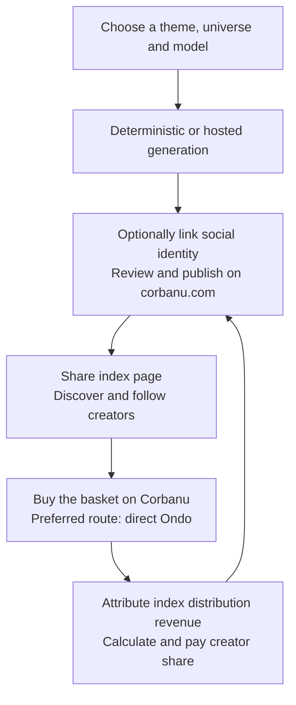
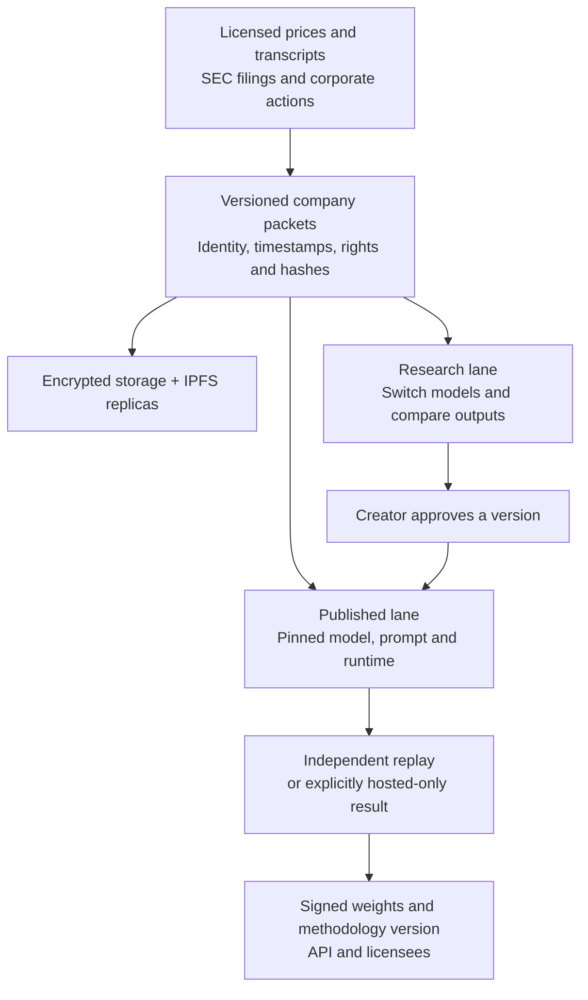
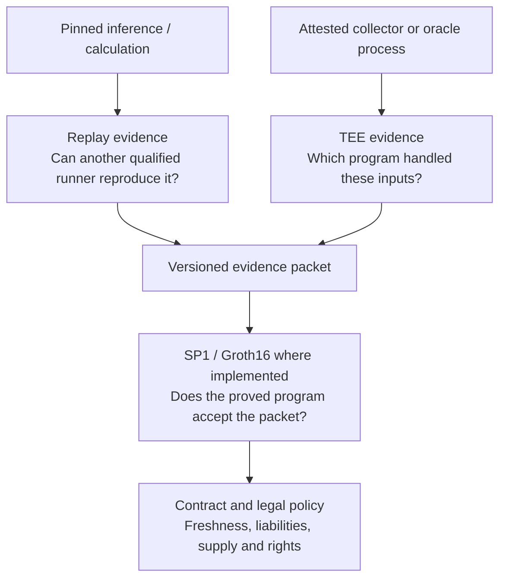
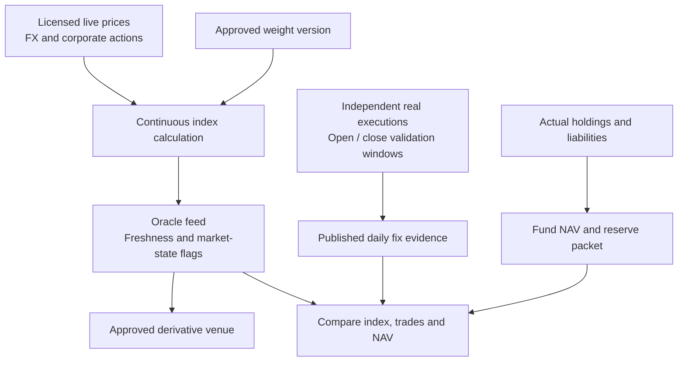
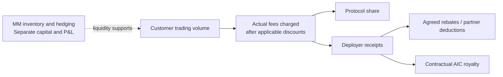
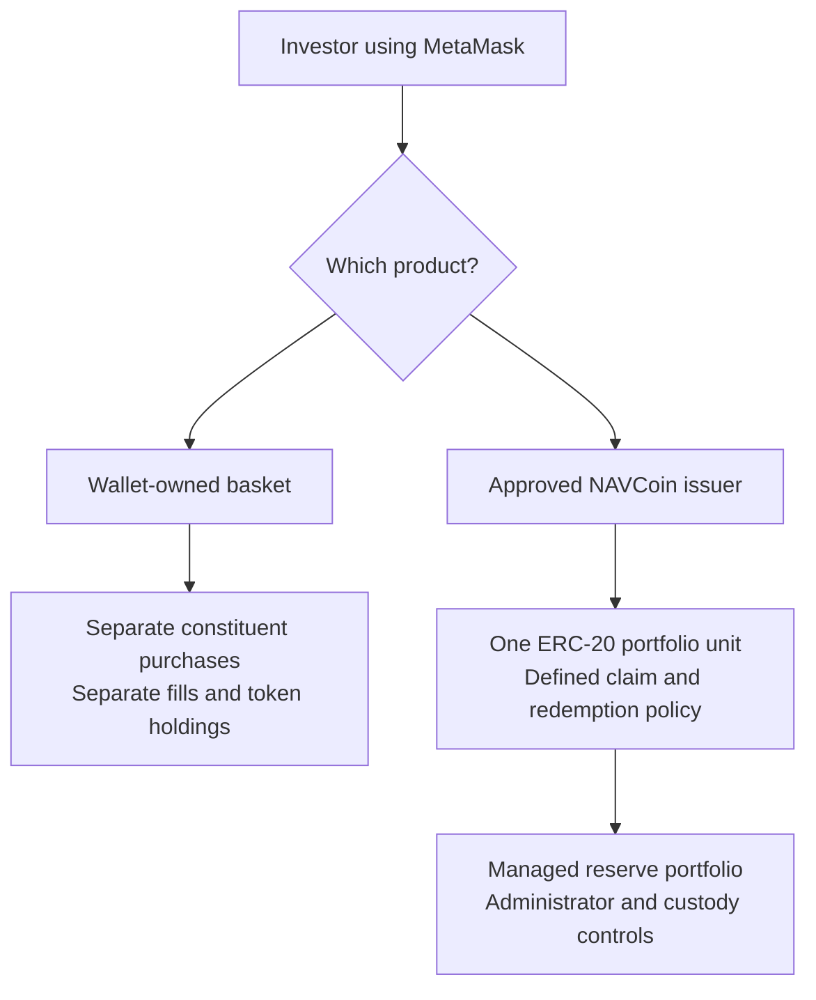
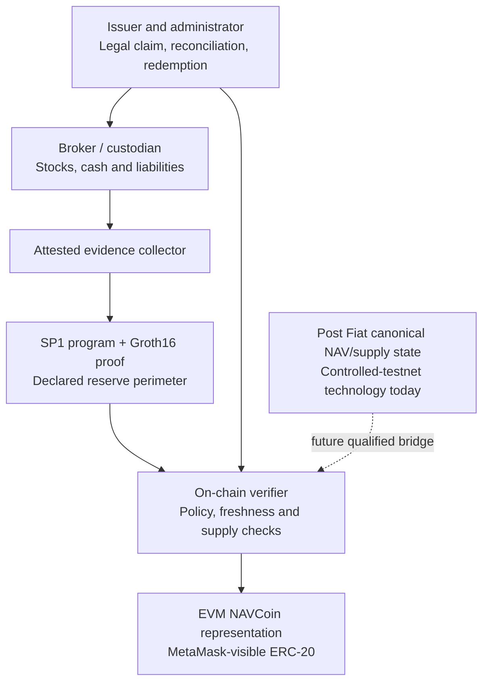
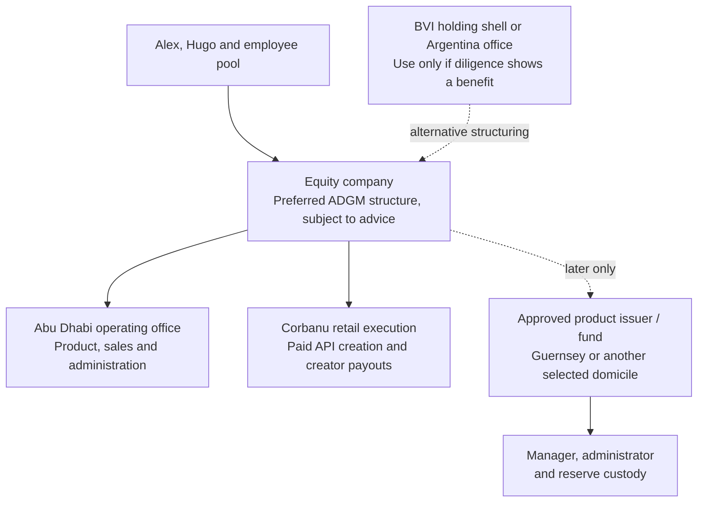

# The AI Indexing Company

## Product and commercial proposal

**17 September 2026 · Public product proposal · Founder subscription terms are maintained separately**

## 1. The business: turn a theme into something people can buy

The **AI Indexing Company (AIC)** will begin with a retail product on **corbanu.com**. A creator describes an investment theme, chooses a model and universe, generates an index, and publishes a shareable page. An eligible follower reviews the holdings and costs, then buys the supported basket through one coordinated wallet flow. The creator and AIC share **index distribution revenue from each qualifying trade—entry, rebalancing buys and sells, and exit**. Separately, users pay per thematic index creation through a funded Corbanu API key.

The initial customers are retail creators and their followers. Published indices turn investment ideas into exposure people can inspect and buy. The launch will test paid creation, assets following an index, rebalance participation, retention and creator earnings.

**Alex owns product, engineering hiring and marketing. Hugo owns administration, business development, legal and counterparties, capital and later product TVL.** Post Fiat would supply NAVCoin technology under agreed licenses; Flare would supply trusted execution environment (TEE) services under an agreed contract through **Flare Confidential Compute (FCC)**. Post Fiat remains Alex’s main effort, and Flare remains Hugo’s.

**The decision now is to agree the Level 1/1a launch, its funding and founder service commitments.** One engineer delivers that launch in sequence. The model release and later financial products receive separate work allocations.

### Seven revenue levels

| Level | What the customer does or holds | AIC revenue |
|---|---|---|
| **1 — Spot basket execution** | Creates or selects an index on corbanu.com and purchases its separate supported spot constituents | Index distribution revenue, shared between creator and AIC after agreed costs |
| **1a — Paid thematic creation** | Pays per index creation through a funded Corbanu API key | Metered creation charges; commercial model licenses tracked separately within the API/model-access business |
| **2 — Spot NAVCoin index primitives** | Buys one spot NAVCoin representing the index instead of purchasing every constituent separately | Recurring fees on average NAV/TVL, like an ETF business; any separate execution or entry/exit charges are disclosed |
| **3 — Perpetual listings** | Trades a perpetual swap on an index | Contracted listing/index license or deployer revenue share |
| **4 — Auto-rebalanced UltraShort perp indices** | Buys maintained exposure built from short perpetual positions | Disclosed index/product fees |
| **4b — Auto-rebalanced YOLO options indices** | Buys maintained, automatically rebalanced options exposure | Disclosed index/product fees |
| **4c — Leveraged bond indices** | Buys maintained leveraged bond exposure, including a proposed **leveraged datacenter bond index** | Disclosed product fees, with financing costs accounted for separately |

Level 1 holds separate assets; Level 2 holds one portfolio unit; Level 3 is a derivative listing; the Level 4 family packages maintained strategies. Customer investment returns, collateral and financing flows are not automatically AIC revenue.

Corbanu provides the retail surface. The API, company-data packets and verifiable model support all levels. Paid creation is Level 1a’s core revenue; external commercial model licenses are a separate account within that business.


*Figure 1. AIC owns its new product and customer business; parent technology and distribution enter through explicit agreements.*

### The retail experience

A creator can start with a theme such as “companies building the AI power grid,” switch models, compare outputs and select a universe. Supported tokenized stocks are the initial executable universe. US and international equity coverage expands as data rights and executable instruments become available.

The creator chooses between:

- **Deterministic / verifiable:** a pinned model, inputs and runtime with qualified replay evidence.
- **Hosted / non-deterministic:** flexible generation whose selected output is frozen for publication, without an independent replay guarantee.

The page shows holdings, weights, source provenance, generation mode, methodology version, executable coverage and compensation. Social identity linking is optional and verifies control of the account. Drafts stay private until publication; publishing creates a permanent URL, version identifier and social preview. Model or methodology changes produce new versions rather than rewriting history.

A follower selects a purchase amount, reviews the basket quote and confirms a coordinated wallet flow. First use may require eligibility checks, provider onboarding, funding, allowances and signatures. “One buy” means coordinated basket execution; it can require several signed transactions. Unsupported constituents are visible before approval; partial fills, failed legs and remaining cash remain visible afterward. Research-only indices can be shared without an enabled buy action.



*Figure 2. Publishing attracts buyers; attributable distribution revenue funds creator payouts.*

**The GoodAlexander DOOM Index is the proposed flagship.** Alex owns its launch, methodology and brand permissions. It uses the same creator page and purchase flow as other indices, with discretionary management clearly labeled.

AIC’s differentiation must exceed “AI builds an index.” [Solactive ARTIS](https://www.solactive.com/artis/) already describes deterministic NLP selection used in more than 100 ETF indices; [Indxx](https://www.indxx.com/index-services) offers development, calculation and administration. AIC must compete through transparent evidence, model comparison, tokenized-instrument mapping and creator-led execution. Hugo should obtain equivalent-scope service quotes before AIC builds its own administration service.

## 2. Commercial route and launch economics

### Market evidence: a social trading interface can earn meaningful fees

**FOMO is a useful Level 1 comparable.** Its investor, Index Ventures, reported more than 600,000 users and $4bn of first-year trading volume when announcing its $75m Series B on 22 June 2026. It describes visible portfolios, live performance and creators with audiences above 100,000 followers. This supports a distribution thesis: people discover ideas through other people, then pay for convenient execution. [Index Ventures](https://www.indexventures.com/perspectives/on-chain-trading-goes-mainstream-fomos-75-million-series-b/).

FOMO’s terms charge for buys and sells, with spot fees shown before confirmation and a separate 0.05% perps charge. Its affiliate program offers ongoing commissions on referred trading. These are useful precedents for repeat distribution income; AIC attributes that income to a published index rather than simply a signup link. [FOMO terms, §§7–8](https://fomo.family/terms); [affiliate program](https://fomo.family/affiliates).

**DeFiLlama snapshot retrieved 17 September 2026:** $31.31m fees, $27.84m protocol revenue and $7.227bn spot volume over 30 days, plus $1.829bn perp volume. Its revenue definition excludes referrals but does not establish company profit after payroll, vendors and other operating costs. The roughly **88.9% fee retention is not an audited gross margin**. Annualizing that particular 30-day window at 365/30 gives about $381m fees/$339m revenue; it is a volatile run-rate illustration, not trailing-year revenue or a forecast. [DeFiLlama metrics and methodology](https://defillama.com/protocol/fomo).

For AIC, size the opportunity from **fee-bearing executed notional**. At the proposed 20bp fee, 20% direct costs and an equal split of the remainder:

| Monthly executed notional | Gross fees | Creator pool | AIC before overhead |
|---:|---:|---:|---:|
| $10m | $20,000 | $8,000 | $8,000 |
| $100m | $200,000 | $80,000 | $80,000 |
| $1bn | $2m | $800,000 | $800,000 |

The $100m scenario is approximately 1.4% of FOMO’s observed spot volume, a scale comparison rather than a market-share forecast. AIC must earn its own volume: thematic equity baskets have different turnover, eligible users and trading costs from crypto speculation.

**The product implication:** offer creators a public track record, shareable investment identity, discovery through Corbanu’s research audience and repeat earnings from followed portfolios. Followers get understandable themes and convenient execution. FOMO supports this interface-and-distribution model; it does not prove demand for AI-generated indices. NAVCoin fees on retained TVL and paid API creation remain separate revenue lines.

### One execution agreement, one defined revenue pool

**The preferred route is for Hugo to negotiate direct Ondo access and AIC’s right to collect the proposed 20bp origination charge.** Alex reports that Felix approached him about its partner program; Felix is the commercial alternative and the current implemented adapter.

The **20bp target is gross collection before costs and creator payouts**; the rate and direct Ondo rights remain to negotiate. Hugo must secure the right to collect it on buys and sells, including index rebalances, and establish customer onboarding, AIC’s distributor obligations, supported instruments, attribution and settlement. [Ondo API](https://docs.ondo.finance/api-reference/overview); [Felix spot-equity mechanics](https://usefelix.gitbook.io/docs/trading-products/spot-equities).

Use **index distribution revenue** consistently:

- **Direct origination receipts:** charges AIC actually collects under its distribution agreement.
- **Affiliate receipts:** payments actually received under an alternative partner agreement.
- Other index-specific campaigns enter only if their contracts explicitly include them.

Customer deposits and investment returns stay outside this revenue pool. General Corbanu advertising remains outside AIC under the ownership boundaries in §4.

Before assigning execution integration, Hugo obtains comparable terms and Alex estimates the build for each route. Both founders approve the route using permitted retail access, retained economics, creator payouts and integration effort. If neither offer works, paid creation and publication can proceed while execution remains unavailable.

### Creator income is earned over the index’s life

An index is a maintained portfolio. Followers buy it, trade its updates and eventually exit. AIC targets a fee on **each executed side**. A $100 sale followed by a $100 replacement purchase therefore creates $200 of fee-bearing notional; a displayed rebalance that nobody executes creates none.

The historical reference comes from the existing **NavStrategies fundamental-index evaluation**:

- **S&P membership:** 113 quarter-end transitions from March 1998 to June 2026 averaged **1.2212% of names entering per quarter**. Assuming equal-sized replacements gives a **4.885% annual one-way replacement proxy**. This is member-count churn, not measured dollar turnover of the cap-weighted S&P 500; it omits reweighting within surviving names.
- **Fundamental index:** the evaluation separately measured **6.7104% one-way weight turnover per rebalance**, or **26.842% annualized** at four rebalances. Weight changes generate trading even when most constituents stay.
- **Creator-curated indices:** model higher activity as a sensitivity, here 25% one-way turnover quarterly or monthly. These are commercial scenarios, not backtested creator behavior or proposed portfolio rules.

One-way turnover is half the sum of absolute weight changes. For a self-financing rebalance, buying plus selling is twice that amount. With steady average followed assets **B**, annual one-way turnover **u**, routed rebalance participation **p**, new purchases **E** and exits **X**:

```text
Annual fee-bearing notional V = E + X + 2 × p × u × B
Gross distribution revenue G = fee rate × V
Distributable pool D = G − reversals − agreed direct costs
Creator payout = creator share s × max(0, D)
AIC contribution = D − creator payout
```

The ledger sums actual fills. The formula is a steady-assets planning approximation; retention, market moves, contributions and route choice change the realized result.

**Sample index: $1m followed assets**, 20bp on each buy/sell, all modeled rebalances executed through AIC. Assume direct costs of 20% of gross receipts and an equal split of the remaining pool. Thus creator and AIC each receive 40% of gross before their own further expenses.

| Turnover case | Annual one-way turnover | Rebalance buys + sells | Annual gross recurring fees | Creator / AIC each |
|---|---:|---:|---:|---:|
| S&P membership proxy | 4.885% | $97,699 | $195 | $78 / $78 |
| Fundamental-index research | 26.842% | $536,835 | $1,074 | $429 / $429 |
| Curated: 25% quarterly | 100% | $2m | $4,000 | $1,600 / $1,600 |
| Curated: 25% monthly | 300% | $6m | $12,000 | $4,800 / $4,800 |

These columns exclude entry and exit. **Initial funding adds $2,000 gross and $800 each**; a later full exit adds the same if the fee applies. The monthly curated example therefore produces **$14,000 gross and $5,600 each in year one**. Across three years with steady assets, initial entry and final exit, it produces **$40,000 gross and $16,000 each**. At $10m of participating assets, those amounts scale tenfold.

Under these assumptions, a single $1,000 purchase pays the creator $0.80; subsequent executed trades add to lifetime income. Recurring income depends on maintaining an audience whose assets continue following useful updates. At 50% rebalance participation, the recurring columns halve. Higher turnover also raises investor trading costs; the methodology and follower decisions drive trades, not a fee-generation target.

A creator should be able to see assets following the index, actual rebalance participation, gross receipts, deductions and earned payouts. Alex owns testing this proposition: useful research plus a social track record attracts followers; maintained portfolios and reliable execution retain them. Track portfolio turnover separately from customers leaving.

**Inputs still to negotiate:** fees on each direction and rebalance, creator share, provider costs and reversal rules. The table is a sensitivity, not a rate agreement, return forecast or promise of income. Detailed definitions and provenance: [turnover model](https://postfiat.org/research/ai-indexing-company/turnover-model.md).

### NAVCoins add recurring fees on TVL

For Level 2, the customer owns one portfolio unit. The business earns a disclosed recurring fee on **average fee-bearing NAV/TVL**, like an ETF manager. It does not require an investor to trade the unit repeatedly.

| Average TVL | 25bp annual fee | 50bp annual fee | 100bp annual fee |
|---|---:|---:|---:|
| $1m | $2,500 | $5,000 | $10,000 |
| $10m | $25,000 | $50,000 | $100,000 |
| $50m | $125,000 | $250,000 | $500,000 |
| $100m | $250,000 | $500,000 | $1,000,000 |

Rates are illustrative. Gross product fees accrue over the period assets are held; custody, administration, data, reserve trading and any manager/creator share determine retained AIC revenue. **Level 1 monetizes executed turnover; Level 2 monetizes maintained TVL.** A portfolio may migrate between the two products. Do not count its assets or fees twice without a genuine, disclosed additional service and charge.

### Paid creation and operating break-even

Level 1a requires a displayed price or accepted maximum charge **before** a funded request runs. Credit is reserved, the generation receives a durable job ID, and completion settles once. Idempotent retries do not rebill; cancellations, failures and unused reservations follow the price contract. Viewing, sharing or buying an existing index does not silently regenerate it. API credit is separate from wallet trading funds.

For a common monthly period, let **N** be paid creations, **P** their average settled charge, **c** direct cost per creation, **d** execution costs/reversals per traded dollar, **L** external model-license contribution, **M** net NAVCoin fee contribution, and **O** operating overhead. Allocate each expense once. Set **L** and **M** to zero until the relevant contracts and live fee-bearing product exist:

```text
Monthly operating contribution
  = D − s × max(0, D) + N × (P − c) + L + M − O
where D = V × (fee rate − d)
```

If the retained execution rate is positive, the notional required to cover the remaining cost base is:

```text
V required = max(0, O − N × (P − c) − L − M)
             ÷ [(fee rate − d) × (1 − s)]
```

Hugo supplies the actual provider quote, collection basis, reversal window and payout costs. Alex measures generation cost by model/universe, proposes the creation price and tests willingness to pay. Both founders select the creator share using those costs and evidence from creator interviews.

### The ledger customers should be able to audit

Bind attribution to the index/version in the accepted quote and resulting venue receipt. A receipt funds one pool. Proposed fork policy: a fork receives a new ID, preserves source credit and earns only from purchases attributed to that publication; any upstream royalty is agreed and disclosed before publishing.

Statements separate pending receipts, settled receipts, deductions, payout and post-payment reversals. Hugo establishes creator eligibility, tax/payment handling and disputes; Alex implements the ledger and controls against duplicate attribution, wash activity and circular self-funding. Compensation is advertised as earned only when the contractual source and settlement conditions exist.

## 3. Delivering Level 1/1a with one engineer

Alex is the accountable product operator. The engineer follows one ordered queue; Hugo advances commercial and legal work in parallel. Basic publishing and optional social linking precede broad discovery features. Fine-tuning, FCC qualification and later products receive no launch-engineer allocation unless separately approved.

### Critical path

| Order | Engineer / Alex | Hugo and dependencies | Evidence to move forward |
|---|---|---|---|
| **0. Authorize the work** | Estimate the narrow build, founder availability and support load | Complete budget, cash responsibility, rights and initial market review | Signed scope, funding authority, owner coverage and dated delivery plan before hiring/committing spend |
| **1. Meter creation** | Funded-key credit, quotes, durable jobs, idempotency and failure settlement | Payment terms and data/model rights for creation | A non-test paid creation settles once; costs and balances reconcile |
| **2. Publish fixed versions** | Alex owns mode qualification; the engineer pins and replays the deterministic runtime, freezes hosted outputs, and builds versioned pages and optional identity | Creator/IP and promotion terms | Immutable publications; deterministic labels require passing replay evidence; hosted outputs are clearly labeled |
| **3. Qualify buying** | One selected adapter; quote/approval boundary, eligibility controls, unsupported legs and partial fills | Executable provider terms, onboarding responsibilities and testing authorization | Funded basket fills reconcile to approved instructions and venue receipts |
| **4. Settle creator revenue** | Attribution, statements, reversals and payout reconciliation | Eligible creator onboarding, payment rails and payout operations | Actual collected revenue produces an actual creator payout |
| **5. Launch and observe** | DOOM, creator cohort, recovery tests, monitoring and funnel measurement | Commercial support and incident escalation | Paid demand, repeat use and reliability against the agreed observation window |

Paid creation can launch before funded execution **if its own permissions and billing are ready**. It must not be marketed as a completed create–share–buy–earn product until buying and payouts pass their gates.

### Hosted execution: the qualification boundary

The observed deployment currently gates external funds on deterministic execution. The proposed hosted path should freeze a publication record containing the generation output, constituent identifiers, weights, model/provenance and version hash. Quote construction references that record and displays executable quantities, prices, fees, unsupported legs and validity conditions.

The buyer’s approval binds to the **frozen version and accepted quote**. Submission must reject a changed version or materially changed quote and obtain fresh approval; later model generations cannot alter an approved order. Receipts reconcile fills and remaining cash against that approval. This is the design to qualify, not a newly implemented capability. Until it passes, keep the existing guard.

### Funding, support and the continuation decision

Hugo completes the funding worksheet using Alex’s engineering and compute inputs:

| Budget input | Owner |
|---|---|
| Engineer compensation, recruiting, equipment and deployment costs | Alex |
| Data, inference, storage, monitoring and backup quotes | Alex, with Hugo negotiating licenses |
| Entity, counsel, accounting, payment/payout operations and insurance advice | Hugo |
| Office, visas, travel, administration and founder compensation, if any | Hugo with Alex |
| One-time integration/legal costs, contingency and customer-transition reserve | Both |

For approved runway **T**:

```text
Required operating funding
  = one-time costs + T × monthly cash operating cost
    + agreed contingency/transition reserve
    − unrestricted cash already committed
```

Unsigned pipeline revenue does not reduce the funding requirement. Customer assets, fund reserves, any later Hyperliquid deployment stake in its HYPE token, and market-maker inventory are separate capital pools.

The private founder schedule specifies the financing proposal and opening budget. Hugo owns the entity, funding process and counterparty/payout escalation; Alex owns engineering costs, daily support and backup coverage. Operating capital remains separate from customer assets and parent treasuries.

Alex measures creator activation, paid creation, publication, share-to-buy conversion, returning buyers, retained creators and settled payouts, excluding employees, test wallets and circular trades. Before the public experiment, both founders record numerical demand, margin, reliability and spending thresholds from the measured funnel and quoted costs. At review, continue, narrow or reprice only with a credible contribution path; otherwise stop spending on the unvalidated scope. A functioning creation service may continue without representing unqualified execution as live.

## 4. Founder structure and company boundaries

### Ownership and founder commitments

AIC is proposed as a separate equity company with an employee option pool. Founder subscriptions, cash amounts, share allocations and contribution schedules are maintained in the private founder proposal. Cash ownership, ongoing service and delivered contributions are treated separately. Alex owns product and distribution; Hugo owns administration, counterparties and capital. Parent assets enter through approved agreements.

### Working arrangement and governance

Prefer an **in-person Abu Dhabi office with one engineer** and scheduled founder sessions. Argentina is the alternative if recruitment and total cost materially improve. Each founder records minimum service availability, decision turnaround and absence coverage before signing.

Propose a three-person board: Alex, Hugo and an independent appointed jointly within 30 days. Ordinary decisions require two votes within budget. Securities issuance, borrowing above the proposed **$50,000** threshold, core-IP sales, regulated products and mandate changes require both founder directors while each retains at least 10%. These are negotiation defaults intended to separate ordinary operation from material financing or business changes. Related-party contracts require the disinterested founder and independent director. Until the independent is seated, founder-approved operations may continue within budget; transactions requiring independent approval wait. The signing schedules must specify an interim budget and essential customer-service coverage if renewal is disputed.

For reserved-matter deadlock, preserve lawful operations under the approved budget and mediate within 30 days. If separation is requested, obtain independent fair value and explore a consensual buyout; no automatic shotgun. **Failure to agree within 90 days does not automatically wind down a viable company.** Continuation, a revised budget or management transition is preferred. Wind-down requires separate authorization under the negotiated governance or applicable law, with customer obligations and the funded transition reserve addressed.

### IP, brands and parent services

| Asset/contribution | Proposed boundary |
|---|---|
| Existing Alex-controlled indexing code | Perpetual, worldwide, non-exclusive source license to use, modify, maintain and sublicense outputs; transferable with AIC; no launch royalty beyond equity. Third-party owners must assent |
| Corbanu/DOOM brands and content funnel | Separate for-cause brand license with 12-month customer transition; agreed launch placements and separately budgeted campaigns |
| Post Fiat NAVCoin technology | Existing open-source rights remain public. Proposed $0 support during retail launch means no assumed service commitment; additional work requires quotes. Proprietary royalties require product-specific approval |
| Flare/FCC | Proposed credited/at-cost qualification, then transparent pricing; no API exclusivity; exportable state and at least 90 days’ migration assistance on ordinary termination |
| New AIC engineer/model work | AIC-owned within assigned scope, subject to upstream and data rights |

AIC owns new customer contracts, scoped product code, licensed index revenue and model contributions it can legally own. Pre-existing Corbanu, navstrategies, Post Fiat, Flare and third-party IP remain outside, as do Alex’s unrelated trading activity and parent treasuries, tokens and roadmaps.

**General Corbanu advertising, sponsorship and unrelated editorial revenue are excluded.** Index-specific distribution revenue remains inside its contracted creator/AIC pool. The perpetual code license survives a separate brand termination, allowing AIC to continue under its own name.

Parent contracts must specify support, improvement ownership, confidentiality, audit and migration. A founder cannot grant company/foundation assets personally. If a required license is refused, price replacement before certifying the associated contribution.

**The Post Fiat-versus-XRP narrative conflict requires explicit acceptance.** Post Fiat publicly competes with XRP; Hugo must be comfortable partnering without control over that criticism or presenting AIC as an XRP endorsement. Neither parent’s community or brand is committed automatically. [Published narrative](https://postfiat.org/blog/postfiat-canton-xrp/).

Equity is the default: customers buy services, shareholders own the company and employees receive options. A later NAVCoin is a product interest, not AIC equity or a company fee-sharing token.

## 5. Evidence, data and the model product

### Current position

The September 2026 research record separates working components from launch dependencies:

| Area | Evidence | Decision boundary |
|---|---|---|
| Corbanu | Preview, confirmation, locking, publishing, firm quotes and wallet submission; GLM 5.3/Flash and DeepSeek V4.1 Flash selection | Catalog at **23:46 UTC, 16 September 2026** reported deterministic execution unavailable, funded fills unverified, creator revenue unconfigured and zero-price generation |
| Company packets | 9 September snapshot: 444 listings, 328 stocks with ready capitalization inputs, 443 prices; 853 transcripts across 313 stocks | Fifteen stocks lacked transcripts; listings are not unique companies or universal coverage |
| SEC/IPFS | Historical campaign: 5,411 issuer outcomes, 147,371 quarterly rows; signed packets, encrypted transcripts, IPNS/IPFS publication | Missing coverage remains; filings are not transcripts; integrity does not establish rights or continuing availability |
| Replay | 15 August research: 2,552 tested Qwen replays; 27 August demonstration: 4,000 cross-H200 receipts | Separate experiments, not additive counts; no arbitrary-model/hardware guarantee |
| DeepSeek/model | Hosted generation and local reconstruction work | GPU replay lane and proposed company-knowledge fine-tune unqualified |
| Options proofs | 6 September Nitro/SP1/Groth16 MU/NVDA workflow, local four-validator verification | No orders or investor issuance; approximately 83/42-minute proving times |
| NAVCoins/FCC | Historical small Ethereum a651 work; Post Fiat V2 reserve primitives; FCC architecture documentation | V2 controlled testnet; production bridge, FCC service/SLA and AIC issuer unqualified |
| Commercial/legal | Prior drafts, founder reports and public rules | Execution economics, Tiingo/transcript grants, creator permissions, funded acceptance and customer demand remain to establish |

Sources: [live catalog](https://api.corbanu.com/v2/indexes/catalog), [deterministic research](https://postfiat.org/blog/deterministic-financial-indices/), [agentic indexing](https://postfiat.org/blog/agentic-indexing/), [options evidence](https://postfiat.org/blog/trustless-single-stock-option-indices/). Launch acceptance requires tests of the actual release.

### Licensed inputs and stable publication

Build on **navstrategies’ SEC fundamentals and post-earnings collection**, capitalization normalization and company/transcript packets. Publish source identities and hashes while keeping restricted text encrypted. IPFS content addressing and signatures establish packet identity; maintained replicas and key recovery establish availability.

Hugo’s Tiingo discussion should cover US/international prices, corporate actions, display, derived indices, oracle redistribution, verifier access, retention and training. An **unsigned Tiingo white-label draft** covers specified EOD/IEX data with onward-use restrictions and no service-level commitment. AIC needs its own executed rights schedule. Transcript rights need their own schedule. [Tiingo equity-data service](https://www.tiingo.com/blog/tiingo-launches-live-chainlink-equity-price-node/).

Underlying stock prices and dividend-adjusted token prices are separate fields. Instrument mapping must preserve that distinction rather than treating every price source as interchangeable.



*Figure 3. Exploration can switch models; publication preserves an approved methodology and evidence version.*

### Free research access; paid creation and commercial licenses

AIC’s explicit model product is a **company-knowledge fine-tune for thematic index generation**. DeepSeek V4.1 Flash is a proposed base to evaluate. The release should include rights-cleared training provenance, AIC-owned weights/adapter, upstream licenses, tokenizer and hashes, runtime image, supported hardware/batching, evaluation, test vectors and verifier runner.

Free research/model access covers learning, local evaluation and permitted independent verification. It does not promise free hosted compute. Corbanu creation is paid through Level 1a, with necessary model rights included and no surprise creator royalty. External operators using the licensed AIC contribution to generate or maintain commercial tradable indices need a commercial deployment license, including for fee-free real-money products.

Within Level 1a, keep hosted creation and external license receipts in separate subaccounts. External contracts may use metered production generations/updates or a negotiated product royalty, with deployment IDs, reporting, audit, cure and continuity terms. This does not encumber independently developed indices or upstream base-model freedoms.

**Kimi K3 provides a precedent for free model access with commercial licensing conditions.** A model-as-a-service operator whose aggregate revenue with affiliates exceeds **$20m over any consecutive 12 months** must obtain a separate Moonshot agreement for commercial use. Defined embedded-product and relay exclusions, plus internal-use and official/certified-provider exceptions, limit its scope. This is a licensing gate, not an explicit price floor or preset royalty. [Kimi K3 license, §§2–4](https://github.com/MoonshotAI/Kimi-K3/blob/main/LICENSE).

AIC proposes its own commercial-use trigger for tradable-index generation using its owned fine-tune; that broader trigger must be drafted expressly. **DeepSeek V4.1 Flash remains the proposed technical base**, subject to upstream and training rights. AIC’s restricted contribution would be source-available with separate commercial terms. [Open Source Definition](https://opensource.org/osd).

Fine-tuning adds company knowledge; **runtime qualification establishes replayability**. SGLang alone is insufficient: exact replay depends on weights, tokenizer, quantization, kernels, hardware, batching, prompts and input bytes. Restricted datasets may limit who can replay an index. Publish that access boundary. [Cross-hardware replay research](https://postfiat.org/blog/sglang-cross-hardware-replay/).

Alex owns the separately funded release plan: rights-cleared baseline, candidate, held-out company/date evaluations, cost measurement and independent reproduction. Thomson Reuters’ report is a useful process precedent, not an AIC budget: it reports under $450,000 for a final large-model run but about $40 million total development. [Thomson report, pp. 2–3](https://www.thomsonreuters.com/content/dam/ewp-m/documents/thomsonreuters/en/pdf/reports/thomson-technical-report.pdf).

## 6. Qualified infrastructure and later products

### TEE services: a bounded Flare contribution

A trusted execution environment can attest which approved workload handled inputs. It does not establish that prices or custody records are truthful. Nitro supports attestation and encrypted external persistence; restart, key release and anti-rollback still require application design. FCC adds its registration, coordination and key-management architecture, subject to qualification of the actual service.



*Figure 4. Replay, attestation, proof verification and legal investor rights answer different questions.*

Hugo must secure a named FCC implementation engineer, service owner, pricing and deployment/SLA statement before scheduling the proposed **30-day qualification**. The qualification clock starts only when that access and staffing are available; Alex allocates AIC integration time separately from the retail launch queue.

Acceptance covers image verification, restore, anti-rollback, stale-input rejection, key compromise, missed updates, failover and support. Qualified inference may run outside FCC while FCC verifies artifacts and operates an oracle; describe that boundary accurately. Flare’s Time Series Oracle (FTSO), Data Connector (FDC) and FAssets are potential services to evaluate separately; AIC still needs equity-data licenses and reserve ownership arrangements.

Sources: [FCC overview](https://dev.flare.network/fcc/overview), [keys](https://dev.flare.network/fcc/tee-keys), [availability FAQ](https://dev.flare.network/support/faqs), [Nitro concepts](https://docs.aws.amazon.com/enclaves/latest/user/nitro-enclave-concepts.html), [attestation-conditioned keys](https://docs.aws.amazon.com/kms/latest/developerguide/conditions-attestation.html).

### Oracle policy before derivative deployment

Distinguish **weights**, **index price**, and **fund NAV**. Weights describe the methodology; index price values its basket; NAV values actual reserves less liabilities per valid share. Cash, fees, financing and execution can make them differ.



*Figure 5. Execution-based fixes validate pricing; they do not replace a continuous oracle or establish reserve ownership.*

Alex’s proposed 9:30 a.m./4:00 p.m. fixes use **America/New_York** exchange time, including daylight saving, holidays and early closes. Felix documents mint/redeem pauses at **9:29–9:31 and 15:59–16:01 Eastern**, so exact-time execution cannot be assumed. Alex and the venue must choose an auction/broker route or disclosed alternative window. [Felix mechanics](https://usefelix.gitbook.io/docs/trading-products/spot-equities).

Before a listing, Alex and the venue risk owner set numeric cadence, source-age, coverage/quorum and divergence rules for open, closed and halted markets. Include FX, corporate actions, continuity adjustments on reweighting, suspension and approved restart. Independent prices and liquidity tests—not small self-directed trades—must support the benchmark. Hugo contracts data rights, reliance, liability, incident duties and the oracle’s own operating economics.

### Level 3: use an existing deployer first

HIP-3 documentation requires **500,000 HYPE per deployer DEX**, not per index. The first three markets avoid additional slot auctions. The staking documentation specifies a minimum 183-day period; confirm its interaction with settlement/release rules before funding. Stake is slashable and supplies no market-making inventory. [HIP-3](https://hyperliquid.gitbook.io/hyperliquid-docs/hyperliquid-improvement-proposals-hips/hip-3-builder-deployed-perpetuals).

At the 16 September 2026 price snapshot of **$78.3205 per HYPE**, the stake costs approximately **$39.2 million**; an illustrative 8% opportunity cost is approximately **$3.13 million annually**, before staking yield. At $50/$80/$100 HYPE, capital is $25m/$40m/$50m.

License the first index to an existing deployer. Hugo can seek a [Kinetiq](https://kinetiq.xyz/) proposal, distinguishing existing-market access from financing a new DEX.

Published tier-zero examples at deployer fee scale 1 are 9bp total taker fee/4.5bp deployer receipts, or eligible growth-mode 0.9bp/0.45bp. Realized rates depend on eligibility, discounts, maker activity and rebates. [Hyperliquid fees](https://hyperliquid.gitbook.io/hyperliquid-docs/trading/fees).



*Figure 6. AIC earns an agreed share of actual deployer receipts, not gross exchange economics.*

At illustrative **0.45bp deployer receipts and 25% to AIC**:

| Monthly volume | Deployer receipts | AIC before its costs |
|---:|---:|---:|
| $100m | $4,500 | $1,125 |
| $1bn | $45,000 | $11,250 |
| $10bn | $450,000 | $112,500 |

Hugo’s term sheet must name liquidity providers, hedge access, depth/spread expectations, closed-market behavior and rebate/guarantee budgets. S&P DJI’s March 2026 TradeXYZ license demonstrates role separation, not known license pricing. [Announcement](https://www.spglobal.com/spdji/en/documents/index-news-and-announcements/20260318-spdji-licenses-sp-500-tokenized-perpetual-contracts.pdf).

Variational instead uses an OLP counterparty and hedging operation; its published model directs 20% of spreads to treasury, subject to change. Zero trading fees do not remove spread. Compare binding RFQ size/spread and maker approval with order-book execution, and obtain custom-index acceptance. [OLP](https://docs.variational.io/omni/the-omni-liquidity-provider-olp); [RFQ](https://docs.variational.io/variational-protocol/key-concepts/trading-via-rfq).

### Level 2: NAVCoins need both reserve controls and investor rights

A NAVCoin combines a spot index unit, reserve controls and the recurring TVL-fee model in §2. The ETF analogy describes the experience and revenue model; the legal wrapper and investor rights require their own approval.



*Figure 7. A wallet-owned basket and a single NAVCoin have different assets and obligations.*

Hugo secures issuer/manager, custody, administration, investor rights and redemption terms. Alex qualifies reserve valuation, liabilities, freshness and mint/supply controls. MetaMask is the wallet interface, not the custodian.



*Figure 8. Proofs constrain declared calculations and supply policies; custody and any cross-chain bridge remain separate responsibilities.*

SP1/Groth16 can prove a specified program accepted an evidence packet. It does not prove broker honesty, completeness of omitted liabilities, legal redemption or full-model inference. Historical options proving latency suits reserve/rebalance evidence, not tick pricing.

Tokenized-stock reserves need issuer, transfer and redemption rights. Broker-held stocks need an approved vehicle/account, segregation, administrator, withdrawal controls and data permissions. An [IBKR fund account](https://www.interactivebrokers.com/en/accounts/hedge-fund.php) is a possible structure to investigate, not blanket permission to tokenize a personal account. A Post Fiat canonical ledger/EVM representation additionally requires qualified global supply and bridge authorization. [NAVCoin Ethereum](https://postfiat.org/blog/navcoin-ethereum/), [collateralization](https://postfiat.org/blog/navcoin-collateralization/), [counterparty boundaries](https://postfiat.org/blog/navcoin-counterparty-risk/).

### Maintained strategies and distribution

Each Level 4 product requires a separately approved methodology and budget:

- **UltraShort perps:** exposure, collateral, funding, rebalance, liquidation and unwind policy. Funding or short profits are portfolio economics, not automatic fees. [Research](https://postfiat.org/blog/trustless-ultrashort-tokens/).
- **YOLO options:** selection, execution, rolls, valuation and reserve evidence. Fully paid calls can lose their entire premium.
- **Leveraged bonds:** eligibility, accrued interest, duration, credit events, valuation, financing, collateral and liquidity. The datacenter concept needs demand and financing-counterparty work before product development.

OCC reports **8.27bn equity-option contracts in 2025, up 26.8%**, plus 5.68bn ETF-option contracts. That is activity, not AIC revenue. [OCC](https://www.theocc.com/newsroom/views/2026/01-05-occ-annual-2025-and-december-2025-volume).

The September options research snapshot totals **$8.045bn** ATM/OTM call premium open interest for NVDA/MU, **$142.283bn** underlying notional and **$787.6m** tracked on-chain perp open interest. Premium uses open interest × 100 × midpoint across returned expiries; hedges and long-dated positions are included. These are snapshots of outstanding positions, not annual trading volume or revenue. [Evidence](https://postfiat.org/blog/trustless-single-stock-option-indices/).

The recurring NAVCoin fee sensitivities in §2 apply to approved portfolio wrappers; each later strategy also needs its own financing, trading and service-cost model.

API and index licensing, including potential [Bloomberg distribution](https://www.bloomberg.com/professional/products/indices/resources/index-data-licensing/), are Hugo’s later BD channels.

## 7. Incorporation and retail access are separate decisions

Hugo owns counsel and counterparty confirmation; Alex implements the resulting access rules. Launch countries depend on the selected provider’s eligibility rules and counsel’s activity review.

| Scope/location | Incorporation or operating use | Creation / research | Publication / promotion | Execution and creator payouts |
|---|---|---|---|---|
| **ADGM / UAE** | Preferred company and office; price actual substance, visas and administration | Determine technology versus adviser/benchmark perimeter | Review UAE-facing financial promotion | Confirm instruments, retail access, intermediary duties and compensated referrals separately |
| **US** | Offshore formation does not remove US obligations | Assess index/information-provider adviser status | Performance, conflicts and marketing analysis | Instrument-specific securities/derivatives and referral review before activation |
| **UK** | Review UK-facing distribution | FCA benchmark/data and adviser analysis | UK financial-promotion review | Provider eligibility and compensation review |
| **EU** | Review each proposed target jurisdiction | Applicable benchmark, data and investment-service rules | Local offering/promotion review | Instrument and provider permissions; creator-payment review |
| **Guernsey** | Candidate later issuer/fund domicile | Relevant licensing/data scope | Offering and distribution permissions | Licensed fund/administrator and investor-rights work; no retail passport |
| **BVI** | Existing shell only after ownership, liabilities, banking, tax and good-standing diligence | Technology versus investment-business perimeter | Destination-market rules remain | Assess securities and virtual-asset perimeters, not merely incorporation |
| **Argentina** | Alternative engineering office/SAS | Local activity and data analysis | Local promotion review | Tokenization regime is not blanket offshore-derivatives permission |

For each selected launch market, Hugo’s signed activity sheet must distinguish browsing, paid creation, publication, execution and payouts, identifying the responsible entity and provider. Research-only access can be broader than trading access. Creator review includes identity, payment/tax obligations, compensation disclosure and reversals.

The **15 September 2026 Senate cloture vote on proceeding to H.R. 3633 failed 49–50**; it was procedural, not an enacted ban or framework. The SEC’s August Regulation Crypto Assets release remains a proposal, not permission for tokenized equities, funds or equity derivatives. [Senate vote](https://www.senate.gov/legislative/LIS/roll_call_votes/vote1192/vote_119_2_00234.htm); [SEC proposal](https://www.sec.gov/files/rules/proposed/2026/33-11434.pdf).

Relevant US questions include [index-provider adviser status](https://www.sec.gov/files/rules/other/2022/ia-6050.pdf), [broad versus narrow security-index derivatives](https://www.cftc.gov/sites/default/files/idc/groups/public/%40newsroom/documents/file/fd_factsheet_final.pdf) and [compensated marketing](https://www.sec.gov/resources-small-businesses/small-business-compliance-guides/investment-adviser-marketing). UK benchmark scope also needs review. [FCA](https://www.fca.org.uk/markets/benchmarks).

ADGM distinguishes digital securities/financial services from ordinary technology activity; a DLT foundation is not a substitute for permissions. Guernsey’s July 2026 tokenization guidance preserves applicable fund responsibilities. Argentina’s June expansion extended its sandbox to **31 December 2027**. Uruguay regulates virtual-asset service providers; autonomous-zone arrangements introduce additional sovereign uncertainty rather than removing accountable directors.

Sources: [ADGM digital assets](https://www.adgm.com/business-areas/digital-assets), [startup route](https://www.adgm.com/business-areas/tech-startup), [Guernsey guidance](https://www.gfsc.gg/sites/default/files/media/helix-file/Guidance%20-%20Tokenisation%20of%20Investments%20(July%202026).pdf), [BVI FSC](https://www.bvifsc.vg/virtual-assets-0), [Argentina SAS](https://www.argentina.gob.ar/justicia/igj/sociedad-por-acciones-simplificada), [CNV expansion](https://www.argentina.gob.ar/node/504466), [Uruguay law](https://www.gub.uy/presidencia/institucional/normativa/ley-n-20345-fecha-19092024-se-regulan-activos-virtuales), [Próspera/Honduras arbitration](https://icsid.worldbank.org/cases/case-database/case-detail?CaseNo=ARB%2F23%2F2).



*Figure 9. Start with an ordinary equity operating company; add a product issuer when the authorized product requires one.*

## Decision requested

Agree the Level 1/1a scope and role split, then complete the signing schedules: **cash and runway, founder service/support, contribution allocations and dates, background-IP permissions, initial activity/access rules, commercial route and creator economics**.

The first proof is a paying creator, a qualified funded buyer, reconciled revenue and a real creator payout. Later products receive funding against their own economics and readiness.
