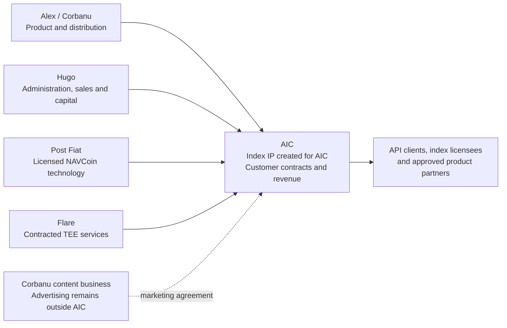
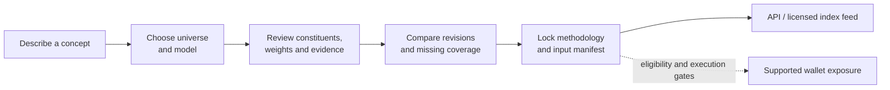
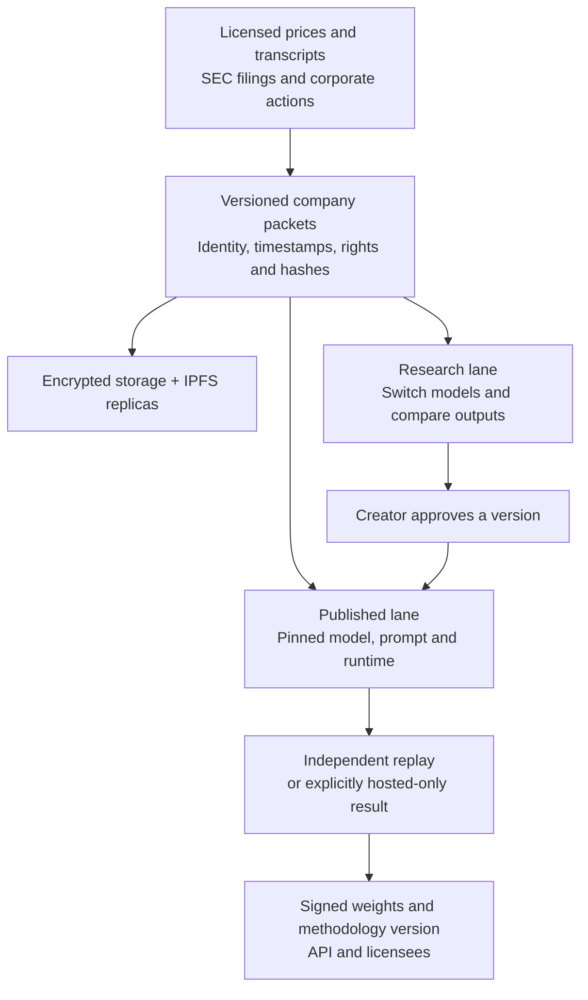
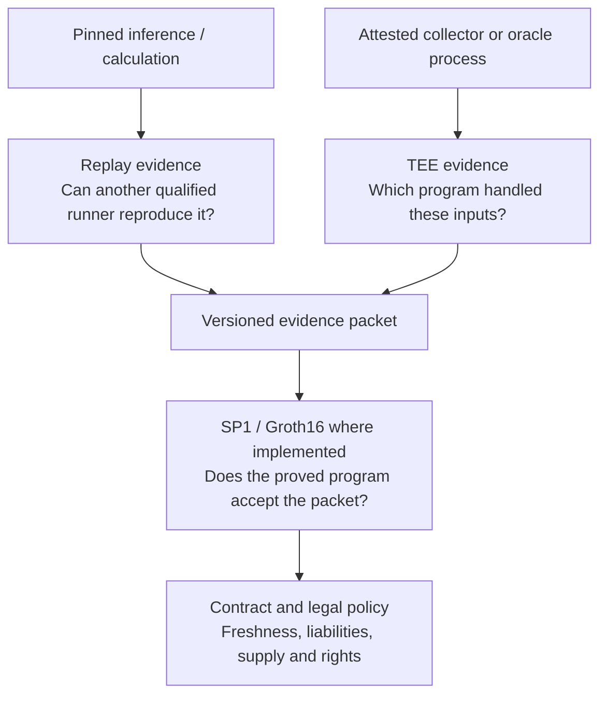
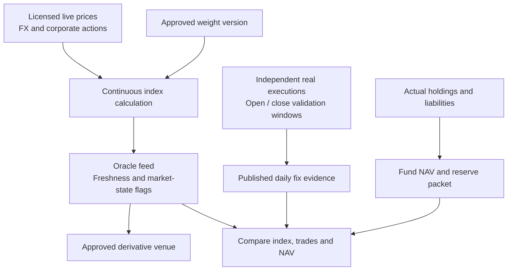
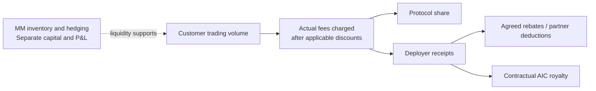
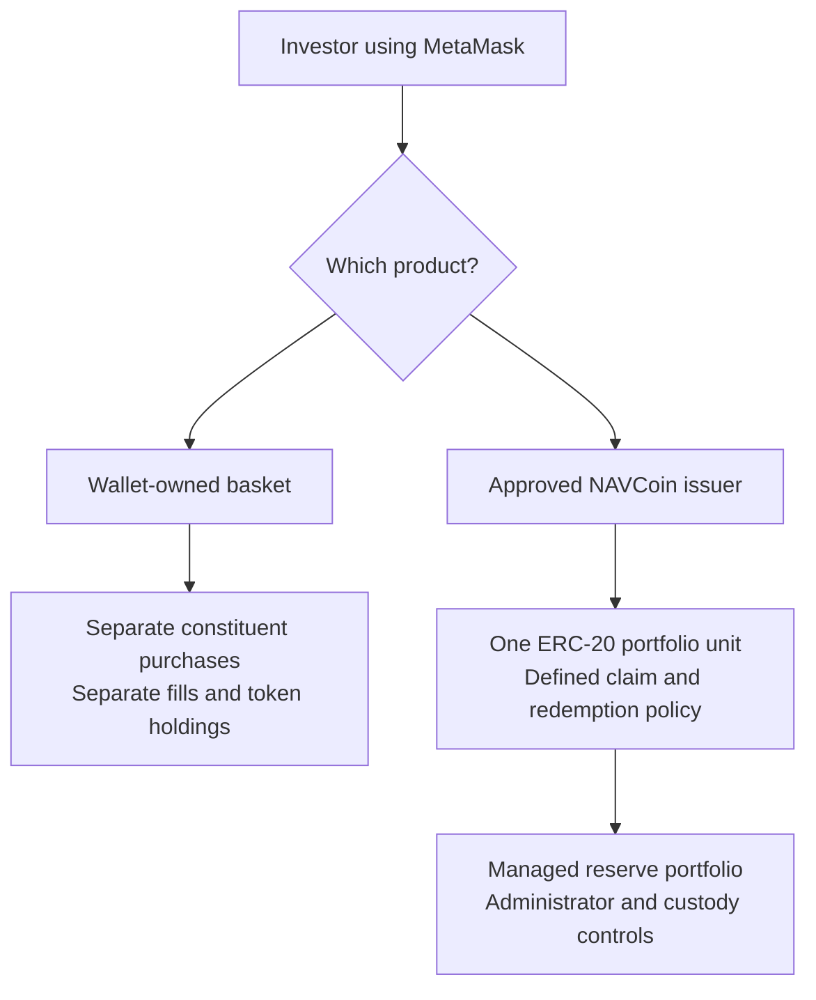
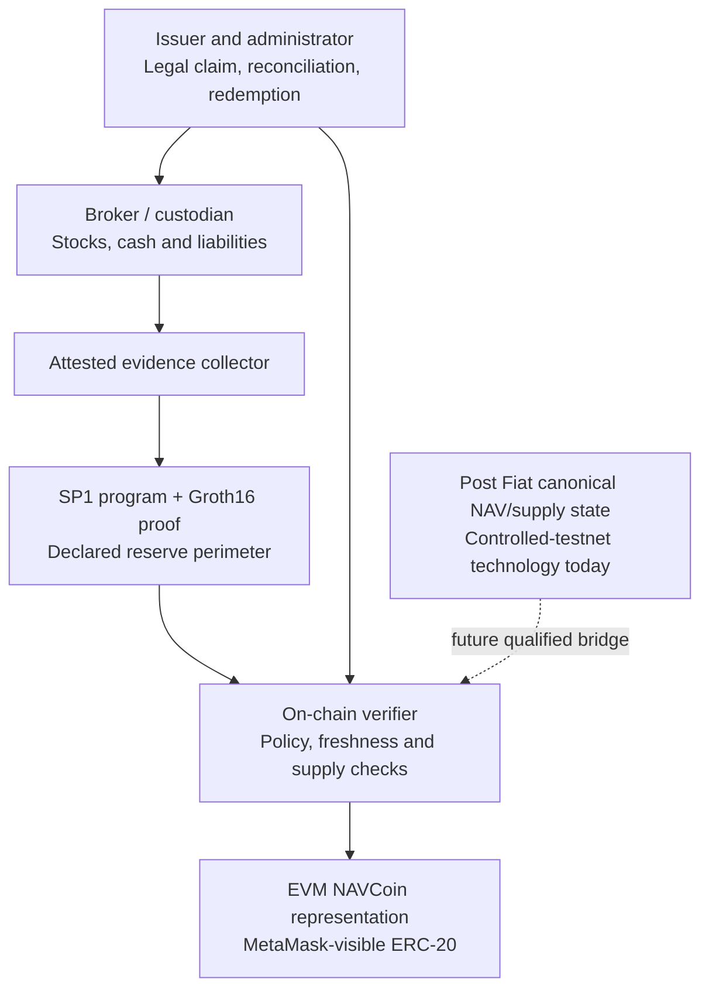
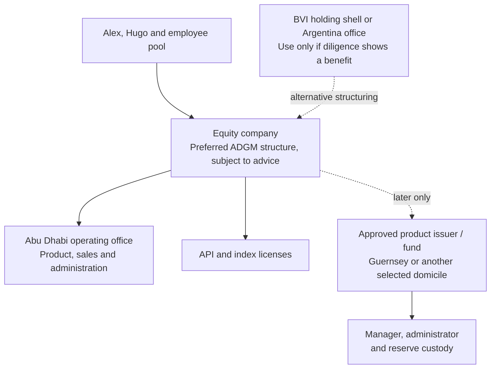

# Shell 1 · The AI Indexing Company

## Founder proposal for Alex and Hugo

**Research cut: 16 September 2026 · Discussion draft · All commercial terms below are proposals, not agreements.**

### Decision brief

**Build an equity-owned index company whose first product is the Corbanu Index API.** A customer describes an investment concept, chooses a supported universe and model, inspects the evidence, and receives a versioned, licensable index. Start with the existing tokenized-equity workflow; expand to US and international equities as data rights and coverage permit. Use the GoodAlexander DOOM Index as the first branded showcase.

The mission is to make financial indices easier to create, understand, verify and use. AI can turn unstructured company information into explicit selection rules and weights. The long-term vision is to turn a tradable idea into accessible exposure with minimal friction. The first product sells the index and its maintenance; financial products built on that index have additional requirements.

**Alex contributes product, existing methodology, engineering leadership and distribution. Hugo contributes company formation and administration, commercial partnerships, capital formation and access to Flare infrastructure.** Post Fiat licenses relevant NAVCoin technology; Flare supplies a separately specified attested-compute service. Neither parent company, community, treasury nor token becomes an asset of AIC by implication.

**Launch the API first; develop a partner-perp opportunity alongside it.** Hugo is right that a successful perp needs dependable weights, a defensible price oracle and a venue with liquidity. Those are distinct deliverables. An existing deployer can supply the venue and stake while AIC supplies the branded index. The current 500,000-HYPE requirement makes operating a new HIP-3 DEX a capital business, not a small extension of an API startup.

**Proposed initial deal:** Alex up to 48%, Hugo up to 32%, employee option pool 20%, fully diluted before outside financing. Founder allocations combine time-vesting shares and measurable contribution tranches. Infrastructure access alone does not earn an unconditional ownership grant. An independent director certifies disputed milestones and related-party terms.

**Proposed working arrangement:** one engineer based in an Abu Dhabi office, with founders committing scheduled in-person product and commercial sessions. Post Fiat remains Alex’s main effort; Flare remains Hugo’s main effort. The company must function with those constraints. Argentina is the alternative office if recruitment and total cost materially improve, not a route around financial regulation.

**What agreement authorizes:** a funded 90-day API pilot, a data-rights workstream, one index-licensing sales effort and a bounded FCC oracle qualification. It does not authorize a token sale, customer custody, a proprietary exchange, or a live stock-backed NAVCoin.

**What must be resolved before signing:** parent-IP permissions; founder commitments and earn-in; initial cash; company domicile and operating permissions; Tiingo/transcript rights; and Hugo’s explicit acceptance that Post Fiat competes with XRP in its public narrative.

---

## 1. Why this collaboration should exist

Alex can build and market an index API without Flare. Hugo has explicitly acknowledged that FCC is unnecessary for basic index licensing and copy trading. The collaboration is valuable if Hugo shortens the path from useful indices to paying institutional customers, funded product distribution and reliable financial infrastructure.

The offer should therefore be reciprocal: Alex is not giving away ownership for a mandatory hosting dependency; Hugo is not underwriting an open-ended engineering project with no deliverables. AIC earns its existence through three combined advantages:

1. **A product already in motion:** Corbanu’s research surface, index creation workflow, data packets and distribution.
2. **A commercial operator:** a founder accountable for legal setup, data deals, venue agreements, institutional sales and capital.
3. **A route from index to investable product:** verified computation, licensed data, qualified oracles and eventually Post Fiat NAVCoin reserve and supply controls.

AIC’s defensibility will come from licensed company data, quality of methodology, useful products, operating history, brands, customer relationships and execution. A downloadable model or a TEE is not, by itself, a durable commercial moat.

### Existing competitors set a real bar

| Existing offer | What it means for AIC |
|---|---|
| **Solactive ARTIS:** client-accessible NLP thematic stock selection; Solactive describes deterministic output and use in more than 100 ETF indices | “AI builds an index” and “same input, same output” are not sufficient differentiation. Test whether inspectable model/input manifests, fast model comparison and tokenized-instrument mapping are materially better for the chosen customer |
| **Indxx:** custom index development, calculation, benchmark administration and corporate-action services | AIC competes with an operating service, not a spreadsheet. Buying administration or shadow calculation may be smarter than recreating it |
| **Felix/Ondo and venue operators** | They already solve parts of exposure and distribution. AIC must improve index selection, evidence and all-in execution while preserving those integrations |

These descriptions follow [Solactive’s ARTIS page](https://www.solactive.com/artis/) and [Indxx’s service offering](https://www.indxx.com/index-services). They do not establish comparative prices or independent performance. Request equivalent-scope quotes and ask design partners which existing process they would replace. **The differentiated hypothesis is a transparent, agent-friendly path from company evidence to a maintained, licensable index and eligible on-chain exposure—not that thematic indexing or deterministic NLP is new.**

*Figure 1. A joint business with explicit boundaries. Technology and distribution are contracted contributions, not transfers of the parent businesses.*

### What belongs to AIC—and what does not

| Inside the proposed company | Retained outside the company |
|---|---|
| New AIC index-product code, customer contracts, licensed branded-index revenue, AIC-owned fine-tunes where rights allow | Pre-existing Corbanu, navstrategies, Post Fiat, Flare and third-party IP |
| AIC API subscriptions, commercial index licenses, agreed oracle and product royalties | Corbanu advertising, sponsorship and unrelated editorial revenue |
| New engineer’s work within the agreed AIC scope | Alex’s general trading P&L, unrelated strategies and Post Fiat token holdings |
| Contractual rights to approved parent technology and brands | Control of Post Fiat/Flare networks, treasuries, roadmaps or public narratives |

Corbanu.com should develop into a research and content franchise comparable in ambition to Citrini. It can market AIC and host an index creator, but an AIC customer is not entitled to Corbanu’s advertising income. A written distribution agreement should price any paid placements, define attribution, and preserve editorial independence.

## 2. What already exists

This assessment combines fetched repository heads, explicitly identified local work, public product configuration and Post Fiat research. It is not a new production qualification. Dirty repositories were preserved; remote changes were fetched without resetting local work. Evidence details are in Appendix A.

| Asset | Evidence available now | Boundary that matters commercially |
|---|---|---|
| **Corbanu Index API and website** | Preview, confirmation, locking, claims, publishing, firm quotes and wallet submission; model selection includes GLM 5.3, GLM 5.3 Flash and DeepSeek V4.1 Flash | Public catalog says deterministic execution unavailable, funded fills unverified and creator revenue unconfigured. Current zero-price generation is not demonstrated unit economics |
| **SEC and company packets** | SEC submissions/CompanyFacts and post-earnings collection; normalized share/class data; full cached transcripts where available; signed immutable packets | SEC filings are not earnings-call transcripts. Access to a cache does not establish rights to redistribute or train on it |
| **Tokenized universe adapter** | September 9 local evidence: 444 listings, 328 stocks with ready capitalization inputs, 443 prices, 853 transcripts covering 313 stocks | A dated snapshot, not current universal coverage. Fifteen stocks lacked transcripts. ETFs/listings and unique underlying companies are different counts |
| **IPFS publication** | Signed IPNS pointer to immutable IPFS packets; encrypted transcript bodies; owned replicas and external pinning | Integrity comes from content addressing and signatures; continued availability requires maintained replicas and key recovery |
| **Replayable Qwen indices** | August 15 research reports 2,552 successful tested replays; the August 27 agentic-index demonstration reports 4,000 cross-H200 replay receipts over four 1,000-company runs | Separate experiments, not counts to add together; neither qualifies arbitrary GPUs, models or prompts |
| **DeepSeek V4.1 Flash research** | Hosted generation works; tokenizer, packet and reconstruction work exists locally | The new GPU replay lane is not qualified. Fine-tuning does not automatically make inference deterministic |
| **Options proof workflow** | September 6 evidence joins private brokerage data, Nitro collection and SP1/Groth16 proofs for MU/NVDA research baskets; verified on a local four-validator environment | No orders, investor issuance or external production deployment. Historical proving took tens of minutes per basket |
| **NAVCoins** | Historical small Ethereum a651 deployment; reserve/supply primitives and private-swap research in Post Fiat L1 V2 | V2 remains controlled testnet. No assumption of a production cross-chain supply bridge or legally complete new AIC fund |

The live catalog observation was captured at **23:46 UTC on September 16, 2026**. Its distinction between hosted output and deterministic output should become customer-facing product language. See the [Corbanu catalog](https://api.corbanu.com/v2/indexes/catalog), [deterministic-index research](https://postfiat.org/blog/deterministic-financial-indices/), and [trustless single-stock options research](https://postfiat.org/blog/trustless-single-stock-option-indices/).

## 3. The 90-day MVP

### The first buyer and offer

Target a **small institutional issuer or investment platform that needs a maintained thematic-equity index**, rather than a mass-market trader expecting free stock picks. Its purchasing problem is the cost of assembling company evidence, maintaining methodology and operating a usable feed. The first sales test is whether it will pay for that work before AIC assumes custody or derivative-market risk.

Proposed offers, to test rather than advertise as established prices:

| Offer | Initial price hypothesis | Included scope and boundary |
|---|---:|---|
| Design-partner pilot | **$5,000 for 30 days**, paid upfront | Two named research indices, up to 20 full research recalculations total, weekday deterministic price/weight-file delivery where qualified, and four support hours; no redistribution or financial-product issuance right |
| Production research API | **$2,000/month**, three-month minimum | Same two-index/20-recalculation envelope; additional compute requires a displayed quote; third-party data entitlements separately identified |
| Tradable-index license | **$25,000/year minimum**, plus a negotiated product royalty where justified | One named product and venue; publication/redistribution rights only after upstream licenses and product approval |

“Recalculation” means one chosen model scoring one approved universe, capped at the contracted constituent count. Continuous price updates do not rerun the language model. Large universes, fine-tunes and new transcript sourcing are priced separately. The existing free Corbanu preview can remain a marketing surface under a separate agreement; it does not commit AIC to unlimited free inference.

**Economic gate:** each paid API contract must show at least 60% contribution margin after attributable data, inference, storage and support labor. At $2,000/month, those direct costs must be at most $800. A test cost envelope is $300 attributable data, $200 inference for 20 recalculations ($10 each), $100 storage/serving and $200 support (four hours at $50). These are break-even design allowances, not measured costs; rights minima are allocated over signed paying customers, never hoped-for future users. If a full-universe run cannot fit $10, quote that run separately or raise the contracted price. Report both contribution margin and total operating loss. Ten such customers produce $20,000 MRR and at least $12,000 contribution, not necessarily company break-even. The pilot spends to learn; it should end with **two independently paying $5,000 pilots and one signed $24,000 annualized API or $25,000 index-license contract**, or a written decision to narrow/stop. Deposits from founders or affiliates do not satisfy demand validation.

Hugo owns the buyer pipeline: 15 qualified institutional conversations by day 30, three design partners by day 45, and paid conversions by day 90. Alex supplies demonstrations and the DOOM audience channel. These are proposed operating targets, not claims of existing customer interest. Market makers and deployers belong in a parallel partner pipeline; they are not interchangeable with paying API customers.

### One primary customer journey

A researcher, adviser, issuer or sophisticated investor describes a concept, selects a universe and model, and receives a reviewable index draft. They can compare models and revisions, see missing inputs, lock a version and obtain an API feed or licensed publication package. Trading is a separately enabled action for eligible users and supported instruments.

*Figure 2. Index creation is the MVP’s complete workflow. A publication does not imply that every constituent can be bought through the app.*

### Three universes, honest coverage

| Universe | MVP commitment | What unlocks expansion |
|---|---|---|
| **Tokenized equities** | Improve the existing supported universe, instrument mapping, live pricing, model comparison and explainable exclusions | Supported venue contracts, eligibility, correct token-to-underlying conversion and funded execution qualification |
| **US equities** | Provide an explicitly enumerated research universe; SEC-derived fundamentals and licensed company material; publish a coverage report | Point-in-time membership, corporate actions, exchange data rights, transcript contracts and missing-data policy |
| **International equities** | Provide the same API contract and a limited, named initial coverage set; report unavailable countries/companies | Local filings, languages, IFRS/local-GAAP treatment, currencies, ADR ratios, listing identity and country-specific data rights |

Proposed engineering coverage packs make the pilot concrete: **Tokenized-current** is the published eligible instrument manifest from the existing adapter; **US-100** is the 100 largest current SEC-reporting US ordinary-equity issuers for which the licensed packet has complete required inputs, ranked by current capitalization solely to bound test coverage; **International-10** tests TSM, ASML, NVO, TM, SONY, SAP, HSBC, RIO, SHEL and UL via their US-listed instruments and mapped primary companies. These are coverage tests, not recommended portfolios or permission to market an index under another provider’s brand. Publish exact identifiers, as-of dates and exclusions; do not fill missing names with proxies. International local-market listings remain a later expansion. If rights or completeness prevent a pack, label it incomplete and reduce the pilot’s supported scope.

“Full US” and “full international” are coverage objectives. They must not appear as shipped claims until the coverage manifest supports them. Model switching should be fast for research; a live licensed index must retain a frozen version until its published change procedure takes effect.

### Deliverables and acceptance

- **Reliable API:** durable jobs, resumable work, billing visibility, reproducible input snapshots, versioned outputs and documented failure states. No silent substitution of models or missing companies.
- **Index contract:** universe, scoring rule, weighting rule, rebalance schedule, corporate-action handling, exclusions, concentration constraints chosen by the creator, and model/runtime identifiers. There is no hidden default portfolio strategy.
- **Comparison interface:** constituent and weight differences between versions, source timestamps and model costs. An AI explanation is traceable to input material, not offered as proof of truth.
- **Publication package:** index card, methodology, identifier, calculation feed, version history and commercial license. Private research is private by default; public publication requires explicit consent.
- **Commercial proof:** the paid-conversion and margin gates above, with customer-level cost records rather than revenue alone.
- **Index-quality checks:** no future-dated source leakage in dated tests; every weight sums to the documented integer total; a reference calculator reproduces corporate actions and rebalance continuity; missing prices fail visibly; model changes produce a constituent/weight diff. The chosen methodology explicitly states price versus total return, dividends, splits, currency conversion and delistings before publication. A model-generated portfolio is not labeled superior because it passed software checks.
- **DOOM demonstration:** Alex publishes one clearly labeled proprietary index with a change log and transparent treatment of discretionary decisions. AIC receives a negotiated license; ownership of Alex’s name and pre-existing concept remains with Alex.

The proposed API reliability test runs the ten agreed test indices at 15-minute intervals during a disclosed eight-hour weekday window for 30 calendar days. The denominator is every scheduled index-run; success means a valid artifact within five minutes of its deadline, with at least **99.5% success and every miss visible**. Separately complete ten simulated outage/restore exercises and retain the full results. Research model jobs use separately displayed deadlines. This yields enough observations to measure the target rather than rounding one daily job into a misleading percentage. This is an internal API target, not a sufficient derivatives-oracle service commitment. A single delayed research index and a stale leveraged-market oracle have very different consequences.

### Changes to Hugo’s initial MVP

| Hugo’s proposal | Recommended treatment |
|---|---|
| Generate indices and upload to FCC | Generate using the existing API; qualify FCC as a deployment option rather than a universal prerequisite |
| Copy trading with rebalance prompts | Preserve the existing wallet path; add prompts only after eligibility, funded-flow and partial-fill handling are qualified |
| Popular indices become perps | Build a partner listing package in parallel; launch only after oracle, venue, liquidity and legal acceptance |
| AI helper, cards, social, rankings | Keep helper, cards and transparent sharing; defer token-based rankings and trading-revenue promises |
| Deterministic updates first | Use frozen rules for operational updates; model-assisted research can iterate freely before publication |
| Private methodology | Permit private research; licensed/live products need auditable access for the administrator, verifier and venue |

## 4. Product lines and their economics

**Only the API and index-license rows are funded product work in the pilot.** Oracle qualification is a capped experiment. The remaining lines are strategic options requested for this proposal; they carry no implied hiring, build or launch commitment. Decide the next product using paid demand and incremental margin, not the number of technically possible wrappers.

| Product | Buyer / source of revenue | Sequence and constraint |
|---|---|---|
| **Corbanu Index API** | Researchers, advisers, fintechs and issuers; subscription, usage or enterprise contract | First. Sell productivity, data quality and maintained outputs |
| **Branded index licensing** | Issuer, exchange or product sponsor; minimum annual license plus negotiated usage/AUM/volume royalty | First commercial expansion; DOOM is the showcase |
| **Bloomberg publication** | Visibility and institutional adoption; revenue comes from the underlying license, not merely appearing on a terminal | Hugo’s BD workstream; negotiate index identifiers, distribution and rights |
| **Replayable index service** | Clients requiring independently checkable calculations; service and support license | Qualified models first; verified and hosted outputs clearly distinguished |
| **Oracle service** | Venues and issuers paying for timely, auditable price/index feeds | Separate data rights, operating SLA and liability budget |
| **Partner-listed perps** | Contractual share of actual deployer receipts or fixed index license | No assumption AIC receives all exchange fees or funding |
| **Stock-backed NAVCoins** | Product-management, index and technology fees within an approved issuer structure | Custody, investor rights, administrator and legal permissions precede launch |
| **Single-stock options indices** | Rolling options exposure licensed to a product issuer; potentially premium product fees | Research exists; costly execution, rolls, option rights and proof cadence still matter |
| **UltraShort / leveraged bonds** | Specialized issuer licenses and possible management fees | Later; funding, borrow, duration, liquidation and path dependence need distinct designs |
| **Execution service** | Disclosed service fee or contracted execution economics | Potentially valuable independently; brokerage/arranging/management perimeter must be resolved |

Bloomberg already supports index data licensing; publication is a business-development task, not an automatic consequence of creating an API. [Bloomberg index licensing](https://www.bloomberg.com/professional/products/indices/resources/index-data-licensing/).

### The execution opportunity

An index identifies desired holdings. A separate execution policy decides how to acquire or dispose of them. AIC should test whether systematic limit orders and patient basket completion reduce all-in implementation cost enough to create a differentiated service. Benchmark the complete result: fees, spread, gas, financing, missed fills, market drift and time to completion. A lower displayed fee with large unfilled exposure is not better execution.

For a future fund, a regulated manager could route among broker fills, tokenized-stock venues and negotiated OTC inventory, subject to mandate and conflict controls. The administrator reconciles actual holdings to the target; temporary cash and tracking error remain visible. Discretionary execution is compatible with fixed index weights if the mandate makes that distinction explicit. It is not permission to change the portfolio’s investment thesis silently.

### Market opportunity without inflated TAM

OCC reports **8.27 billion equity-option contracts in 2025, up 26.8%**, alongside 5.68 billion ETF-option contracts. That demonstrates activity, not the revenue available to AIC. [OCC 2025 volume](https://www.theocc.com/newsroom/views/2026/01-05-occ-annual-2025-and-december-2025-volume).

The existing Post Fiat market-sizing work provides a more specific comparison:

| September 2026 research snapshot | NVDA | MU | Combined |
|---|---:|---:|---:|
| ATM/OTM call premium represented by open interest | $3.626bn | $4.419bn | **$8.045bn** |
| Associated underlying notional | $84.988bn | $57.295bn | $142.284bn |
| Tracked on-chain perp open interest | $359.3m | $428.3m | $787.5m |

The calculation uses contract open interest × 100 × quoted option midpoint across returned expiries. Much of the premium sits in long-dated contracts; positions may hedge other exposures. These are dated stock measures, not annual flows, investable demand or fee revenue. [Options research and downloadable evidence](https://postfiat.org/blog/trustless-single-stock-option-indices/).

For planning, **$10m / $50m / $100m of retained product assets at a hypothetical 50bp annual fee generates $50k / $250k / $500k gross annually**. Data, administration, custody, market making, distribution and legal costs come out of that. Options complexity might support higher fees, but high margin is a hypothesis to test with issuer quotes and roll-cost evidence. Leveraged bond indices need their own demand research; this draft does not invent a bond-market TAM.

## 5. Data, models and replayability

### Build on the SEC and packet work

The relevant local SEC work lives in **navstrategies**, including its SEC historical fundamentals contract, post-catalyst release pipeline and Felix company-packet publisher. A historical campaign records 5,411 issuer outcomes and 147,371 quarterly rows, with material missing coverage and production qualification still pending. It does not create a survivorship-free global stock database.

The September tokenized-equity packet work combines listing identity, SEC-derived share counts, capitalization conversions, current prices and transcript references. The IPFS publication layer makes a particular input set identifiable later. It should preserve permission boundaries: a public index can disclose source identities and hashes while restricted transcript text remains encrypted for licensed readers.

**Proposed Tiingo discussion:** consolidate US/international pricing and corporate actions; establish derived-index, display, oracle, replay-verifier and training rights; document exchange pass-through fees and service terms. Alex reports an existing proprietary relationship, but exclusivity, sublicensing and AIC’s rights remain unexecuted. Tiingo has operated Chainlink equity-data services; the claim that it is “one of the largest” was not established by the reviewed primary evidence. [Tiingo’s equity node](https://www.tiingo.com/blog/tiingo-launches-live-chainlink-equity-price-node/).

An existing **unsigned white-label Tiingo draft** was also recovered from fetched `navstrategies origin/master`, at `docs/legal/drafts/tiingo_corbanu_white_label_api_agreement_draft.md`; its local working-tree copy had been deleted. It covers specified EOD/IEX data, limits customer use and onward distribution, excludes several other datasets, and does not promise an SLA. It is evidence of prior deal work, not an executed grant or authority to sell an oracle. AIC needs explicit amendments for licensed-index use, live oracle publication, verifier access, retention and any training rights. Transcript sourcing requires a separate rights schedule. Preserve this distinction even if the commercial relationship is strong.

**Ondo pricing:** its API supports real-time price and quote workflows, but direct purchaser access involves onboarding. Current local work uses the Felix/Ondo public-price path; direct Ondo execution is not enabled in the observed Corbanu catalog. Underlying stock price and the token’s dividend-adjusted price are distinct fields. [Ondo API](https://docs.ondo.finance/api-reference/overview).

*Figure 3. Rapid experimentation and stable published indices are separate modes of the same product.*

### Replayability is an operating contract

SGLang provides a serving environment. Exact replay additionally depends on model weights, tokenizer, quantization, kernels, hardware, batching, prompts and input bytes. The Post Fiat research demonstrates this for specified configurations and separately investigates cross-hardware replay. Neither result licenses a generic “all AI is deterministic” claim. [Financial-index replay](https://postfiat.org/blog/deterministic-financial-indices/) and [cross-hardware work](https://postfiat.org/blog/sglang-cross-hardware-replay/).

A live index should publish a manifest identifying all material versions. Model changes create a new approved methodology version with notice and an effective time. If a scheduled AI refresh fails, the previously disclosed fallback applies: hold existing weights, flag stale status or suspend the dependent product. Silently switching models is prohibited.

### A company-knowledge fine-tune

A useful research program is a DeepSeek V4.1 Flash fine-tune or adapter trained on licensed company material and expert-labeled index tasks. It might improve consistency, explainability and inference cost. Its value must be measured against the base model on held-out companies and dates, citation accuracy, leakage, stability and cost. Start only after rights and economics justify it; a massive checkpoint is not automatically the cheapest way to serve an index API.

Thomson Reuters’ **Thomson technical report** is a concrete precedent for continued training of an institution-controlled model. It identifies Qwen3.5-397B and Qwen3.6-35B bases, full-weight updates, data curation and professional evaluations. It estimates under **$450,000 for the final large-model training run**, but approximately **$40m for total development**, including reusable research, infrastructure, staff and partners. These are the authors’ reported costs, not AIC quotes. The lesson is to build rights-cleared data, evaluations and a repeatable release process before scaling training; it is not that a $450,000 budget recreates Thomson. The report does not establish DeepSeek index performance or exact replay. [Thomson technical report, introduction, pp. 2–3](https://www.thomsonreuters.com/content/dam/ewp-m/documents/thomsonreuters/en/pdf/reports/thomson-technical-report.pdf).

The proposed “free except when used to create a tradable index” license is **source-available or dual-licensed**, not open source under the Open Source Definition’s prohibition on field-of-use restrictions. Kimi K2’s reviewed modified MIT license has a large-scale attribution condition; it is not a precedent for an index royalty. AIC cannot revoke permissive rights in an upstream base model. It can license its own separable adapters, curated proprietary datasets, updates, trademarks and service. Authorized independent verifiers must receive the exact weights, runtime and inputs needed for replay, or the claim must be narrowed to attested private execution. A verifier NDA or paid license is compatible with controlled access; it is not permission to claim public reproducibility while withholding essential artifacts. Counsel must test whether training licenses permit downloadable weights and whether output-based restrictions are enforceable. [Open Source Definition](https://opensource.org/osd); [Kimi K2 license](https://huggingface.co/moonshotai/Kimi-K2-Instruct/blob/cc613312db6692a12f650552166d3bf1d09e936a/LICENSE).

**A fine-tune does not solve numerical replay.** Any new weights require the same qualification as the original model. Keep the MVP capable of using a qualified open model while this research proceeds.

## 6. What FCC adds—and what it does not

Hugo’s revised argument is strongest for an oracle operating over time: registered execution, attested code, secret management and recoverable service operation can reduce reliance on one operator. Those services have commercial value if they are demonstrably available and supported.

Flare’s current developer material describes FCC’s attested container architecture, provider coordination and key handling. Its FAQ still describes a developing availability path rather than a generally available, fully qualified production service. AIC should obtain a written deployment/SLA statement for the exact network and service. [FCC overview](https://dev.flare.network/fcc/overview), [TEE keys](https://dev.flare.network/fcc/tee-keys), [availability FAQ](https://dev.flare.network/support/faqs).

| Question | AWS Nitro route | FCC route | AIC requirement |
|---|---|---|---|
| Is execution attested? | Yes: measurement-bound attestation rooted in AWS Nitro | Attested workload plus Flare’s registration/coordination architecture | Independently verify the exact approved image and output identity |
| Does a crash preserve enclave memory? | No; persistence/recovery must be designed around encrypted external state | Key/state mechanisms help, but application recovery still needs qualification | Restore an approved state without accepting rollback |
| Is availability automatic? | No; operator supplies redundancy and recovery | No; service architecture may reduce work but still needs measured operations | Prove failover, deadlines, alerting and operator coverage |
| Does it prove prices or custody are truthful? | No | No | Licensed inputs, provenance, independent checks and legal custody controls |
| Can it run our GPU model unchanged? | Not established by existing work | Not established by existing work | Do not represent outside-TEE inference as inside-TEE inference |

Filip is correct about Nitro’s intentionally restricted storage and networking, but that does not mean reliable persistence is impossible or that Nitro lacks attestation. Encrypted, authenticated state can be stored outside the enclave; key-release policy and rollback protection must be designed. FCC’s cloud trust assumptions also remain relevant. [AWS enclave concepts](https://docs.aws.amazon.com/enclaves/latest/user/nitro-enclave-concepts.html), [AWS attestation-conditioned keys](https://docs.aws.amazon.com/kms/latest/developerguide/conditions-attestation.html), [Google Confidential Space](https://docs.cloud.google.com/confidential-computing/confidential-space/docs/confidential-space-overview).

*Figure 4. Replay, attestation, a zero-knowledge proof and an investor’s legal claim answer different questions. None substitutes for the others.*

### A bounded FCC engagement

Propose a 30-day technical qualification alongside the API pilot. **Hugo must secure a named Flare/FCC implementation engineer and service owner; no Flare staff time is assumed committed.** Flare’s proposed contribution supplies the environment, pricing, verification instructions and incident responsibilities. AIC’s engineer contributes at most five working days to the narrow oracle/packet interface. If that staffing or access is unavailable by day 15, postpone the FCC experiment and continue the API. The same engineer is not responsible for independently rebuilding a production oracle network.

Acceptance should include independent verification of the approved image; restart and restore; stale-input rejection; key compromise response; anti-rollback checks; a missed-weight-update exercise; and failover across the failure domains actually offered. AIC compares this result with the existing Nitro implementation on measured cost and operational burden.

An initial architecture can run qualified inference outside FCC and use FCC to verify approved weight artifacts and operate the oracle. That is useful, but must be described accurately. FTSO price feeds, FDC attestations and FAssets are separate Flare offerings; none is presumed to supply licensed global equity data or ownership of stock reserves. [Flare technical papers](https://dev.flare.network/support/whitepapers).

The contract should prefer FCC when it meets agreed acceptance, pricing and portability requirements. It should not make AIC’s entire API business exclusive to FCC or transfer unrelated Post Fiat engineering obligations to Flare.

## 7. The oracle and the daily-fix proposal

There are three distinct outputs:

1. **Index weights:** what the methodology says to hold at a defined time.
2. **Index price:** what the current basket is worth under a published pricing policy.
3. **Fund NAV:** actual reserve value minus liabilities, divided by valid shares, under the fund’s valuation policy.

They can differ because of cash, execution, fees, financing and stale markets. An index level is not proof that a fund owns the constituents.

*Figure 5. Executed fixes validate a pricing process. They do not replace a continuous oracle.*

Alex’s proposed 9:30 a.m. and 4:00 p.m. fixes should be stated as **America/New_York exchange times**, with daylight saving, holidays and early closes handled explicitly. A broker’s opening/closing auction participation or a specified execution window is more precise than promising an instantaneous trade. International portfolios need separate local-market and FX policies.

The current Felix documentation pauses mint/redeem activity around **9:29–9:31 and 15:59–16:01 Eastern**. Therefore the current route cannot be assumed to deliver the proposed exact-time executions. This is a material implementation choice: auction/broker route, another qualified venue or a disclosed nearby window. [Felix spot-equity mechanics](https://usefelix.gitbook.io/docs/trading-products/spot-equities).

For perps, an agreed policy must cover closed underlying markets, halts, missing constituents, corporate actions, FX, extreme divergence and fallback/settlement. Before deployment, the oracle acceptance sheet must contain numeric update cadence, maximum source age, quorum/coverage minimum and divergence bounds for each market state; this research proposal does not invent safe thresholds for an unselected venue. The venue’s designated risk operator must have explicit pause authority. Restart requires reconciled state, recovered sources and recorded approval under a tested procedure; the founder’s Telegram reassurance is insufficient. Changing weights requires a continuity adjustment so the rebalance itself cannot manufacture a jump in index value. A model update must not secretly redefine an existing leveraged contract.

Real trades are useful evidence but not an anti-manipulation guarantee. Tiny self-directed trades cannot set a benchmark simply because they occurred on-chain. Use independently sourced prices, precommitted execution rules, minimum liquidity tests and disclosed conflicts; do not let the derivative’s own price circularly establish its oracle without an explicit, reviewed design.

The oracle business needs a standalone agreement covering data rights, timing, liability limits, incident response, customer reliance and termination. Tiingo plus Post Fiat plus FCC is a plausible architecture, not a completed partnership or a production certification.

## 8. Perps: capital, liquidity and actual revenue

### The capital hurdle

The current HIP-3 documentation requires **500,000 HYPE per deployer DEX**, not per individual index. The first three markets avoid additional slot auctions; later slots use an auction. The retrieved staking section specifies a minimum 183-day period, while settlement language separately describes release after markets settle; confirm the exact current lock and exit mechanics before funding. Stake is slashable and does not supply market-making liquidity. [HIP-3 specification](https://hyperliquid.gitbook.io/hyperliquid-docs/hyperliquid-improvement-proposals-hips/hip-3-builder-deployed-perpetuals).

At the captured Hyperliquid midpoint of **$78.3205**, 500,000 HYPE is **$39,160,250**. This is capital at risk, not an annual license expense. At an illustrative 8% annual opportunity cost, it ties up roughly **$3.13m/year before any staking yield**. HYPE at $50/$80/$100 changes the capital requirement to $25m/$40m/$50m. The quote and arithmetic are archived with this proposal.

**Recommendation: license the first index to an existing deployer.** Consider a sponsored/crowdfunded deployer only after signed customer demand exceeds the added capital and operational burden. Obtain a current Kinetiq proposal rather than assuming a standard royalty or free stake. Distinguish access to an existing market operator from a financing product that funds a new DEX. [Kinetiq](https://kinetiq.xyz/).

### How much revenue can the venue share?

Hyperliquid’s published fee rules distinguish protocol receipts from deployer receipts. At the ordinary tier-zero rates, with deployer fee scale 1, the example taker pays 9bp total and the deployer receives 4.5bp. An eligible growth-mode market reduces this example to 0.9bp total and 0.45bp to the deployer. Discounts, maker trades/rebates, referrals and actual settings change the realized figure. Not every asset is growth-mode eligible. [Hyperliquid fees](https://hyperliquid.gitbook.io/hyperliquid-docs/trading/fees).

AIC should negotiate against **cash received by the deployer on AIC markets**, with auditable deductions. Funding payments are not automatically AIC revenue. Open interest, gross volume, product AUM and deposited collateral are different metrics.

*Figure 6. An index license earns a negotiated part of a defined revenue stream. It does not inherit the exchange’s entire economics.*

For illustration, assume growth-mode taker economics of 0.45bp to the deployer and **25% to AIC**:

| Monthly volume | Deployer receipts before other deductions | AIC share before its costs |
|---:|---:|---:|
| $100m | $4,500 | $1,125 |
| $1bn | $45,000 | $11,250 |
| $10bn | $450,000 | $112,500 |

These are sensitivity calculations, not forecasts or negotiated terms. Realized mixed maker/taker economics can be lower. At these assumptions, a stand-alone new DEX needs extraordinary scale to justify the stake’s opportunity cost; an index licensor can test demand with much less capital.

TradeXYZ’s S&P 500 product is an instructive commercial model because **S&P DJI formally licensed it in March 2026**. That does not reveal its license price, revenue split or prove an arbitrary new index will be accepted. AIC should seek the same separation of roles: benchmark licensor, market operator and liquidity providers. [S&P DJI announcement](https://www.spglobal.com/spdji/en/documents/index-news-and-announcements/20260318-spdji-licenses-sp-500-tokenized-perpetual-contracts.pdf).

### Where liquidity comes from

A perp order book needs market makers with hedge access, capital and acceptable oracle risk. The stake unlocks deployment; it does not create bids. Hugo’s venue term sheet should identify who quotes, minimum depth/spread expectations, inventory limits, hedge markets, closed-market behavior and the budget for rebates or guarantees.

Variational is a different model. Its Omni Liquidity Provider is the counterparty and operates an in-house market-making and hedging operation; the published material describes a USDC vault and an initial team-funded phase. It currently directs 20% of spreads to the protocol treasury, subject to change. “Zero trading fees” does not mean no execution spread. AIC would need a specific custom-index and risk arrangement, not assume permissionless listing. [Variational OLP](https://docs.variational.io/omni/the-omni-liquidity-provider-olp).

Variational’s RFQ design also includes quote acceptance and maker approval before settlement. Compare a binding RFQ spread and available size against an order book’s depth, fees and slippage; headline fees alone are insufficient. [RFQ mechanics](https://docs.variational.io/variational-protocol/key-concepts/trading-via-rfq).

### Felix as competitor and current distribution rail

Felix provides tokenized equity exposure through Ondo and already supplies part of Corbanu’s practical execution path. Alex reports a 20bp origination charge; the reviewed public page did not establish that current rate. Verify the contract fee and an actual eligible firm quote before printing a competitor price comparison.

AIC can compete on transparent coverage, better basket construction, model choice, provenance and implementation quality. It should not promise a larger executable universe merely by listing more research names. The current coverage is determined by actual supported instruments and legal access, not a generic global-equity database.

## 9. Tokenized indices and Post Fiat NAVCoins

### Two wallet experiences that must stay distinct

**Existing basket path:** MetaMask signs the approvals and Felix purchase transactions for supported constituents. The user receives separate underlying tokens. Trades may fill separately or fail partially. This is not an atomic purchase of a single AIC fund share. The current flow has synthetic/RPC test evidence, but its public configuration does not claim a qualified live funded purchase.

**Future NAVCoin path:** an eligible investor mints one transferable fund or portfolio unit under a defined legal claim. An issuer/manager holds the reserves, calculates liabilities and follows a mint/redemption policy. A smart contract constrains supply using accepted proof evidence. MetaMask is the wallet interface to the EVM token and contracts; it is not the custodian or the legal structure.

*Figure 7. Copy trading and a tokenized fund have different assets, risks and operating obligations.*

### How the proof stack would work

1. A brokerage or custody source supplies a portfolio snapshot through an approved collector. The collector’s measurement and output identity can be attested by Nitro or a qualified FCC implementation.
2. A specified program checks the supplied evidence, valuations, liabilities, freshness and policy. Where implemented, SP1 produces a Groth16 proof and public outputs that an on-chain verifier can check.
3. The NAV adapter accepts only the expected program/policy, data age and reserve perimeter. The supply controller applies limits before minting or redeeming.
4. Investors hold an EVM representation in MetaMask. If Post Fiat is the canonical ledger, cross-chain authorization and global supply accounting must be independently qualified before the representation relies on that bridge.

*Figure 8. Cryptographic evidence can constrain a portfolio token. The broker, legal claim and cross-chain boundary remain explicit.*

The proof does **not** establish that the broker cannot lie, that omitted liabilities do not exist, or that a private key cannot cause an off-policy withdrawal unless those controls are actually part of the enforceable perimeter. It also does not prove the quality of an AI investment decision. The existing options evidence is a proof of a specified evidence-handling/calculation process, not a proof of an entire large language model inside Groth16.

The historical Nitro/SP1 options workflow took roughly 83 and 42 minutes for its two baskets. This is useful reserve/rebalance evidence; it is unsuitable as the sole tick-by-tick pricing mechanism. FCC attestation does not automatically replace this proof. [Options TEE research](https://postfiat.org/blog/trustless-single-stock-option-indices/), [NAVCoin collateralization](https://postfiat.org/blog/navcoin-collateralization/), [counterparty boundaries](https://postfiat.org/blog/navcoin-counterparty-risk/).

### Two reserve models

| Model | Benefits | Conditions before launch |
|---|---|---|
| **Tokenized-stock reserves** | On-chain ownership evidence and composability; potential OTC accumulation | Issuer rights, transfer eligibility, underlying/token conversions, redemption access and exposure to the stock-token issuer |
| **Broker-held real stocks, potentially IBKR** | Broad universe and mature execution; potential auction access | Dedicated institutional/fund account, written broker approval, segregation, legal claim, administrator, API/data permissions and withdrawal controls |

“Tokenized IBKR account” should mean a legally constituted vehicle with an approved brokerage account and tokenized investor interests—not selling tokens against Alex’s personal login. IBKR offers fund account structures, but that is not blanket permission to tokenize an account. [IBKR fund accounts](https://www.interactivebrokers.com/en/accounts/hedge-fund.php).

Each product must disclose whether redemption is available, by whom, in what asset and on what timetable. Existing NAVCoin experiments have differing designs; AIC must choose its policy deliberately. NAVCoins are floating-NAV claims, not stablecoins. Existing Ethereum work is evidence to build on, not a certification of a new AIC issuer. [Ethereum NAVCoin work](https://postfiat.org/blog/navcoin-ethereum/).

### Options, shorts and bonds

Single-stock options indices could give a recognizable ticker continuous exposure to a published rolling call strategy. The existing research uses fully paid calls, but option premiums can still expire worthless. Rolls, spreads, volatility, taxes, corporate actions and liquidity determine whether the product is useful.

UltraShort research proposes packaged short exposure with a defined operating policy. It remains research; borrowing/funding, liquidation and path dependence must be explicit. Leveraged bond indices similarly need duration, financing, collateral and rebalance rules before a margin claim is credible. These are attractive research lanes, not interchangeable wrappers around the stock-index MVP. [UltraShort research](https://postfiat.org/blog/trustless-ultrashort-tokens/).

## 10. Legal work and where to put the company

### The US position has changed, but it is not a launch permission

On **September 15, 2026**, the Senate’s vote on cloture on the motion to proceed to H.R. 3633 failed **49–50**. That is a failed procedural vote, not a final statutory ban or an enacted CLARITY framework. [Official Senate vote](https://www.senate.gov/legislative/LIS/roll_call_votes/vote1192/vote_119_2_00234.htm).

The SEC’s August 18 Regulation Crypto Assets release is a **proposal**. Its contemplated treatment of certain crypto-asset investment-contract offerings does not automatically authorize tokenized stocks, pooled investment funds or equity derivatives. Incorporating outside the US does not remove US-facing offering, solicitation or derivatives questions. [SEC proposal announcement](https://www.sec.gov/newsroom/press-releases/2026-76-sec-proposes-new-regulation-crypto-assets), [proposed rule](https://www.sec.gov/files/rules/proposed/2026/33-11434.pdf).

The proposed initial perimeter is **invitation-only B2B research/API pilots contracted with established UAE professional businesses**, subject to a written ADGM/UAE activity opinion. No retail investment execution, custody, discretionary management, NAVCoin issuance, paid investor referrals or US/UK/EU financial-product marketing is activated by the pilot. Existing Corbanu editorial content remains separate; AIC does not treat that global audience as automatically eligible product customers. Public DOOM material initially presents methodology/research, with financial-product promotion held for review. Hugo retains local corporate/regulatory counsel by day 10 and obtains a written go/no-go for this exact scope before paid service starts; Alex enforces the resulting product/access rules. Broader countries enter only through a documented expansion decision. Do not make the business depend on a hoped-for US exemption.

### Legal lifts by product

| Activity | Work required before commercial activation |
|---|---|
| **Research/index API** | Data and model licenses; index/IP contract; analysis of adviser/benchmark-provider status and customer use; privacy and cybersecurity terms |
| **Public social indices** | Clear methodology, hypothetical/live performance separation, conflicts, promotions policy, creator identity/IP terms and moderation |
| **Creator bounties** | Separate fixed research/bug-bounty compensation from inducements to invest; review referral, solicitation, adviser-endorsement and revenue-share rules |
| **Wallet execution / discretionary routing** | Determine whether AIC arranges, advises, brokers, manages or only supplies software; jurisdiction and instrument eligibility; best-execution/conflict obligations where applicable |
| **Index perps** | Venue/operator and market eligibility, oracle duties, derivatives classification, market surveillance and restrictions on access/marketing |
| **Stock/option NAVCoins** | Fund/securities structure, issuer, manager, custody, administrator, investor rights, offering documents, AML/KYC, valuation, redemption and audited controls |
| **Oracle business** | Benchmark/data redistribution rights, independence, reliance/SLA/liability, incident governance and venue acceptance |

The SEC has specifically examined whether index and information providers may fall within investment-adviser rules; an “API” label is not dispositive. US derivatives treatment also distinguishes broad security indices from single securities and narrow indices. Obtain an instrument-specific analysis rather than assuming all products are ordinary crypto perps. [SEC information-provider inquiry](https://www.sec.gov/files/rules/other/2022/ia-6050.pdf); [CFTC/SEC definitions fact sheet](https://www.cftc.gov/sites/default/files/idc/groups/public/%40newsroom/documents/file/fd_factsheet_final.pdf).

For launch, prefer fixed bounties for documented research or software contributions, with no token and no promise of trading-fee income. Even then, review the actual communication and services. Paid promotion of an investment product is different from a code contribution. If creators later receive royalties, publish compensation/conflicts and use written eligibility and compliance terms. [SEC marketing-rule guide](https://www.sec.gov/resources-small-businesses/small-business-compliance-guides/investment-adviser-marketing).

### Domicile and office recommendation

| Option | Best use | Decision |
|---|---|---|
| **ADGM / Abu Dhabi** | Equity operating company, founder proximity, institutional BD and a real office; financial permissions as activities require | Preferred operating base. Obtain written scope/cost advice before formation |
| **Guernsey** | Potential future regulated fund/issuer and administrator ecosystem for tokenized investment interests | Strong candidate for a product vehicle; do not add it to the API pilot without need |
| **Hugo’s existing BVI shell** | Potential holding company if clean and commercially useful | Diligence first; convenience does not outweigh ownership, tax, substance or licensing problems |
| **Argentina** | Engineering office and conventional local corporate structure; possible later local-market product work | Alternative operating location if cost/recruiting wins; separate from fund domicile |
| **DAO / autonomous foundation** | Specialized governance or ecosystem assets | Not the default for a founder-led, equity-funded company with employees and customers |

ADGM distinguishes digital securities and financial services from ordinary technology activity. A DLT foundation can serve particular governance purposes; it is not a substitute for the permission to conduct regulated financial services. A conventional share company better fits vesting, ESOP, contracts and outside equity. Tech-startup incentives have eligibility conditions; budget actual office, visas, administration and renewal costs rather than treating incorporation fees as the full cost. [ADGM digital assets](https://www.adgm.com/business-areas/digital-assets), [DLT foundations](https://www.adgm.com/dlt-foundations), [tech-startup route](https://www.adgm.com/business-areas/tech-startup).

Guernsey’s July 2026 tokenization guidance accommodates investment records on public or private distributed ledgers while retaining the relevant investment/fund responsibilities. Tokenization does not erase the role of the licensed administrator or applicable securities rules. Distinguish those published provisions from additional proposed digital-finance reforms. [GFSC July update](https://www.gfsc.gg/news/digital-finance-commission-takes-steps-simplify-regulation-provide-regulatory-clarity-and-0), [tokenization guidance](https://www.gfsc.gg/sites/default/files/media/helix-file/Guidance%20-%20Tokenisation%20of%20Investments%20(July%202026).pdf).

For BVI, obtain the shell’s incorporation and good-standing documents, full history, liabilities, shareholder register, banking and tax position. It must have no undisclosed encumbrance and must accept the negotiated capitalization. Assess both virtual-asset and securities/investment-business perimeters. Operating from Abu Dhabi still creates local obligations. [BVI FSC virtual assets](https://www.bvifsc.vg/virtual-assets-0).

Argentina offers a conventional SAS structure. Its CNV expanded the tokenization regime in June 2026 and extended the sandbox to **December 31, 2027**; this is not a general permission for an offshore derivatives business. Uruguay also regulates virtual-asset service providers. Neither provides a reason to make AIC an autonomous organization. “Autonomous zone” experiments add sovereign/legal uncertainty, illustrated by the publicly recorded Próspera/Honduras arbitration. [Argentina SAS](https://www.argentina.gob.ar/justicia/igj/sociedad-por-acciones-simplificada), [CNV June 2026 expansion](https://www.argentina.gob.ar/node/504466), [Uruguay law](https://www.gub.uy/presidencia/institucional/normativa/ley-n-20345-fecha-19092024-se-regulan-activos-virtuales), [ICSID case](https://icsid.worldbank.org/cases/case-database/case-detail?CaseNo=ARB%2F23%2F2).

An autonomous agent can perform bounded company tasks; it does not replace accountable directors, a legal employer, beneficial owners or a regulated manager. Use agent automation inside an ordinary company. UK/EU benchmark distribution and tax/substance questions should be included in counsel’s launch-country matrix. [FCA benchmark framework](https://www.fca.org.uk/markets/benchmarks).

*Figure 9. Keep the software business simple. Add an issuer when an actual financial product requires it.*

## 11. A founder deal that rewards delivery

### Proposed ownership

This is an opening offer designed around Alex’s existing product and distribution contribution, while giving Hugo meaningful upside for turning it into a financeable business. It is not a valuation of either parent network.

| Fully diluted allocation | Time-vesting founder shares | Contribution tranches | Maximum |
|---|---:|---:|---:|
| **Alex** | 30% | 18% | **48%** |
| **Hugo** | 20% | 12% | **32%** |
| **Employee option pool** | — | — | **20%** |
| **Total** | 50% | 30% | **100%** |

Time-vesting shares: proposed four years from signing, one-year cliff, monthly thereafter, with **no automatic backdating**. The 60/40 split of the founder pool recognizes Alex’s existing product/distribution and Hugo’s prospective company-building role; it does not convey either parent’s IP. Contribution options have the deadlines below, a 24-month absolute long-stop and no discretionary deadline extension by the benefiting founder. On certification, half the tranche vests immediately and half monthly over the next 12 months of agreed service. On departure, unearned and service-unvested rights lapse; vested options have a 12-month exercise window, capped by their original expiry; exercised vested shares remain owned by the founder. Apply only a narrowly defined, legally enforceable fraud remedy to vested ownership, not a discretionary bad-leaver forfeiture. Unearned/cancelled allocations return to an unallocated reserve, not automatically to the other founder or the employee pool. Future financing dilutes all fully diluted allocations proportionally unless shareholders expressly agree otherwise. The employee pool is separate from founder earn-in.

| Founder tranche | Proposed evidence for earning it |
|---|---|
| Alex 6%: usable index product | Section 3 technical acceptance, reproducible cost records and two independent evaluator acceptance reports; payment/sales conversion is assessed separately, so Hugo’s sales work cannot block earned product equity; due within 6 months |
| Alex 6%: company-owned execution capacity | Engineer employed for 90 days; AIC IP assignment; paid backup operator restores and runs the service from documentation; no founder-only production dependency; due within 9 months |
| Alex 6%: distribution and product adoption | At least five unaffiliated paying customers and $100,000 cumulative collected AIC revenue attributable to Alex-led channels, net of refunds; at least three customers retained for 90 days; due within 24 months |
| Hugo 4%: operating/legal foundation | Functioning bank account, written pilot legal perimeter, executed minimum viable data/parent permissions and an accountable administrative process; due within 3 months. Cleared pilot funding is a start condition, not itself an equity-earning service |
| Hugo 4%: commercial distribution | Two unaffiliated institutional license contracts sourced by Hugo, each at least $25,000 annual committed value; first invoices paid and no convenience cancellation during the first year; due within 12 months |
| Hugo 4%: capital and sustained distribution | Split into **2%** for at least $1m new third-party primary equity cash beyond pilot funding, and **2%** for $250,000 annualized contracted index/API royalties from Hugo-sourced unaffiliated clients, with three months’ cash receipts at that rate; each due within 24 months. This rewards the core business without requiring a fund launch |

These thresholds are opening negotiating terms. Hiring alone is not worth a 6% grant: Alex’s second tranche buys a transferable operating capability. Hugo’s financing and recurring-revenue targets are separate. If a NAVCoin is approved later, Hugo also owns a proposed **$10m external AUM retained for 90 days** distribution target; resulting AIC royalties count toward his revenue hurdle, but transient TVL, perp volume and OI do not substitute for revenue. Do not reward gross volume, transient deposits or affiliated circular capital as durable revenue. Revenue is assigned to a source channel in the CRM before the contract is signed. Jointly sourced contracts receive a fixed 50/50 attribution unless the independent director approves another split in advance; each dollar is counted only once across founder sales milestones. Raised capital excludes customer deposits, token sales, in-kind services and founder/affiliate money. The independent director certifies milestones after reviewing the technical evaluator or accountant’s report. The definitive schedule names an external independent expert at signing to resolve evidence disputes or act during a director vacancy; no dependent grant is issued until that appointment is agreed. A vacancy does not stop evidence submission or erase work completed on time. Neither founder can withhold sign-off on the other’s objectively satisfied milestone.

### Operating commitments and governance

Alex owns product direction, engineering hiring, methodology and marketing; proposed commitment **12 hours/week**. Hugo owns administration, legal coordination, capital raising, institutional BD and venue negotiations; proposed commitment **10 hours/week**. Both attend a weekly 60-minute decision meeting and an in-person two-day operating session each month. The first engineer works full time in the office and owns day-to-day delivery. The engineer and paid backup coverage, not two part-time founders, carry service continuity. Four weeks below commitment without agreed leave pauses further service vesting after a written cure notice. These terms accommodate the primacy of Post Fiat and Flare; neither founder promises to relocate full time.

Propose a three-person board: Alex, Hugo and an independent appointed jointly within 30 days. Ordinary decisions require two votes within the approved budget. Issuing securities, borrowing above $50,000, selling core IP, entering regulated products or changing the mandate requires both founder directors’ approval while each retains at least 10%. A related-party contract requires the disinterested founder plus the independent director; the benefiting founder abstains. For an unresolved reserved matter, hold the status quo, mediate within 30 days and commission an independent fair-value assessment if separation is requested. No automatic shotgun purchase. If no consensual buyout emerges within 90 days, fund an orderly customer wind-down from the reserve and preserve paid-up licenses for existing obligations. Draft the valuation, customer-protection and insolvency mechanics with counsel before signing.

The proposed background-IP schedule is intentionally non-exclusive:

| Contribution | Opening license economics and continuity |
|---|---|
| Existing Alex-controlled index code/methodology | AIC receives a perpetual, worldwide, non-exclusive right to use, modify and maintain the listed assets for indexing, sublicense outputs and transfer that license with a sale of AIC. Source delivery is required; no termination for founder departure or loss of a brand license. No pilot royalty beyond founder equity. Third-party-owned code requires its owner’s assent. No general navstrategies trading IP assignment |
| Corbanu brand/content funnel and DOOM name | Revocable-for-cause brand license with 12-month customer transition; no advertising revenue share. New paid campaigns require a written budget; ordinary agreed pilot placements are the founder contribution |
| Post Fiat NAVCoin technology | Existing open-source rights remain available to everyone. Separately required support: proposed $0 during the API pilot, then quoted work orders; later proprietary technology royalties require a product-specific agreement approved as a related-party transaction |
| Flare/FCC | Proposed credited or at-cost pilot access, then a transparent service-price schedule; no API exclusivity. Exportable state, verifiable artifacts and at least 90 days’ migration assistance on ordinary termination |
| New AIC engineer/model work | Owned by AIC within assigned scope; upstream licenses and training-data restrictions persist; no automatic assignment back to either parent |

AIC owns the new customer product and its customer contracts; the perpetual code license survives independently of the separately terminable Corbanu/DOOM brand permission. It can continue under an AIC-owned brand if the marketing relationship ends. Non-exclusivity preserves parent projects, but limits a claim that AIC alone owns the underlying technology. If an investor requires exclusivity, price a narrowly defined field license separately rather than silently surrendering Post Fiat’s technology.

These are proposed terms for the actual owners to approve. A founder cannot personally grant a foundation/company asset that they do not own. If a necessary license is refused, price its replacement before vesting the affected contribution tranche.

Parent-technology contracts should define background IP, paid services, contribution ownership, confidentiality, audit rights, service termination and a practical migration period. AIC owns its new product work; general-purpose improvements to parent technology follow a separately agreed contribution policy. Related-party prices need independent review. Post Fiat and Flare receive actual contractual value, not vague promises of token appreciation.

**Narrative conflict must be explicit:** Post Fiat actively positions itself against XRP. Hugo must be comfortable partnering with Alex without controlling Post Fiat’s public criticism or presenting AIC as an XRP endorsement. Neither parent’s brand or community is committed without permission. The [Post Fiat/Canton/XRP discussion](https://postfiat.org/blog/postfiat-canton-xrp/) makes this more than a hypothetical issue.

### Equity rather than a company token

Equity fits the expected business: customers pay for products, owners share distributable profits, and employees earn options. A token would introduce distribution, governance, disclosure and incentive-design work before product-market fit. It also risks blurring AIC with PFT and FLR. A future NAVCoin is an investment-product interest, not AIC’s corporate equity or an automatic fee-sharing meme token.

## 12. Work plan, budget and gates

### Proposed 90-day pilot budget

| Use | Planning allowance |
|---|---:|
| Engineer and tightly scoped specialist support | $60,000 |
| Corporate/product-perimeter counsel | $30,000 |
| Data pilot and licensing allowance | $20,000 |
| Compute, storage and monitoring | $10,000 |
| Office/setup/travel allowance | $10,000 |
| Contingency | $20,000 |
| **Total cash authorization ceiling** | **$150,000** |

These are planning allowances, not obtained quotes. No founder salary, regulated-product launch, HIP-3 stake or market-making capital is included. If counsel or data rights exceed the allowance, reduce scope or approve new funding.

**Proposed funding responsibility:** Hugo arranges the $150,000 and has cleared cash in the company account before the pilot starts. Preferred instrument is a documented unsecured shareholder/strategic bridge loan: 0% for 12 months, 5% simple annual interest thereafter, 24-month maturity, no automatic equity conversion or additional founder vesting, and no Alex/Post Fiat guarantee. It is subordinated to customer obligations and ordinary third-party trade creditors; repayment cannot leave less than three months of operating cash while trading. In a wind-down, statutory priorities apply and the lender takes its agreed creditor rank ahead of shareholder distributions. At month 18 the board must refinance, agree an extension or plan orderly closure before maturity; no silent perpetual rollover. If a third party requires equity instead, both founders approve its separately priced dilution before signing. This is a proposed obligation, not a statement that Hugo has agreed or must personally lend. If no funding is secured within 30 days, the pilot does not commence and no cash-dependent tranche is earned.

Target post-pilot fixed operating burn is **at most $35,000/month**, excluding separately funded regulated products. Day 75 is a provisional financing decision based on observed costs and pipeline; day 90 is the final commercial-gate decision. Continue beyond day 90 only with those gates met and six months of committed runway (up to $210,000 at that ceiling), or a separately approved smaller plan. The $150,000 pilot ceiling is not a claim of self-funding or long-term break-even. The $20,000 contingency first protects service wind-down and customer obligations.

**Clock definition:** allow up to 30 calendar days before the pilot for formation, cleared funding, an accepted engineer start date and minimum lawful data access. Pilot day 1 begins only when those prerequisites hold; otherwise no open-ended unfunded build starts. The day 1–15 legal work finalizes the exact customer/activity perimeter before paid service. The technical observation period begins by day 45, leaving time for fixes and commercial conversion. Founder milestone deadlines run from the signed definitive agreement, not a silently movable pilot start.

| Period | Alex / engineer | Hugo | Decision evidence |
|---|---|---|---|
| Days 1–15 | Inventory reusable code and rights; freeze MVP contract; select engineer | Entity/legal scope, funding, data counterparties and parent permissions | Signed pilot budget, IP schedule and customer/geography perimeter |
| Days 16–45 | Improve API, coverage reports and comparison UX; draft DOOM methodology | Three design partners; Tiingo/transcript negotiations; venue/oracle conversations | Demonstrated API workflow; written data position; FCC qualification report |
| Days 46–75 | Operational observation, cost measurement and failure recovery; customer fixes | Convert paid pilots; obtain Bloomberg/venue requirements and next-stage funding | Customer-level contribution margin; six-month runway decision |
| Days 76–90 | Release accepted API package; product and support handover | Close annual contract or explain failed demand | Two paid pilots plus annual conversion; go/narrow/stop decision |

### Expansion gates

**Perp:** written venue acceptance; licensed prices and methodology; tested oracle operations; MM commitment; instrument/geography counsel; signed revenue share. No new DEX stake in the pilot.

**NAVCoin:** approved issuer and reserve account; enforceable investor rights; administrator and withdrawal controls; qualified proof/supply/mint-redemption path; security review; funded operational acceptance under explicit authorization.

**Options/shorts/bonds:** separate methodology and risk review, realistic execution/roll study, qualified data, issuer demand and viable economics. No use of attractive market-size figures to bypass these gates.

**Fine-tune:** training rights, baseline comparison and affordable inference/replay plan. It remains optional if a licensed API and qualified existing model already solve the customer problem.

Stop or narrow the project if data rights cannot be obtained, customers will not pay, neither founder supplies the promised operating time, or FCC integration consumes the API runway without a commercial case. Failure to qualify FCC does not kill the independent index API; failure to establish legal/data rights does block the affected product.

## 13. Proposed response to Hugo

> I propose that we form the AI Indexing Company as an equity business focused on creating, maintaining and licensing useful AI-generated indices. The first release improves the existing Corbanu Index API, with a DOOM flagship and a clear path from tokenized equities to broader US and international coverage.
>
> I will lead the product, hire the engineer and drive marketing. You will lead the company setup, commercial partnerships and capital formation. Post Fiat and Flare remain our respective main efforts. Their technology comes through explicit agreements, and Corbanu’s advertising business stays outside this company.
>
> I agree that dependable oracle infrastructure matters for perps. Let’s qualify FCC against a narrow operating specification while you secure a venue and liquidity proposal. The first perp should use a partner deployer rather than require us to finance 500,000 HYPE ourselves.
>
> I suggest an Abu Dhabi office, founder equity that rewards delivered contributions, and a meaningful employee pool. The attached opening structure is 48% Alex, 32% Hugo and 20% employees, with founder vesting and milestone tranches. We can negotiate the numbers alongside the actual commitments.
>
> Before signing, we should settle the data rights, parent-IP terms, funding, domicile and milestones. We should also explicitly acknowledge Post Fiat’s competitive stance toward XRP so that no one discovers that conflict after the company exists.

---

## Appendix A. Evidence map and limits

The accompanying evidence folder records repository heads, dirty paths, dated public observations, research snapshots and TIH runs. The following identifiers anchor the principal claims without requiring the reader to trust a repository name alone:

| Claim / material | Inspected identity and reproducible locator |
|---|---|
| Current API workflow | `CorbanuAPI` HEAD `b41de962f86d1ae339720d9f7179ba97a5488409`; `docs/index-workflow-v2.md`; catalog observation in `sources/live-observations.json` |
| Latest Corbanu website | Fetched `origin/main` `1d9472ba89fdf02634b217524468859645407146`; local changes separately recorded |
| SEC / Felix packet evidence | `navstrategies` HEAD `4703c2eee3a555c22a573cb1c94287517a8ab181`, with uncommitted evidence explicitly included: `docs/pre_production/evidence/felix_consumption_index_20260909.md`, `docs/wiki/SEC_Historical_Fundamentals_Data_Contract.md` |
| DeepSeek qualification limits | `corbanu-index-operator` HEAD `46e3e97aa1d782f3ad9db6acd870d41d903fed9f`; local `docs/DEEPSEEK_V41_REPLAY_FEASIBILITY.md` and execution-status document |
| Latest research | `postfiatorg.github.io` fetched `origin/main` `6191d58cc1f49e9b00a95831f475ae93e5978cb0`; named Markdown snapshots in `sources/` |
| L1 production boundary | `postfiatl1v2` HEAD `9cc4048a7dccea8fdebba64719c8369a22e33f77`; `STATUS.md` and `docs/navcoins/reserve-primitives.md` |

A commit identifier does not authenticate an uncommitted artifact: those are labeled local evidence and separately hashed in the evidence inventory. Quoted repository tests are historical reports, not tests rerun for this proposal. Code was inspected and remotes fetched; production systems were not modified or newly qualified.

| Repository / local source | Material used |
|---|---|
| `corbanucore.github.io` / `CorbanuAPI` | Website index contract; API v2 workflow; model catalog; MetaMask/Felix flow and execution truth flags |
| `navstrategies` | SEC fundamentals contract; post-earnings data; Felix company packets; September 9 consumption evidence; options methodology and TEE/proof evaluations |
| `corbanu-index-operator` | Qwen replay workflow, full-transcript use, DeepSeek V4.1 feasibility and execution status |
| `pft_indexing` | Canonical index/intelligence schemas, encrypted packet transport and publication lineage |
| `ipfs-infra` / local `ipfs-gcs` | Publication and replication infrastructure; `ipfs-gcs` remote could not be fetched and was treated as local evidence only |
| `StakeHub` | Historical a651 launch and NAVCoin launch controls |
| `postfiatl1v2` | Current controlled-testnet status and native reserve primitives |
| `postfiatorg.github.io` fetched `origin/main` | Latest relevant public research; local working branch was not assumed current |

### Short glossary

**AIC:** proposed AI Indexing Company. **FCC:** Flare Confidential Compute. **TEE:** a trusted execution environment with attestation of a specified workload. **SGLang:** model-serving software used in the replay research. **Groth16:** a proof system used to verify a specified computation, not a legal custody guarantee. **NAV:** net asset value. **HIP-3:** Hyperliquid’s builder-deployed perpetual-market framework. **Felix:** the current tokenized-equity venue integration; **Ondo:** its stock-token infrastructure provider. **Kinetiq:** a Hyperliquid staking/markets business. **TIH:** the text-improvement harness used to critique this proposal.

### Post Fiat research reading guide

- [Agentic indexing](https://postfiat.org/blog/agentic-indexing/): product and methodology context.
- [Deterministic financial indices](https://postfiat.org/blog/deterministic-financial-indices/): qualified replay evidence and its boundaries.
- [SGLang cross-hardware replay](https://postfiat.org/blog/sglang-cross-hardware-replay/): runtime and numerical-reproducibility work.
- [Trustless single-stock options indices](https://postfiat.org/blog/trustless-single-stock-option-indices/): options-market sizing, TEE collection and proof experiments.
- [Trustless UltraShort tokens](https://postfiat.org/blog/trustless-ultrashort-tokens/): proposed short-exposure product.
- [NAVCoin Ethereum](https://postfiat.org/blog/navcoin-ethereum/), [collateralization](https://postfiat.org/blog/navcoin-collateralization/), and [counterparty risk](https://postfiat.org/blog/navcoin-counterparty-risk/): reserve technology, product variants and limits.
- [Replayable prediction-market oracles](https://postfiat.org/blog/prediction-market-replayable-oracles/): related evidence architecture, not an equity-perp oracle certification.

**Evidence still required:** executed Tiingo/transcript permissions; verified Felix fee quote; FCC production support and SLA; current venue listing economics; broker consent for any tokenized reserve vehicle; jurisdiction-specific legal opinions; customer willingness to pay; and live funded execution acceptance. Those are assigned commercial/technical work items, not claims that this research has already resolved them.
