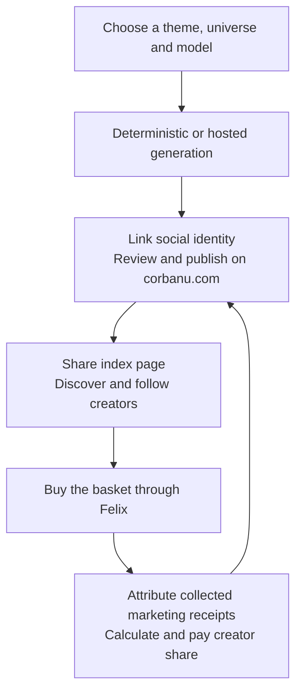
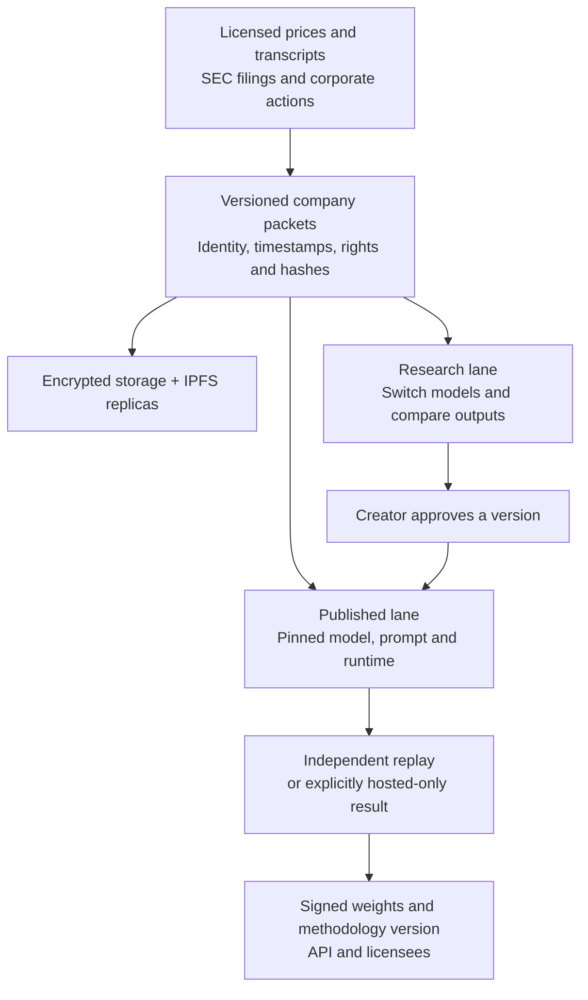
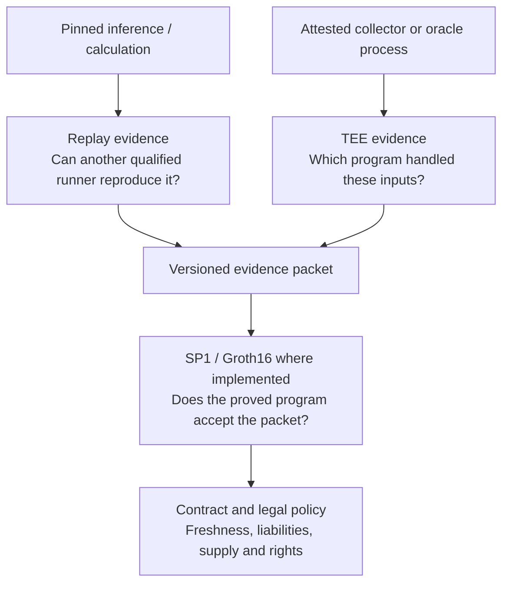
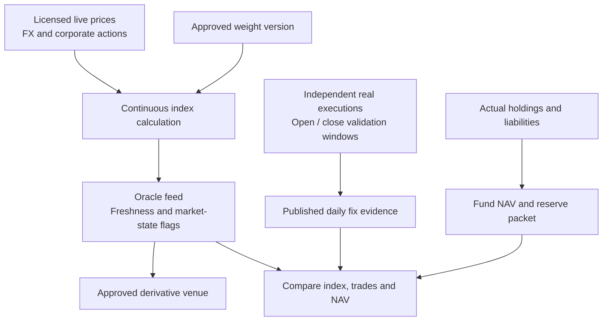
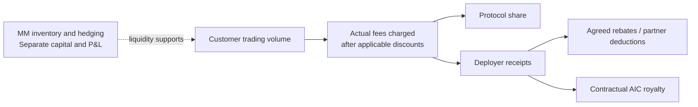
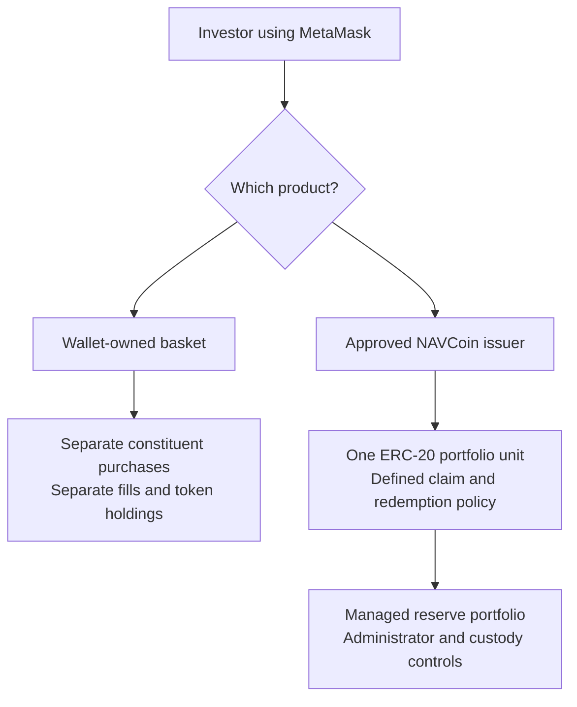
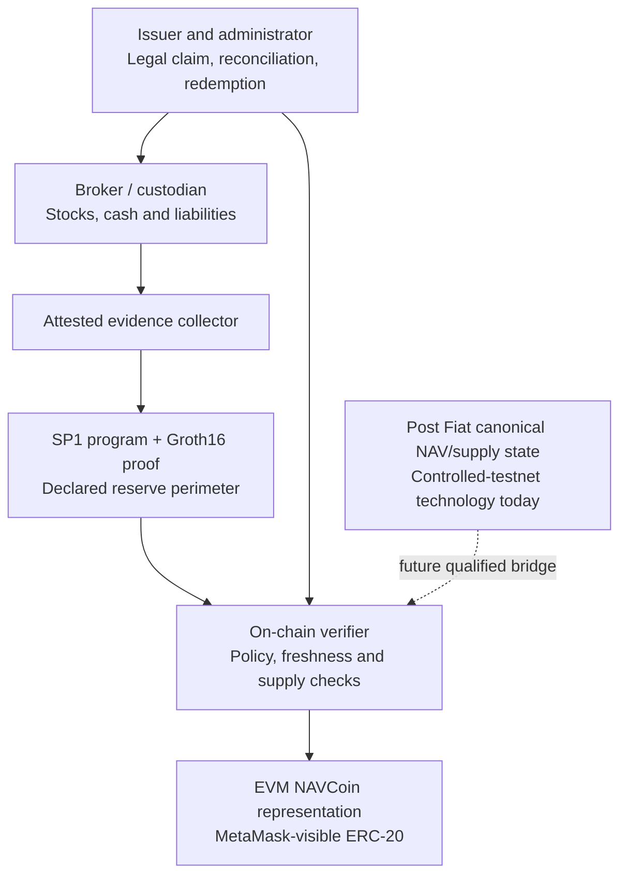
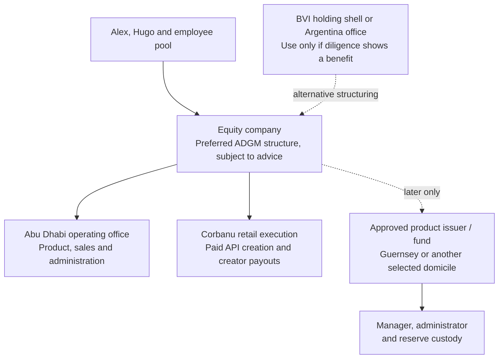

# Shell 1 · The AI Indexing Company

## Founder proposal for Alex and Hugo

**Retail V0 revision: 17 September 2026 · Research observations dated individually · Discussion draft · Commercial terms remain proposals, not agreements.**

### Decision brief

**Build an equity-owned index company whose V0 is a retail product hosted on corbanu.com.** Anyone can begin with a theme, generate an index, link it to their social identity, choose deterministic or non-deterministic generation, and publish a page they can share. Other users can buy that index’s supported basket through a single Felix purchase flow. Each index has an attributed marketing-P&L account that pays its creator a disclosed share. **Level 1a monetizes that same infrastructure immediately: users pay per thematic index creation through their funded Corbanu API key.** This is usage-based API revenue, not an institutional sales-led product.

The mission is to make financial indices easier to create, understand, verify and use. AI can turn unstructured company information into explicit selection rules and weights. The long-term vision is to turn a tradable idea into accessible exposure with minimal friction. The first product turns creation and sharing into distribution: useful indices attract buyers, attributable marketing economics fund creator payouts, and creators have a reason to publish more useful work. The verifiable fine-tuned model supports the revenue ladder below: free research access to the licensed model contribution, paid Corbanu API execution, and paid rights for external commercial tradable-index use.

**Alex contributes product, existing methodology, engineering leadership and distribution. Hugo contributes company formation and administration, commercial partnerships, capital formation and access to Flare infrastructure.** Post Fiat licenses relevant NAVCoin technology; Flare supplies a separately specified attested-compute service. Neither parent company, community, treasury nor token becomes an asset of AIC by implication.

**Launch the retail create–share–buy–earn loop first; develop a partner-perp opportunity alongside it.** Hugo is right that a successful perp needs dependable weights, a defensible price oracle and a venue with liquidity. Those are distinct deliverables. An existing deployer can supply the venue and stake while AIC supplies the branded index. The current 500,000-HYPE requirement makes operating a new HIP-3 DEX a capital business, not a small extension of an API startup.

**Proposed initial deal:** Alex up to 48%, Hugo up to 32%, employee option pool 20%, fully diluted before outside financing. Founder allocations combine time-vesting shares and measurable contribution tranches. Infrastructure access alone does not earn an unconditional ownership grant. An independent director certifies disputed milestones and related-party terms.

**Proposed working arrangement:** one engineer based in an Abu Dhabi office, with founders committing scheduled in-person product and commercial sessions. Post Fiat remains Alex’s main effort; Flare remains Hugo’s main effort. The company must function with those constraints. Argentina is the alternative office if recruitment and total cost materially improve, not a route around financial regulation.

**Initial delivery scope:** Level 1 retail spot execution and creator payouts on corbanu.com; Level 1a metered thematic creation billed through Corbanu API keys; and the verifiable fine-tuned-model release and license workstream. Funded launch requires the venue, data and creator-program permissions described below. A company token, customer custody, a proprietary exchange and a live NAVCoin are separate future decisions.

**What must be resolved before signing:** parent-IP permissions; founder commitments and earn-in; initial cash; company domicile and operating permissions; Tiingo/transcript rights; Felix affiliate and creator-payout terms; and Hugo’s acceptance of Post Fiat’s competitive XRP narrative.

### The business model: seven defined revenue streams

| Level | What the user buys or does | How the indexing company earns |
|---|---|---|
| **Level 1 — Spot execution** | Log onto corbanu.com, connect a wallet, create or select an index, and get filled on its underlying spot basket through Felix | Collected affiliate/retailer economics attributable to the index are split between the creator beneficiary and AIC |
| **Level 1a — API revenue** | Pay per thematic index creation through the Corbanu API, using a funded corbanu.com API key | A metered index-creation charge; distinct from affiliate revenue on subsequent trades |
| **Level 2 — Synthetic spot ETF execution** | Buy one spot NAVCoin representing the index, instead of buying all constituent spot positions | The NAVCoin series’ disclosed product economics: agreed origination/redemption, management or licensing fees, with the chosen schedule explicit before launch |
| **Level 3 — Perpetual swap listings** | Trade a perpetual swap on a listed index | The negotiated index/deployer revenue share or listing license described in the venue agreement |
| **Level 4 — Auto-rebalanced UltraShort perp indices** | Buy a maintained index product built from short perpetual-swap exposures | The series’ disclosed index/product fees; funding and trading P&L remain portfolio economics unless expressly part of an agreed fee |
| **Level 4b — Auto-rebalanced YOLO options indices** | Buy a maintained options-index product with automatic strategy rebalancing | The series’ disclosed index/product fees; option trades, rolls and reserve maintenance implement the product |
| **Level 4c — Leveraged bond indices** | Buy a leveraged bond-index product, such as a **leveraged datacenter bond index** | The series’ disclosed index/product fees, with financing costs separately accounted for |

**These are the revenue streams.** Levels 1 and 1a launch the retail business; the following levels expand what users can buy. The precise fee rates and partner splits remain commercial terms to negotiate.

The critical distinction is what the customer holds: **Level 1 holds the basket’s separate spot assets; Level 2 holds one spot NAVCoin; Level 3 trades a perp; Levels 4/4b/4c package maintained strategy exposure.** Corbanu supplies the retail front end. The API and verifiable model are shared production infrastructure and monetized access to that infrastructure.


---

## 1. Why this collaboration should exist

Alex can build and market an index API without Flare. Hugo has explicitly acknowledged that FCC is unnecessary for basic index licensing and copy trading. The collaboration is valuable if Hugo turns Alex’s retail product and distribution into a functioning creator economy: venue economics, data rights, payout operations, legal setup and capital, followed by product TVL and institutional distribution.

The offer should therefore be reciprocal: Alex is not giving away ownership for a mandatory hosting dependency; Hugo is not underwriting an open-ended engineering project with no deliverables. AIC earns its existence through three combined advantages:

1. **A product already in motion:** Corbanu’s research surface, index creation workflow, data packets and distribution.
2. **A commercial operator:** a founder accountable for legal setup, data deals, venue agreements, creator-payment operations and capital.
3. **A route from index to investable product:** verified computation, licensed data, qualified oracles and eventually Post Fiat NAVCoin reserve and supply controls.

AIC’s defensibility will come from licensed company data, quality of methodology, useful products, operating history, brands, customer relationships and execution. A downloadable model or a TEE is not, by itself, a durable commercial moat.

### Existing competitors set a real bar

| Existing offer | What it means for AIC |
|---|---|
| **Solactive ARTIS:** client-accessible NLP thematic stock selection; Solactive describes deterministic output and use in more than 100 ETF indices | “AI builds an index” and “same input, same output” are not sufficient differentiation. Test whether inspectable model/input manifests, fast model comparison and tokenized-instrument mapping are materially better for the chosen customer |
| **Indxx:** custom index development, calculation, benchmark administration and corporate-action services | AIC competes with an operating service, not a spreadsheet. Buying administration or shadow calculation may be smarter than recreating it |
| **Felix/Ondo and venue operators** | They already solve parts of exposure and distribution. AIC must improve index selection, evidence and all-in execution while preserving those integrations |

These descriptions follow [Solactive’s ARTIS page](https://www.solactive.com/artis/) and [Indxx’s service offering](https://www.indxx.com/index-services). They do not establish comparative prices or independent performance. Request equivalent-scope quotes and ask design partners which existing process they would replace. **The differentiated hypothesis is a transparent, agent-friendly path from company evidence to a maintained, licensable index and eligible on-chain exposure—not that thematic indexing or deterministic NLP is new.**


*Figure 1. A joint business with explicit boundaries. Technology and distribution are contracted contributions, not transfers of the parent businesses.*

### What belongs to AIC—and what does not

| Inside the proposed company | Retained outside the company |
|---|---|
| New AIC index-product code, customer contracts, licensed branded-index revenue, AIC-owned fine-tunes where rights allow | Pre-existing Corbanu, navstrategies, Post Fiat, Flare and third-party IP |
| Index-attributed marketing receipts and creator payout pool; model/index licenses; agreed oracle and product royalties | General Corbanu advertising, sponsorship and unrelated editorial revenue |
| New engineer’s work within the agreed AIC scope | Alex’s general trading P&L, unrelated strategies and Post Fiat token holdings |
| Contractual rights to approved parent technology and brands | Control of Post Fiat/Flare networks, treasuries, roadmaps or public narratives |

**Corbanu.com is the V0 product home**, as well as a research/content franchise comparable in ambition to Citrini. Its index pages, creator profiles and buy flows are the consumer surface of AIC. General Corbanu advertising and editorial revenue remain outside AIC; the specific marketing/affiliate receipts attributable to an index are assigned to its creator-program pool by written agreement. An index sponsorship enters that pool only if its contract explicitly says so. The existing exclusion of general ad revenue must not erase the new creator-payout product.

## 2. What already exists

This assessment combines fetched repository heads, explicitly identified local work, public product configuration and Post Fiat research. It is not a new production qualification. Dirty repositories were preserved; remote changes were fetched without resetting local work. Evidence details are in Appendix A.

| Asset | Evidence available now | Boundary that matters commercially |
|---|---|---|
| **Corbanu Index API and website** | Preview, confirmation, locking, claims, publishing, firm quotes and wallet submission; model selection includes GLM 5.3, GLM 5.3 Flash and DeepSeek V4.1 Flash | Public catalog says deterministic execution unavailable, funded fills unverified and creator revenue unconfigured. Current zero-price generation is not demonstrated unit economics |
| **SEC and company packets** | SEC submissions/CompanyFacts and post-earnings collection; normalized share/class data; full cached transcripts where available; signed immutable packets | SEC filings are not earnings-call transcripts. Access to a cache does not establish rights to redistribute or train on it |
| **Tokenized universe adapter** | September 9 local evidence: 444 listings, 328 stocks with ready capitalization inputs, 443 prices, 853 transcripts covering 313 stocks | A dated snapshot, not current universal coverage. Fifteen stocks lacked transcripts. ETFs/listings and unique underlying companies are different counts |
| **IPFS publication** | Signed IPNS pointer to immutable IPFS packets; encrypted transcript bodies; owned replicas and external pinning | Integrity comes from content addressing and signatures; continued availability requires maintained replicas and key recovery |
| **Replayable Qwen indices** | August 15 research reports 2,552 successful tested replays; the August 27 agentic-index demonstration reports 4,000 cross-H200 replay receipts over four 1,000-company runs | Separate experiments, not counts to add together; neither qualifies arbitrary GPUs, models or prompts |
| **DeepSeek V4.1 Flash research** | Hosted generation works; tokenizer, packet and reconstruction work exists locally | The new GPU replay lane is not qualified. Fine-tuning does not automatically make inference deterministic |
| **Options proof workflow** | September 6 evidence joins private brokerage data, Nitro collection and SP1/Groth16 proofs for MU/NVDA research baskets; verified on a local four-validator environment | No orders, investor issuance or external production deployment. Historical proving took tens of minutes per basket |
| **NAVCoins** | Historical small Ethereum a651 deployment; reserve/supply primitives and private-swap research in Post Fiat L1 V2 | V2 remains controlled testnet. No assumption of a production cross-chain supply bridge or legally complete new AIC fund |

The live catalog observation was captured at **23:46 UTC on September 16, 2026**. Its distinction between hosted output and deterministic output should become customer-facing product language. See the [Corbanu catalog](https://api.corbanu.com/v2/indexes/catalog), [deterministic-index research](https://postfiat.org/blog/deterministic-financial-indices/), and [trustless single-stock options research](https://postfiat.org/blog/trustless-single-stock-option-indices/).

## 3. Retail V0: create, share, buy and earn

### The user and the experience

V0 serves **retail creators and the people who follow their ideas**. A creator might describe “companies building the AI power grid,” generate candidate holdings, refine the theme, link an X account, and publish a branded index page. A reader arriving from a shared link can inspect the idea and buy the supported basket through Felix. The creator earns from that index’s attributable marketing P&L. An institutional procurement process is not the entry point.

The product lives on **corbanu.com**, using the existing Corbanu Index API for generation, versioning and execution preparation. **Index generation is metered under Level 1a:** the user pays per thematic index creation with a funded Corbanu API key. The interface shows the creation charge and available credit before starting. Publishing, sharing and trading attribution are distinct operations; no enterprise subscription or procurement process is required. A sponsored creation allowance can be offered explicitly, but is a subsidy rather than the business model.

### The complete creator and buyer journey

1. **Create from a theme.** Enter a name, thesis and preferred universe; choose a model; inspect the proposed constituents, weights and evidence. The creator controls the methodology choices. No hidden portfolio rules are introduced.
2. **Choose the generation mode.** Select **Deterministic / verifiable** for a qualified pinned model/runtime with replay evidence, or **Hosted / non-deterministic** for flexible model generation without a replay guarantee. Both modes can produce published, executable indices once the relevant flow is qualified. The mode is visible on every index page.
3. **Link a social identity.** Verify control of an optional social account through the provider’s supported authorization/proof flow. Show the account, creator name and payout identity on the profile. Linking an account neither proves expertise nor authorizes automatic posting.
4. **Preview and publish.** Review holdings, supported buy coverage, methodology, costs and creator compensation. Publish a permanent shareable URL, social preview card and immutable version identifier. Drafts remain private until the creator publishes.
5. **Share and discover.** Share to X or another social channel; readers can follow the creator, browse themes and compare indices. Performance displays distinguish historical simulations, published-index performance and realized investor results.
6. **Buy through Felix.** Select an amount, review the basket quote and total costs, and confirm one coordinated purchase flow. Eligible, onboarded users should not have to reconstruct and enter every constituent manually. The interface records partial fills and remaining cash.
7. **Earn and return.** Each index’s creator dashboard shows attributable receipts, permitted cost deductions, pending adjustments and settled payout. Creators return to improve their published work, explain updates and reach new buyers.



*Figure 2. The retail loop is the V0: creation creates distribution, purchases create attributable economics, and creator payouts encourage participation.*

### What “one click” means

The product promise is **one buy action on the shared index page**, carrying the chosen basket and budget into Felix. It is not a promise of one blockchain transaction or the removal of necessary account checks. First use can require eligibility checks, Felix onboarding, wallet connection, funding, allowance approvals and signatures. The current integration can execute constituents separately; settlement can be partial. Show the full state and let the buyer explicitly approve any changed quote or composition.

The aspiration is that anyone who discovers an index can use the same simple flow. Actual trading is available to users and instruments supported by Felix and the applicable access rules. Unsupported constituents must be disclosed before confirmation; never silently turn an unavailable basket into a different portfolio. Research-only indices can still be published and shared, with the buy action clearly unavailable. [Felix account and execution mechanics](https://usefelix.gitbook.io/docs/trading-products/spot-equities).

The observed catalog currently gates external funds on deterministic execution and reports funded fills unverified. **That is an existing implementation limit, not the proposed product policy.** To enable hosted/non-deterministic indices for buying, qualify a path that binds the buyer’s approval to a frozen published output, quote and version. Do not simply remove the guard. Choosing a mode must not let a creator retroactively alter a basket already approved for purchase.

### Creator payouts from index marketing P&L

Every published index has a stable attribution ID and a creator beneficiary. Its creator-program terms define the share rate before monetization. Free, unpublished or untraded indices can accrue zero; publishing is not a guaranteed payment.

**Proposed accounting definition, subject to the commercial agreements:**

```text
Index marketing P&L
  = collected, contractually attributable marketing/affiliate receipts
  - refunds, reversals and documented directly attributable external costs

Creator payout
  = disclosed creator share × max(0, settled index marketing P&L)
```

“Receipts” can include an agreed Felix retailer/affiliate payment, a distribution partner payment or an explicitly included index campaign. Felix’s customer origination fee is **not automatically AIC revenue**. There is no assumed revenue-share agreement or verified 20bp entitlement today. Buyer trading profits, the value of customer deposits and a hypothetical token price are not marketing P&L.

Cost deductions are specified in advance: partner pass-throughs, attributable refunds, approved campaign spend and directly metered costs where the creator terms permit them. General corporate salaries, unrelated Corbanu losses and discretionary overhead cannot be allocated to erase an index payout. Creator compensation itself is not deducted before calculating its own base. The creator share is a contractual variable, not an agreed number in this draft.

Illustration only: $100 collected receipts minus $20 approved direct costs leaves $80. A hypothetical 50% creator share pays $40 and leaves $40 for AIC. Neither the rate nor those receipts is a claim about Felix’s current terms.

Bind attribution to the index/version shown in the accepted buy quote and the resulting venue receipt, not merely a browser cookie or self-reported referral. One receipt funds one defined pool; a shared link and a fork must not both claim 100% of it. Proposed fork policy: a new publication gets a new ID, preserves source credit, and receives future attribution only for purchases of that new version. Any upstream royalty must be disclosed before publishing.

Provide a monthly statement and payout after the contract’s settlement/reversal window. Keep pending and settled balances separate, specify treatment of post-payment reversals, and retain a dispute trail. Apply controls for self-dealing, wash activity, duplicate identities and abusive attribution. Creators earn for genuine distribution and use, not cycling their own funds to manufacture rewards. Creator eligibility and payment information can require checks even when public browsing and index drafting do not.

### Coverage and deterministic choice

Start the executable experience with the supported tokenized-stock universe. Broader US and international equities remain creation/research targets as licensed data coverage expands. Every index page states which constituents can actually be bought through Felix. “Full US” and “full international” are objectives, not current coverage claims.

A deterministic index fixes the model weights, tokenizer, prompt, input packet, runtime and allowed update procedure. Publication follows a successful qualified replay; an unavailable verifier cannot produce a verified badge. A hosted index freezes the selected output and records provenance but makes no independent replay promise. Both preserve published versions. Model/mode changes create a new version with clear notice; neither mode quietly rewrites history or triggers an unapproved purchase.

### V0 acceptance and launch evidence

- **Creation and identity:** a retail user creates an index without an enterprise sales process, links a social account, previews and publishes a working share page.
- **Choice that means something:** both generation modes work under their stated guarantees; verification failures are visible; a frozen hosted output cannot mutate inside a buyer-approved order.
- **Purchase:** an eligible user arriving through the share link completes a funded Felix basket flow under explicit testing authorization; costs, failures, approvals, partial fills and receipts reconcile.
- **Creator economics:** the venue/marketing contracts establish a real receipt source; an attributed receipt reconciles to the index statement and an actual eligible creator payout. A simulated ledger is not a paid creator.
- **Repeat use:** measure creator activation, published indices, share-to-buy conversion, returning buyers, creator retention and repeat purchases—not institutional contract count.
- **Reliability:** maintain an observed 30-day record of scheduled index updates, visible stale/missing states, backup recovery and payout reconciliation. Set service deadlines per flow before measurement; a social page and a live purchase quote require different limits.
- **DOOM flagship:** GoodAlexander publishes the first recognizable index using the same page, share and buy experience. It can be discretionary and honestly labeled; its source brand/methodology rights remain explicitly licensed.

Track activated creators, published indices, funded buyers, repeat purchases, retained positions, settled creator payouts, affiliate receipts and paid API creations. Report Level 1 contribution after creator payouts separately from Level 1a generation revenue and compute/data cost. Do not count test wallets, employees or circular self-trading as retail adoption. Set numerical operating targets after measuring the existing funnel; institutional contract counts and invented enterprise price points are not V0 acceptance criteria.

### Changes to Hugo’s first MVP

| Proposed element | Retail V0 treatment |
|---|---|
| AI creation and index cards | Core: thematic creation, social identity, public pages, provenance and version history on corbanu.com |
| Copy trading | Core: one coordinated Felix basket-buy flow from a shared page |
| Deterministic-only updates | User chooses a qualified deterministic or clearly labeled hosted index; each published version remains fixed and buyer-approved |
| Popular indices become perps | Later expansion after oracle, venue, liquidity and legal acceptance |
| Upload everything to FCC | Qualify FCC for the roles it usefully performs; retail creation is not dependent on universal FCC hosting |
| Tokens or staking for ranking | V0 incentives are index-attributed creator payouts; no creator coin or company token is required |
| Private research | Supported before publication; executable public pages disclose holdings/methodology and compensation as required |

## 4. How the revenue ladder works

### Level 1: spot index execution and affiliate P&L

The first financial product is buying the underlying spot basket. A user logs into corbanu.com, connects a wallet, creates or chooses an index and is routed to fills through Felix. Sharing a creator’s index distributes that same executable basket. The platform records the creator beneficiary, index version, accepted quote and resulting venue receipts.

AIC and the creator split the **actual affiliate economics** earned from that activity. The payout ledger in §3 distinguishes gross partner receipts, agreed direct costs, settled profit and each beneficiary’s share. This revenue is neither the buyer’s investment return nor ownership of Corbanu’s general advertising business. The fee/split contract must exist before the app advertises an earned payout.

A systematic limit-order entry system can improve the Level 1 fill experience. It is execution technology within the retail business: compare all-in fees, spread, gas, missed fills, drift and completion time. It does not replace the index or create a new revenue level. Order types and routing are deployed only after the supported venue flow is qualified.

### Level 1a: pay-per-creation thematic API

Users fund a Corbanu account and authorize requests with its API key. Each requested thematic index creation has a disclosed price or accepted maximum cost; the service reserves the relevant credit, performs the generation and settles the charge to a durable job/receipt. Retries of the same idempotent job must not become new paid creations. The price contract states what counts as completion, how cancellation/failure is treated and when unused reservation is released.

Model selection and the universe can affect the quoted creation cost. An explicit new generation or update can incur a new charge; viewing, sharing or buying an already published index must not silently regenerate and rebill it. Wallet trading funds and Corbanu API credit are separate balances.

This stream has its own economics:

```text
Level 1a revenue = settled paid index-creation charges
Level 1a contribution = that revenue - attributable inference/data/serving costs
```

The API key is the credential authorizing use of funded credit; the key itself is not money. The product should nevertheless feel like the existing Corbanu API experience: fund the key’s account, create an index, receive its output and charge receipt.

### Level 2: synthetic spot ETF execution through NAVCoins

Develop NAVCoins as basic index primitives. The retail user buys **one spot NAVCoin outright**, representing the maintained index, instead of separately acquiring every underlying position. The NAVCoin can hold the required basket in its reserve structure and represent net portfolio value under the published policy.

“Synthetic spot ETF” describes the intended ETF-like user experience; it is not a claim that the token is already a registered exchange-traded fund. Define the series’ investor claim, reserve custody, valuation, supply, redemption and fee schedule. Do not imply that Level 2 necessarily uses a derivative backing: a stock index NAVCoin can be backed by actual spot assets. §9 explains the proof and MetaMask overlay.

AIC earns the contracted product economics. Choose and disclose which origination/redemption, management and/or index-license fees actually apply; do not stack unspecified charges. Market making or execution rebates are additional receipts only where a real agreement provides them. A secondary token trade does not necessarily mint/redeem shares or create an origination fee.

### Level 3: perpetual swap listings

List indices as perpetual swaps through a qualified venue/deployer. AIC supplies the index/methodology and agreed oracle responsibilities; a partner can supply the HIP-3 deployment, stake and market infrastructure. Revenue is the contracted share of deployer receipts or index-license fee. §8 distinguishes this from HYPE staking capital, market-maker capital, customer funding payments and gross trading volume.

### Level 4: auto-rebalanced UltraShort perpetual-swap indices

Create index products whose defined short-perp exposures are automatically rebalanced. The consumer acquires the maintained exposure rather than manually managing all underlying short positions. The product can use a NAVCoin representation where appropriate; it is not the same as simply listing an index perp under Level 3.

Specify the target exposure, rebalance trigger, collateral, funding, liquidation and unwind policy for each series. AIC earns disclosed index/product fees. Negative funding or a profitable short position is not automatically company fee revenue. Existing [UltraShort research](https://postfiat.org/blog/trustless-ultrashort-tokens/) is the starting design evidence, not a production launch.

### Level 4b: auto-rebalanced YOLO options indices

Create options-index products that maintain and automatically rebalance their defined options exposure. Single-stock YOLO call indices are an initial expression of the existing research. The user buys the maintained product rather than researching and manually rolling each option.

AIC earns the agreed index/product fees. The product must implement its stated options methodology, execution, rolls, valuation and reserve proof; no new strike, expiry, weighting, leverage or risk rule is invented by this proposal. Fully paid options can still lose their entire premium. The existing TEE/proof work and market sizing support development, not a claim that live options issuance is qualified.

### Level 4c: leveraged bond indices

Create maintained leveraged bond-index products. A **leveraged datacenter bond index** is the concrete proposed example: exposure to the defined datacenter-related bond universe, with leverage and financing specified in its methodology.

AIC earns the product’s disclosed index/management/origination economics as agreed for that series. Before launch, define bond eligibility, prices, interest accrual, duration, credit events, financing, collateral, liquidity, leverage and rebalance policy. Those parameters are not set here. Financing cost and losses belong in investor NAV; they cannot be omitted to make an index’s apparent return attractive.

### Distribution and shared technology

The GoodAlexander DOOM Index is the flagship for Level 1 adoption and can later support other levels. Publishing indices on Bloomberg is Hugo’s distribution/BD workstream for the relevant product, not a replacement for retail V0 or a separate invented revenue level. [Bloomberg index licensing](https://www.bloomberg.com/professional/products/indices/resources/index-data-licensing/).

The Corbanu API, SEC/transcript packets, IPFS evidence, replayable model releases, FCC and Post Fiat reserve technology are shared capabilities. Their responsibilities and proof limits follow below. The company is paid for the seven streams above; technical infrastructure is valuable insofar as it makes those streams useful, reliable and economical.

### Market opportunity without inflated TAM

OCC reports **8.27 billion equity-option contracts in 2025, up 26.8%**, alongside 5.68 billion ETF-option contracts. That demonstrates activity, not the revenue available to AIC. [OCC 2025 volume](https://www.theocc.com/newsroom/views/2026/01-05-occ-annual-2025-and-december-2025-volume).

The existing Post Fiat market-sizing work provides a more specific comparison:

| September 2026 research snapshot | NVDA | MU | Combined |
|---|---:|---:|---:|
| ATM/OTM call premium represented by open interest | $3.626bn | $4.419bn | **$8.045bn** |
| Associated underlying notional | $84.988bn | $57.295bn | $142.284bn |
| Tracked on-chain perp open interest | $359.3m | $428.3m | $787.5m |

The calculation uses contract open interest × 100 × quoted option midpoint across returned expiries. Much of the premium sits in long-dated contracts; positions may hedge other exposures. These are dated stock measures, not annual flows, investable demand or fee revenue. [Options research and downloadable evidence](https://postfiat.org/blog/trustless-single-stock-option-indices/).

For planning, **$10m / $50m / $100m of retained product assets at a hypothetical 50bp annual fee generates $50k / $250k / $500k gross annually**. Data, administration, custody, market making, distribution and legal costs come out of that. Options complexity might support higher fees, but high margin is a hypothesis to test with issuer quotes and roll-cost evidence. Leveraged bond indices need their own demand research; this draft does not invent a bond-market TAM.

## 5. Data, models and replayability

### Build on the SEC and packet work

The relevant local SEC work lives in **navstrategies**, including its SEC historical fundamentals contract, post-catalyst release pipeline and Felix company-packet publisher. A historical campaign records 5,411 issuer outcomes and 147,371 quarterly rows, with material missing coverage and production qualification still pending. It does not create a survivorship-free global stock database.

The September tokenized-equity packet work combines listing identity, SEC-derived share counts, capitalization conversions, current prices and transcript references. The IPFS publication layer makes a particular input set identifiable later. It should preserve permission boundaries: a public index can disclose source identities and hashes while restricted transcript text remains encrypted for licensed readers.

**Proposed Tiingo discussion:** consolidate US/international pricing and corporate actions; establish derived-index, display, oracle, replay-verifier and training rights; document exchange pass-through fees and service terms. Alex reports an existing proprietary relationship, but exclusivity, sublicensing and AIC’s rights remain unexecuted. Tiingo has operated Chainlink equity-data services; the claim that it is “one of the largest” was not established by the reviewed primary evidence. [Tiingo’s equity node](https://www.tiingo.com/blog/tiingo-launches-live-chainlink-equity-price-node/).

An existing **unsigned white-label Tiingo draft** was also recovered from fetched `navstrategies origin/master`, at `docs/legal/drafts/tiingo_corbanu_white_label_api_agreement_draft.md`; its local working-tree copy had been deleted. It covers specified EOD/IEX data, limits customer use and onward distribution, excludes several other datasets, and does not promise an SLA. It is evidence of prior deal work, not an executed grant or authority to sell an oracle. AIC needs explicit amendments for licensed-index use, live oracle publication, verifier access, retention and any training rights. Transcript sourcing requires a separate rights schedule. Preserve this distinction even if the commercial relationship is strong.

**Ondo pricing:** its API supports real-time price and quote workflows, but direct purchaser access involves onboarding. Current local work uses the Felix/Ondo public-price path; direct Ondo execution is not enabled in the observed Corbanu catalog. Underlying stock price and the token’s dividend-adjusted price are distinct fields. [Ondo API](https://docs.ondo.finance/api-reference/overview).



*Figure 3. Rapid experimentation and stable published indices are separate modes of the same product.*

### Replayability is an operating contract

SGLang provides a serving environment. Exact replay additionally depends on model weights, tokenizer, quantization, kernels, hardware, batching, prompts and input bytes. The Post Fiat research demonstrates this for specified configurations and separately investigates cross-hardware replay. Neither result licenses a generic “all AI is deterministic” claim. [Financial-index replay](https://postfiat.org/blog/deterministic-financial-indices/) and [cross-hardware work](https://postfiat.org/blog/sglang-cross-hardware-replay/).

A live index should publish a manifest identifying all material versions. Model changes create a new approved methodology version with notice and an effective time. If a scheduled AI refresh fails, the previously disclosed fallback applies: hold existing weights, flag stale status or suspend the dependent product. Silently switching models is prohibited.

### Verifiable fine-tuned generation supporting the revenue ladder

Alongside the execution levels and Level 1a API, AIC ships a named model product with a release and license contract: **a company-knowledge fine-tune for generating indices that can be independently replayed**. It serves the Corbanu creator interface and developers who want to build their own index products. DeepSeek V4.1 Flash is the proposed base to evaluate; it is not yet a qualified deterministic fine-tune.

A release package includes the base-model/license identity, AIC-owned fine-tune or adapter, tokenizer and weight hashes, a licensed company-knowledge manifest, the SGLang/runtime image, supported hardware/batch configuration, test vectors, evaluation results and a verifier runner. Every generated index binds its published weights to that release and its actual input packet. Replay checks the exact output; a signature alone cannot replace replay.

The deliverables are (1) a rights-cleared training set and baseline evaluation, (2) a bounded fine-tuned candidate, (3) independently reproduced index-generation outputs on the declared runtime, and (4) a usable free/commercial license package with registration and reporting. Measure held-out company/date accuracy, citation quality, leakage, stability, index-construction usefulness and cost. The retail app can start with currently qualified base models and hosted options while this product is qualified; do not present a base-model demo as a shipped fine-tune.

Thomson Reuters’ **Thomson technical report** is a concrete precedent for continued training of an institution-controlled model. It identifies Qwen3.5-397B and Qwen3.6-35B bases, full-weight updates, data curation and professional evaluations. It estimates under **$450,000 for the final large-model training run**, but approximately **$40m for total development**, including reusable research, infrastructure, staff and partners. These are the authors’ reported costs, not AIC quotes. The lesson is to build rights-cleared data, evaluations and a repeatable release process before scaling training; it is not that a $450,000 budget recreates Thomson. The report does not establish DeepSeek index performance or exact replay. [Thomson technical report, introduction, pp. 2–3](https://www.thomsonreuters.com/content/dam/ewp-m/documents/thomsonreuters/en/pdf/reports/thomson-technical-report.pdf).

### Free access; paid commercial index use

The commercial principle is **free research access to the model contribution, paid hosted index creation under Level 1a, and paid licensing for external commercial tradable-index use**. “Free model” describes the license allowance for research; it does not promise free hosted compute or free Corbanu API generations. Proposed license classes make that usable:

| Use | Proposed treatment |
|---|---|
| Learning, local evaluation, non-commercial research and independent verification | Free model/adapter license, subject to the upstream license and applicable data rights; users provide their own compute, or use a displayed hosted free allowance |
| Retail creation through Corbanu | Pay the Level 1a per-creation API charge using funded Corbanu credit. The platform agreement also covers the necessary model rights; no separate surprise model royalty is added to the creator’s payout |
| Buying an existing Corbanu index | Level 1 affiliate economics apply to the fill. Buying must not trigger a second index-creation charge or an undisclosed duplicate model royalty |
| External service or operator using the AIC fine-tune to generate, maintain, sell or execute real-money index portfolios, including fee-free products | Commercial license required before activation; register the deployment and index IDs and agree the usage/royalty schedule and reporting |
| Redistribution of the AIC fine-tune, adapters or restricted company material | Allowed only to the extent expressly granted; preserve required notices and downstream terms. Base-model freedoms remain intact |

A commercial trigger is tied to **use of the licensed AIC contribution**, including its covered derivatives, to operate a tradable index or provide that capability to others. It is not a claim to royalties on all indices, every independently written model or the permissively licensed base checkpoint. Personal offline experimentation remains free; when a generated index is put into actual commercial/real-money service, the applicable platform or external license must cover it.

For external users, propose a published schedule using metered production generations/updates, with an alternative contracted product royalty for issuers. The exact rates need cost measurements and signed terms; no invented Kimi royalty is inserted here. Registration records the model release, index/deployment identifiers, customer operator, reporting period and permitted uses. Contracts specify audits, cure periods, termination, existing-product continuity and limits on sublicensing. Hashes establish which artifact ran; they do not automatically collect money or make an off-platform contractual restriction self-enforcing.

This implements the desired free-adoption/paid-use business model. **Kimi is a commercial analogy, not the legal template:** the reviewed Kimi K2 modified-MIT license contains a large-scale attribution condition, not a tradable-index royalty. A field-of-use restriction should be called **source-available or dual-licensed**, rather than OSI open source. Counsel must confirm AIC can license the fine-tune/adapter and that training-data permissions allow its release. [Kimi K2 license](https://huggingface.co/moonshotai/Kimi-K2-Instruct/blob/cc613312db6692a12f650552166d3bf1d09e936a/LICENSE); [Open Source Definition](https://opensource.org/osd).

Authorized verifiers need the exact weights, runtime and permitted inputs for the replay claim being offered. Public model availability does not authorize publication of licensed transcripts. Where data access is restricted, state who can reproduce the index and under what license. Fine-tuning adds company knowledge; **runtime qualification provides replayability**. Neither eliminates the other workstream.

## 6. What FCC adds—and what it does not

Hugo’s revised argument is strongest for an oracle operating over time: registered execution, attested code, secret management and recoverable service operation can reduce reliance on one operator. Those services have commercial value if they are demonstrably available and supported.

Flare’s current developer material describes FCC’s attested container architecture, provider coordination and key handling. Its FAQ still describes a developing availability path rather than a generally available, fully qualified production service. AIC should obtain a written deployment/SLA statement for the exact network and service. [FCC overview](https://dev.flare.network/fcc/overview), [TEE keys](https://dev.flare.network/fcc/tee-keys), [availability FAQ](https://dev.flare.network/support/faqs).

| Question | AWS Nitro route | FCC route | AIC requirement |
|---|---|---|---|
| Is execution attested? | Yes: measurement-bound attestation rooted in AWS Nitro | Attested workload plus Flare’s registration/coordination architecture | Independently verify the exact approved image and output identity |
| Does a crash preserve enclave memory? | No; persistence/recovery must be designed around encrypted external state | Key/state mechanisms help, but application recovery still needs qualification | Restore an approved state without accepting rollback |
| Is availability automatic? | No; operator supplies redundancy and recovery | No; service architecture may reduce work but still needs measured operations | Prove failover, deadlines, alerting and operator coverage |
| Does it prove prices or custody are truthful? | No | No | Licensed inputs, provenance, independent checks and legal custody controls |
| Can it run our GPU model unchanged? | Not established by existing work | Not established by existing work | Do not represent outside-TEE inference as inside-TEE inference |

Filip is correct about Nitro’s intentionally restricted storage and networking, but that does not mean reliable persistence is impossible or that Nitro lacks attestation. Encrypted, authenticated state can be stored outside the enclave; key-release policy and rollback protection must be designed. FCC’s cloud trust assumptions also remain relevant. [AWS enclave concepts](https://docs.aws.amazon.com/enclaves/latest/user/nitro-enclave-concepts.html), [AWS attestation-conditioned keys](https://docs.aws.amazon.com/kms/latest/developerguide/conditions-attestation.html), [Google Confidential Space](https://docs.cloud.google.com/confidential-computing/confidential-space/docs/confidential-space-overview).



*Figure 4. Replay, attestation, a zero-knowledge proof and an investor’s legal claim answer different questions. None substitutes for the others.*

### A bounded FCC engagement

Propose a 30-day technical qualification alongside the retail launch. **Hugo must secure a named Flare/FCC implementation engineer and service owner; no Flare staff time is assumed committed.** Flare’s proposed contribution supplies the environment, pricing, verification instructions and incident responsibilities. AIC’s engineer integrates the narrow oracle/packet interface within a separately agreed work allocation. If that staffing or access is unavailable by day 15, postpone the FCC experiment and continue the API. The same engineer is not expected to independently rebuild a production oracle network.

Acceptance should include independent verification of the approved image; restart and restore; stale-input rejection; key compromise response; anti-rollback checks; a missed-weight-update exercise; and failover across the failure domains actually offered. AIC compares this result with the existing Nitro implementation on measured cost and operational burden.

An initial architecture can run qualified inference outside FCC and use FCC to verify approved weight artifacts and operate the oracle. That is useful, but must be described accurately. FTSO price feeds, FDC attestations and FAssets are separate Flare offerings; none is presumed to supply licensed global equity data or ownership of stock reserves. [Flare technical papers](https://dev.flare.network/support/whitepapers).

The contract should prefer FCC when it meets agreed acceptance, pricing and portability requirements. It should not make AIC’s entire API business exclusive to FCC or transfer unrelated Post Fiat engineering obligations to Flare.

## 7. The oracle and the daily-fix proposal

There are three distinct outputs:

1. **Index weights:** what the methodology says to hold at a defined time.
2. **Index price:** what the current basket is worth under a published pricing policy.
3. **Fund NAV:** actual reserve value minus liabilities, divided by valid shares, under the fund’s valuation policy.

They can differ because of cash, execution, fees, financing and stale markets. An index level is not proof that a fund owns the constituents.



*Figure 5. Executed fixes validate a pricing process. They do not replace a continuous oracle.*

Alex’s proposed 9:30 a.m. and 4:00 p.m. fixes should be stated as **America/New_York exchange times**, with daylight saving, holidays and early closes handled explicitly. A broker’s opening/closing auction participation or a specified execution window is more precise than promising an instantaneous trade. International portfolios need separate local-market and FX policies.

The current Felix documentation pauses mint/redeem activity around **9:29–9:31 and 15:59–16:01 Eastern**. Therefore the current route cannot be assumed to deliver the proposed exact-time executions. This is a material implementation choice: auction/broker route, another qualified venue or a disclosed nearby window. [Felix spot-equity mechanics](https://usefelix.gitbook.io/docs/trading-products/spot-equities).

For perps, an agreed policy must cover closed underlying markets, halts, missing constituents, corporate actions, FX, extreme divergence and fallback/settlement. Before deployment, the oracle acceptance sheet must contain numeric update cadence, maximum source age, quorum/coverage minimum and divergence bounds for each market state; this research proposal does not invent safe thresholds for an unselected venue. The venue’s designated risk operator must have explicit pause authority. Restart requires reconciled state, recovered sources and recorded approval under a tested procedure; the founder’s Telegram reassurance is insufficient. Changing weights requires a continuity adjustment so the rebalance itself cannot manufacture a jump in index value. A model update must not secretly redefine an existing leveraged contract.

Real trades are useful evidence but not an anti-manipulation guarantee. Tiny self-directed trades cannot set a benchmark simply because they occurred on-chain. Use independently sourced prices, precommitted execution rules, minimum liquidity tests and disclosed conflicts; do not let the derivative’s own price circularly establish its oracle without an explicit, reviewed design.

The oracle business needs a standalone agreement covering data rights, timing, liability limits, incident response, customer reliance and termination. Tiingo plus Post Fiat plus FCC is a plausible architecture, not a completed partnership or a production certification.

## 8. Perps: capital, liquidity and actual revenue

### The capital hurdle

The current HIP-3 documentation requires **500,000 HYPE per deployer DEX**, not per individual index. The first three markets avoid additional slot auctions; later slots use an auction. The retrieved staking section specifies a minimum 183-day period, while settlement language separately describes release after markets settle; confirm the exact current lock and exit mechanics before funding. Stake is slashable and does not supply market-making liquidity. [HIP-3 specification](https://hyperliquid.gitbook.io/hyperliquid-docs/hyperliquid-improvement-proposals-hips/hip-3-builder-deployed-perpetuals).

At the captured Hyperliquid midpoint of **$78.3205**, 500,000 HYPE is **$39,160,250**. This is capital at risk, not an annual license expense. At an illustrative 8% annual opportunity cost, it ties up roughly **$3.13m/year before any staking yield**. HYPE at $50/$80/$100 changes the capital requirement to $25m/$40m/$50m. The quote and arithmetic are archived with this proposal.

**Recommendation: license the first index to an existing deployer.** Consider a sponsored/crowdfunded deployer only after signed customer demand exceeds the added capital and operational burden. Obtain a current Kinetiq proposal rather than assuming a standard royalty or free stake. Distinguish access to an existing market operator from a financing product that funds a new DEX. [Kinetiq](https://kinetiq.xyz/).

### How much revenue can the venue share?

Hyperliquid’s published fee rules distinguish protocol receipts from deployer receipts. At the ordinary tier-zero rates, with deployer fee scale 1, the example taker pays 9bp total and the deployer receives 4.5bp. An eligible growth-mode market reduces this example to 0.9bp total and 0.45bp to the deployer. Discounts, maker trades/rebates, referrals and actual settings change the realized figure. Not every asset is growth-mode eligible. [Hyperliquid fees](https://hyperliquid.gitbook.io/hyperliquid-docs/trading/fees).

AIC should negotiate against **cash received by the deployer on AIC markets**, with auditable deductions. Funding payments are not automatically AIC revenue. Open interest, gross volume, product AUM and deposited collateral are different metrics.



*Figure 6. An index license earns a negotiated part of a defined revenue stream. It does not inherit the exchange’s entire economics.*

For illustration, assume growth-mode taker economics of 0.45bp to the deployer and **25% to AIC**:

| Monthly volume | Deployer receipts before other deductions | AIC share before its costs |
|---:|---:|---:|
| $100m | $4,500 | $1,125 |
| $1bn | $45,000 | $11,250 |
| $10bn | $450,000 | $112,500 |

These are sensitivity calculations, not forecasts or negotiated terms. Realized mixed maker/taker economics can be lower. At these assumptions, a stand-alone new DEX needs extraordinary scale to justify the stake’s opportunity cost; an index licensor can test demand with much less capital.

TradeXYZ’s S&P 500 product is an instructive commercial model because **S&P DJI formally licensed it in March 2026**. That does not reveal its license price, revenue split or prove an arbitrary new index will be accepted. AIC should seek the same separation of roles: benchmark licensor, market operator and liquidity providers. [S&P DJI announcement](https://www.spglobal.com/spdji/en/documents/index-news-and-announcements/20260318-spdji-licenses-sp-500-tokenized-perpetual-contracts.pdf).

### Where liquidity comes from

A perp order book needs market makers with hedge access, capital and acceptable oracle risk. The stake unlocks deployment; it does not create bids. Hugo’s venue term sheet should identify who quotes, minimum depth/spread expectations, inventory limits, hedge markets, closed-market behavior and the budget for rebates or guarantees.

Variational is a different model. Its Omni Liquidity Provider is the counterparty and operates an in-house market-making and hedging operation; the published material describes a USDC vault and an initial team-funded phase. It currently directs 20% of spreads to the protocol treasury, subject to change. “Zero trading fees” does not mean no execution spread. AIC would need a specific custom-index and risk arrangement, not assume permissionless listing. [Variational OLP](https://docs.variational.io/omni/the-omni-liquidity-provider-olp).

Variational’s RFQ design also includes quote acceptance and maker approval before settlement. Compare a binding RFQ spread and available size against an order book’s depth, fees and slippage; headline fees alone are insufficient. [RFQ mechanics](https://docs.variational.io/variational-protocol/key-concepts/trading-via-rfq).

### Felix as competitor and current distribution rail

Felix provides tokenized equity exposure through Ondo and already supplies part of Corbanu’s practical execution path. Alex reports a 20bp origination charge; the reviewed public page did not establish that current rate. Verify the contract fee and an actual eligible firm quote before printing a competitor price comparison.

AIC can compete on transparent coverage, better basket construction, model choice, provenance and implementation quality. It should not promise a larger executable universe merely by listing more research names. The current coverage is determined by actual supported instruments and legal access, not a generic global-equity database.

## 9. Tokenized indices and Post Fiat NAVCoins

### Two wallet experiences that must stay distinct

**Existing basket path:** MetaMask signs the approvals and Felix purchase transactions for supported constituents. The user receives separate underlying tokens. Trades may fill separately or fail partially. This is not an atomic purchase of a single AIC fund share. The current flow has synthetic/RPC test evidence, but its public configuration does not claim a qualified live funded purchase.

**Future NAVCoin path:** an eligible investor mints one transferable fund or portfolio unit under a defined legal claim. An issuer/manager holds the reserves, calculates liabilities and follows a mint/redemption policy. A smart contract constrains supply using accepted proof evidence. MetaMask is the wallet interface to the EVM token and contracts; it is not the custodian or the legal structure.



*Figure 7. Copy trading and a tokenized fund have different assets, risks and operating obligations.*

### How the proof stack would work

1. A brokerage or custody source supplies a portfolio snapshot through an approved collector. The collector’s measurement and output identity can be attested by Nitro or a qualified FCC implementation.
2. A specified program checks the supplied evidence, valuations, liabilities, freshness and policy. Where implemented, SP1 produces a Groth16 proof and public outputs that an on-chain verifier can check.
3. The NAV adapter accepts only the expected program/policy, data age and reserve perimeter. The supply controller applies limits before minting or redeeming.
4. Investors hold an EVM representation in MetaMask. If Post Fiat is the canonical ledger, cross-chain authorization and global supply accounting must be independently qualified before the representation relies on that bridge.



*Figure 8. Cryptographic evidence can constrain a portfolio token. The broker, legal claim and cross-chain boundary remain explicit.*

The proof does **not** establish that the broker cannot lie, that omitted liabilities do not exist, or that a private key cannot cause an off-policy withdrawal unless those controls are actually part of the enforceable perimeter. It also does not prove the quality of an AI investment decision. The existing options evidence is a proof of a specified evidence-handling/calculation process, not a proof of an entire large language model inside Groth16.

The historical Nitro/SP1 options workflow took roughly 83 and 42 minutes for its two baskets. This is useful reserve/rebalance evidence; it is unsuitable as the sole tick-by-tick pricing mechanism. FCC attestation does not automatically replace this proof. [Options TEE research](https://postfiat.org/blog/trustless-single-stock-option-indices/), [NAVCoin collateralization](https://postfiat.org/blog/navcoin-collateralization/), [counterparty boundaries](https://postfiat.org/blog/navcoin-counterparty-risk/).

### Two reserve models

| Model | Benefits | Conditions before launch |
|---|---|---|
| **Tokenized-stock reserves** | On-chain ownership evidence and composability; potential OTC accumulation | Issuer rights, transfer eligibility, underlying/token conversions, redemption access and exposure to the stock-token issuer |
| **Broker-held real stocks, potentially IBKR** | Broad universe and mature execution; potential auction access | Dedicated institutional/fund account, written broker approval, segregation, legal claim, administrator, API/data permissions and withdrawal controls |

“Tokenized IBKR account” should mean a legally constituted vehicle with an approved brokerage account and tokenized investor interests—not selling tokens against Alex’s personal login. IBKR offers fund account structures, but that is not blanket permission to tokenize an account. [IBKR fund accounts](https://www.interactivebrokers.com/en/accounts/hedge-fund.php).

Each product must disclose whether redemption is available, by whom, in what asset and on what timetable. Existing NAVCoin experiments have differing designs; AIC must choose its policy deliberately. NAVCoins are floating-NAV claims, not stablecoins. Existing Ethereum work is evidence to build on, not a certification of a new AIC issuer. [Ethereum NAVCoin work](https://postfiat.org/blog/navcoin-ethereum/).

### Options, shorts and bonds

Single-stock options indices could give a recognizable ticker continuous exposure to a published rolling call strategy. The existing research uses fully paid calls, but option premiums can still expire worthless. Rolls, spreads, volatility, taxes, corporate actions and liquidity determine whether the product is useful.

UltraShort research proposes packaged short exposure with a defined operating policy. It remains research; borrowing/funding, liquidation and path dependence must be explicit. Leveraged bond indices similarly need duration, financing, collateral and rebalance rules before a margin claim is credible. These are attractive research lanes, not interchangeable wrappers around the stock-index MVP. [UltraShort research](https://postfiat.org/blog/trustless-ultrashort-tokens/).

## 10. Legal work and where to put the company

### The US position has changed, but it is not a launch permission

On **September 15, 2026**, the Senate’s vote on cloture on the motion to proceed to H.R. 3633 failed **49–50**. That is a failed procedural vote, not a final statutory ban or an enacted CLARITY framework. [Official Senate vote](https://www.senate.gov/legislative/LIS/roll_call_votes/vote1192/vote_119_2_00234.htm).

The SEC’s August 18 Regulation Crypto Assets release is a **proposal**. Its contemplated treatment of certain crypto-asset investment-contract offerings does not automatically authorize tokenized stocks, pooled investment funds or equity derivatives. Incorporating outside the US does not remove US-facing offering, solicitation or derivatives questions. [SEC proposal announcement](https://www.sec.gov/newsroom/press-releases/2026-76-sec-proposes-new-regulation-crypto-assets), [proposed rule](https://www.sec.gov/files/rules/proposed/2026/33-11434.pdf).

The initial product is **retail creation, social publication, paid API generation, Felix spot execution and creator affiliate payouts**. Hugo’s legal work must address those actual flows, rather than replace them with an invitation-only institutional service. Map where users can browse/create, publish financial promotions, execute supported instruments and receive compensation. Keep these permissions distinct.

Corbanu should offer a common retail flow with venue-required onboarding and jurisdiction/instrument checks. “Anyone can buy from a share link” is the UX objective, not a claim that Felix can legally serve every jurisdiction. Do not assume US, UK, EU or UAE retail permissions merely because AIC incorporates offshore. Creator revenue sharing and paid promotion need review before payout activation. Formation in Abu Dhabi and global retail distribution are separate questions. Alex implements the resulting access rules; Hugo owns obtaining the required counsel and counterparties.

### Legal lifts by product

| Activity | Work required before commercial activation |
|---|---|
| **Research/index API** | Data and model licenses; index/IP contract; analysis of adviser/benchmark-provider status and customer use; privacy and cybersecurity terms |
| **Public social indices** | Clear methodology, hypothetical/live performance separation, conflicts, promotions policy, creator identity/IP terms and moderation |
| **Creator affiliate-P&L payouts** | Review the actual revenue-sharing/referral and financial-promotion program; define payout eligibility, compensation disclosure, attribution, reversals and payment/tax obligations |
| **Wallet execution / discretionary routing** | Determine whether AIC arranges, advises, brokers, manages or only supplies software; jurisdiction and instrument eligibility; best-execution/conflict obligations where applicable |
| **Index perps** | Venue/operator and market eligibility, oracle duties, derivatives classification, market surveillance and restrictions on access/marketing |
| **Stock/option NAVCoins** | Fund/securities structure, issuer, manager, custody, administrator, investor rights, offering documents, AML/KYC, valuation, redemption and audited controls |
| **Oracle business** | Benchmark/data redistribution rights, independence, reliance/SLA/liability, incident governance and venue acceptance |

The SEC has specifically examined whether index and information providers may fall within investment-adviser rules; an “API” label is not dispositive. US derivatives treatment also distinguishes broad security indices from single securities and narrow indices. Obtain an instrument-specific analysis rather than assuming all products are ordinary crypto perps. [SEC information-provider inquiry](https://www.sec.gov/files/rules/other/2022/ia-6050.pdf); [CFTC/SEC definitions fact sheet](https://www.cftc.gov/sites/default/files/idc/groups/public/%40newsroom/documents/file/fd_factsheet_final.pdf).

**Creator affiliate-P&L sharing is part of Level 1.** It is not replaced by fixed research bounties. Use written creator terms, show compensation/conflicts on index pages, substantiate performance claims and obtain the jurisdiction-specific permissions for promotion and payouts. A general code-bounty policy does not establish permission for investment referrals. [SEC marketing-rule guide](https://www.sec.gov/resources-small-businesses/small-business-compliance-guides/investment-adviser-marketing).

### Domicile and office recommendation

| Option | Best use | Decision |
|---|---|---|
| **ADGM / Abu Dhabi** | Equity operating company, founder proximity, institutional BD and a real office; financial permissions as activities require | Preferred operating base. Obtain written scope/cost advice before formation |
| **Guernsey** | Potential future regulated fund/issuer and administrator ecosystem for tokenized investment interests | Strong candidate for a product vehicle; do not add it to the retail launch without need |
| **Hugo’s existing BVI shell** | Potential holding company if clean and commercially useful | Diligence first; convenience does not outweigh ownership, tax, substance or licensing problems |
| **Argentina** | Engineering office and conventional local corporate structure; possible later local-market product work | Alternative operating location if cost/recruiting wins; separate from fund domicile |
| **DAO / autonomous foundation** | Specialized governance or ecosystem assets | Not the default for a founder-led, equity-funded company with employees and customers |

ADGM distinguishes digital securities and financial services from ordinary technology activity. A DLT foundation can serve particular governance purposes; it is not a substitute for the permission to conduct regulated financial services. A conventional share company better fits vesting, ESOP, contracts and outside equity. Tech-startup incentives have eligibility conditions; budget actual office, visas, administration and renewal costs rather than treating incorporation fees as the full cost. [ADGM digital assets](https://www.adgm.com/business-areas/digital-assets), [DLT foundations](https://www.adgm.com/dlt-foundations), [tech-startup route](https://www.adgm.com/business-areas/tech-startup).

Guernsey’s July 2026 tokenization guidance accommodates investment records on public or private distributed ledgers while retaining the relevant investment/fund responsibilities. Tokenization does not erase the role of the licensed administrator or applicable securities rules. Distinguish those published provisions from additional proposed digital-finance reforms. [GFSC July update](https://www.gfsc.gg/news/digital-finance-commission-takes-steps-simplify-regulation-provide-regulatory-clarity-and-0), [tokenization guidance](https://www.gfsc.gg/sites/default/files/media/helix-file/Guidance%20-%20Tokenisation%20of%20Investments%20(July%202026).pdf).

For BVI, obtain the shell’s incorporation and good-standing documents, full history, liabilities, shareholder register, banking and tax position. It must have no undisclosed encumbrance and must accept the negotiated capitalization. Assess both virtual-asset and securities/investment-business perimeters. Operating from Abu Dhabi still creates local obligations. [BVI FSC virtual assets](https://www.bvifsc.vg/virtual-assets-0).

Argentina offers a conventional SAS structure. Its CNV expanded the tokenization regime in June 2026 and extended the sandbox to **December 31, 2027**; this is not a general permission for an offshore derivatives business. Uruguay also regulates virtual-asset service providers. Neither provides a reason to make AIC an autonomous organization. “Autonomous zone” experiments add sovereign/legal uncertainty, illustrated by the publicly recorded Próspera/Honduras arbitration. [Argentina SAS](https://www.argentina.gob.ar/justicia/igj/sociedad-por-acciones-simplificada), [CNV June 2026 expansion](https://www.argentina.gob.ar/node/504466), [Uruguay law](https://www.gub.uy/presidencia/institucional/normativa/ley-n-20345-fecha-19092024-se-regulan-activos-virtuales), [ICSID case](https://icsid.worldbank.org/cases/case-database/case-detail?CaseNo=ARB%2F23%2F2).

An autonomous agent can perform bounded company tasks; it does not replace accountable directors, a legal employer, beneficial owners or a regulated manager. Use agent automation inside an ordinary company. UK/EU benchmark distribution and tax/substance questions should be included in counsel’s launch-country matrix. [FCA benchmark framework](https://www.fca.org.uk/markets/benchmarks).



*Figure 9. Keep the software business simple. Add an issuer when an actual financial product requires it.*

## 11. A founder deal that rewards delivery

### Proposed ownership

This is an opening offer designed around Alex’s existing product and distribution contribution, while giving Hugo meaningful upside for turning it into a financeable business. It is not a valuation of either parent network.

| Fully diluted allocation | Time-vesting founder shares | Contribution tranches | Maximum |
|---|---:|---:|---:|
| **Alex** | 30% | 18% | **48%** |
| **Hugo** | 20% | 12% | **32%** |
| **Employee option pool** | — | — | **20%** |
| **Total** | 50% | 30% | **100%** |

Time-vesting shares: proposed four years from signing, one-year cliff, monthly thereafter, with **no automatic backdating**. The 60/40 split of the founder pool recognizes Alex’s existing product/distribution and Hugo’s prospective company-building role; it does not convey either parent’s IP. Contribution options have the deadlines below, a 24-month absolute long-stop and no discretionary deadline extension by the benefiting founder. On certification, half the tranche vests immediately and half monthly over the next 12 months of agreed service. On departure, unearned and service-unvested rights lapse; vested options have a 12-month exercise window, capped by their original expiry; exercised vested shares remain owned by the founder. Apply only a narrowly defined, legally enforceable fraud remedy to vested ownership, not a discretionary bad-leaver forfeiture. Unearned/cancelled allocations return to an unallocated reserve, not automatically to the other founder or the employee pool. Future financing dilutes all fully diluted allocations proportionally unless shareholders expressly agree otherwise. The employee pool is separate from founder earn-in.

| Founder contribution | Evidence to use in a negotiated earn-in schedule |
|---|---|
| Alex: retail product delivery | Working create–publish–share–buy journey, social linking, both honestly labeled generation modes and qualified execution |
| Alex: API and model delivery | Paid per-index API creation with correct credit/job accounting; fine-tuned release, evaluation and replay evidence under usable license terms |
| Alex: team and distribution | Engineer hired and delivery/support established; DOOM and creator launch; measurable retail adoption and attributed execution |
| Hugo: operating foundation | Entity, administration, funding, data/technology permissions and legal coverage for the actual retail business |
| Hugo: affiliate and commercial rails | Executed venue affiliate terms, creator-payout arrangements and working settlement/accounting; later venue-listing agreements |
| Hugo: capital and TVL | Financing and durable product assets for the NAVCoin/strategy stages, measured separately from perp volume or marketing clicks |

The ownership percentages above remain an opening proposal. Define objective acceptance and earn-in amounts around these retail, technology, operating and capital contributions before signing. Affiliate receipts, API creation revenue, product TVL and perp volume are different measures; do not substitute one for another or count circular founder funding as customer demand. An independent director or agreed external expert verifies disputed milestones.

### Operating commitments and governance

Alex owns product direction, engineering hiring, methodology and marketing. Hugo owns administration, legal coordination, capital formation, venue/affiliate agreements and gathering product TVL. Agree a practical in-person schedule around an Abu Dhabi office and a full-time engineer. Post Fiat remains Alex’s main effort and Flare remains Hugo’s main effort. Assign day-to-day support explicitly rather than assuming founder availability.

Propose a three-person board: Alex, Hugo and an independent appointed jointly within 30 days. Ordinary decisions require two votes within the approved budget. Issuing securities, borrowing above $50,000, selling core IP, entering regulated products or changing the mandate requires both founder directors’ approval while each retains at least 10%. A related-party contract requires the disinterested founder plus the independent director; the benefiting founder abstains. For an unresolved reserved matter, hold the status quo, mediate within 30 days and commission an independent fair-value assessment if separation is requested. No automatic shotgun purchase. If no consensual buyout emerges within 90 days, fund an orderly customer wind-down from the reserve and preserve paid-up licenses for existing obligations. Draft the valuation, customer-protection and insolvency mechanics with counsel before signing.

The proposed background-IP schedule is intentionally non-exclusive:

| Contribution | Opening license economics and continuity |
|---|---|
| Existing Alex-controlled index code/methodology | AIC receives a perpetual, worldwide, non-exclusive right to use, modify and maintain the listed assets for indexing, sublicense outputs and transfer that license with a sale of AIC. Source delivery is required; no termination for founder departure or loss of a brand license. No pilot royalty beyond founder equity. Third-party-owned code requires its owner’s assent. No general navstrategies trading IP assignment |
| Corbanu brand/content funnel and DOOM name | Revocable-for-cause brand license with 12-month customer transition; no advertising revenue share. New paid campaigns require a written budget; ordinary agreed pilot placements are the founder contribution |
| Post Fiat NAVCoin technology | Existing open-source rights remain available to everyone. Separately required support: proposed $0 during the retail launch, then quoted work orders; later proprietary technology royalties require a product-specific agreement approved as a related-party transaction |
| Flare/FCC | Proposed credited or at-cost pilot access, then a transparent service-price schedule; no API exclusivity. Exportable state, verifiable artifacts and at least 90 days’ migration assistance on ordinary termination |
| New AIC engineer/model work | Owned by AIC within assigned scope; upstream licenses and training-data restrictions persist; no automatic assignment back to either parent |

AIC owns the new customer product and its customer contracts; the perpetual code license survives independently of the separately terminable Corbanu/DOOM brand permission. It can continue under an AIC-owned brand if the marketing relationship ends. Non-exclusivity preserves parent projects, but limits a claim that AIC alone owns the underlying technology. If an investor requires exclusivity, price a narrowly defined field license separately rather than silently surrendering Post Fiat’s technology.

These are proposed terms for the actual owners to approve. A founder cannot personally grant a foundation/company asset that they do not own. If a necessary license is refused, price its replacement before vesting the affected contribution tranche.

Parent-technology contracts should define background IP, paid services, contribution ownership, confidentiality, audit rights, service termination and a practical migration period. AIC owns its new product work; general-purpose improvements to parent technology follow a separately agreed contribution policy. Related-party prices need independent review. Post Fiat and Flare receive actual contractual value, not vague promises of token appreciation.

**Narrative conflict must be explicit:** Post Fiat actively positions itself against XRP. Hugo must be comfortable partnering with Alex without controlling Post Fiat’s public criticism or presenting AIC as an XRP endorsement. Neither parent’s brand or community is committed without permission. The [Post Fiat/Canton/XRP discussion](https://postfiat.org/blog/postfiat-canton-xrp/) makes this more than a hypothetical issue.

### Equity rather than a company token

Equity fits the expected business: customers pay for products, owners share distributable profits, and employees earn options. A token would introduce distribution, governance, disclosure and incentive-design work before product-market fit. It also risks blurring AIC with PFT and FLR. A future NAVCoin is an investment-product interest, not AIC’s corporate equity or an automatic fee-sharing meme token.

## 12. Delivery sequence and launch evidence

The sequence follows the revenue ladder. **Levels 1 and 1a are the initial product.** Levels 2, 3, 4, 4b and 4c are explicit product lines with their own implementation and launch work. Their implementation is organized around retail adoption, execution quality and product readiness.

| Stage | Alex / engineering | Hugo / commercial and operations | Evidence for moving forward |
|---|---|---|---|
| **Level 1** | Corbanu wallet connection, thematic creator, social profiles, publishing, Felix basket execution, attribution ledger and payout UI | Felix affiliate agreement, creator terms, retail-access permissions, payout operations and data rights | Eligible funded basket fills; receipts reconcile; creator and AIC shares are actually settled |
| **Level 1a** | Funded API-key account, quoted per-creation charge, durable generation jobs, idempotent billing and outputs | Data/model commercial rights and payment terms | Paid thematic creation settles once; failures/refunds and balances reconcile; cost per generation is measured |
| **Level 2** | NAVCoin index primitive, spot purchase, reserve/supply controls and wallet experience | Issuer/manager, custody, capital/TVL, valuation and redemption arrangements | One spot NAVCoin can be bought under a defined investor claim; reserves, supply and fees reconcile |
| **Level 3** | Venue-approved index/oracle feed and operational monitoring | Perp listing, revenue share, stake/deployer and liquidity agreement | Venue acceptance, tested oracle operations and actual trading-fee settlement |
| **Level 4** | Auto-rebalanced UltraShort perp strategy product | Financing/collateral counterparties, distribution and product permissions | Approved methodology, working rebalance/closeout, risk and fee accounting |
| **Level 4b** | Auto-rebalanced YOLO options product and reserve evidence | Options/broker/data rights, issuer arrangements and distribution | Authorized fills/rolls, NAV/proof reconciliation and product-fee reporting |
| **Level 4c** | Leveraged bond-index implementation, beginning with the proposed datacenter-bond concept | Bond sourcing, financing, valuation, issuer and distribution arrangements | Approved universe/methodology, executable financing, reliable valuation and product-fee reporting |

The **fine-tuned model** has a parallel release track: rights-cleared training material, company-knowledge candidate, held-out evaluation, reproducible generation on its declared SGLang configuration, and free/research versus paid/commercial license terms. It supports Level 1a and the creation of indices across the ladder. Do not label a release verifiable until the specific fine-tune passes replay qualification.

### Funding and measurement

Approve an engineering, data, legal, compute, office and payout-operations budget against this retail scope. Price Level 1a per index creation; agree the Level 1 affiliate and creator splits; set the fee schedule for each later product before launch. No enterprise subscription, institutional pilot fee or negotiated minimum license replaces those revenue streams.

Hugo leads arranging operating capital and later product TVL. Neither Post Fiat’s treasury nor either founder’s personal guarantee is committed by this document. Separate operating runway from customer assets, HYPE stake, MM inventory and fund reserve capital.

Track each stream separately: Level 1 collected affiliate receipts and creator payouts; Level 1a creation charges and compute cost; Level 2 NAVCoin assets/fees; Level 3 listing/deployer receipts; and each Level 4 series’ product fees, financing and investor NAV. Free model downloads, social impressions and simulated trades do not substitute for revenue.

### Product-specific launch conditions

**Level 1/1a:** supported retail access, data rights, a qualified funded Felix path, executed affiliate terms, creator compensation policy, accurate per-creation API billing and auditable receipts. Hosted generation can be executable only when the frozen-output/buyer-approval path is qualified; no false deterministic badge.

**Level 2:** approved legal claim, custody/administrator, reserve and liability policy, qualified NAV/supply/mint-redemption controls and funded acceptance under explicit authorization.

**Level 3:** licensed pricing, numeric venue-approved oracle operating policy, market maker/deployer commitments, instrument eligibility and agreed fee share.

**Levels 4/4b/4c:** user-approved strategy methodology, required venue/broker permissions, financing and execution, tested rebalancing and closeout, and accurate NAV/fee disclosures. No unspecified leverage, option selection or portfolio rule is inferred here.

The launch sequence is governed by working retail execution, real affiliate economics, paid API use and readiness of each product.

## 13. Proposed response to Hugo

> The AI Indexing Company starts as a retail business on corbanu.com. A user connects a wallet, creates or selects a thematic index, links a social account, chooses deterministic or hosted generation, publishes it and lets others buy the basket through Felix. The index’s affiliate P&L is shared between its creator and the indexing company.
>
> Level 1 is those spot fills. Level 1a is paid thematic index creation through a funded Corbanu API key. Level 2 is buying one spot NAVCoin instead of every underlying holding. Level 3 is perp listings. Level 4 is auto-rebalanced UltraShort perp indices; 4b is auto-rebalanced YOLO options indices; 4c is leveraged bond indices, including a leveraged datacenter bond index.
>
> The verifiable company-knowledge fine-tune supports this business. We provide free research access to our model contribution, charge for hosted API creation, and license external commercial tradable-index use. Replayability and the commercial license need concrete, separate deliverables.
>
> I lead product, hire the engineer and do the marketing. You lead administration, counterparties, capital and gathering TVL. Post Fiat supplies agreed NAVCoin technology and Flare supplies qualified TEE capabilities. Post Fiat and Flare remain our main efforts, and Corbanu’s general ad business stays outside the deal.
>
> Let’s structure equity and founder earn-in around those contributions, with an in-person operating office. We need the actual affiliate split, API creation price, data rights, technology agreements and product permissions to ship this retail business.

---

## Appendix A. Evidence map and limits

The accompanying evidence folder records repository heads, dirty paths, dated public observations, research snapshots and TIH runs. The following identifiers anchor the principal claims without requiring the reader to trust a repository name alone:

| Claim / material | Inspected identity and reproducible locator |
|---|---|
| Current API workflow | `CorbanuAPI` HEAD `b41de962f86d1ae339720d9f7179ba97a5488409`; `docs/index-workflow-v2.md`; catalog observation in `sources/live-observations.json` |
| Latest Corbanu website | Fetched `origin/main` `1d9472ba89fdf02634b217524468859645407146`; local changes separately recorded |
| SEC / Felix packet evidence | `navstrategies` HEAD `4703c2eee3a555c22a573cb1c94287517a8ab181`, with uncommitted evidence explicitly included: `docs/pre_production/evidence/felix_consumption_index_20260909.md`, `docs/wiki/SEC_Historical_Fundamentals_Data_Contract.md` |
| DeepSeek qualification limits | `corbanu-index-operator` HEAD `46e3e97aa1d782f3ad9db6acd870d41d903fed9f`; local `docs/DEEPSEEK_V41_REPLAY_FEASIBILITY.md` and execution-status document |
| Latest research | `postfiatorg.github.io` fetched `origin/main` `6191d58cc1f49e9b00a95831f475ae93e5978cb0`; named Markdown snapshots in `sources/` |
| L1 production boundary | `postfiatl1v2` HEAD `9cc4048a7dccea8fdebba64719c8369a22e33f77`; `STATUS.md` and `docs/navcoins/reserve-primitives.md` |

A commit identifier does not authenticate an uncommitted artifact: those are labeled local evidence and separately hashed in the evidence inventory. Quoted repository tests are historical reports, not tests rerun for this proposal. Code was inspected and remotes fetched; production systems were not modified or newly qualified.

| Repository / local source | Material used |
|---|---|
| `corbanucore.github.io` / `CorbanuAPI` | Website index contract; API v2 workflow; model catalog; MetaMask/Felix flow and execution truth flags |
| `navstrategies` | SEC fundamentals contract; post-earnings data; Felix company packets; September 9 consumption evidence; options methodology and TEE/proof evaluations |
| `corbanu-index-operator` | Qwen replay workflow, full-transcript use, DeepSeek V4.1 feasibility and execution status |
| `pft_indexing` | Canonical index/intelligence schemas, encrypted packet transport and publication lineage |
| `ipfs-infra` / local `ipfs-gcs` | Publication and replication infrastructure; `ipfs-gcs` remote could not be fetched and was treated as local evidence only |
| `StakeHub` | Historical a651 launch and NAVCoin launch controls |
| `postfiatl1v2` | Current controlled-testnet status and native reserve primitives |
| `postfiatorg.github.io` fetched `origin/main` | Latest relevant public research; local working branch was not assumed current |

### Short glossary

**AIC:** proposed AI Indexing Company. **FCC:** Flare Confidential Compute. **TEE:** a trusted execution environment with attestation of a specified workload. **SGLang:** model-serving software used in the replay research. **Groth16:** a proof system used to verify a specified computation, not a legal custody guarantee. **NAV:** net asset value. **HIP-3:** Hyperliquid’s builder-deployed perpetual-market framework. **Felix:** the current tokenized-equity venue integration; **Ondo:** its stock-token infrastructure provider. **Kinetiq:** a Hyperliquid staking/markets business. **TIH:** the text-improvement harness used to critique this proposal.

### Post Fiat research reading guide

- [Agentic indexing](https://postfiat.org/blog/agentic-indexing/): product and methodology context.
- [Deterministic financial indices](https://postfiat.org/blog/deterministic-financial-indices/): qualified replay evidence and its boundaries.
- [SGLang cross-hardware replay](https://postfiat.org/blog/sglang-cross-hardware-replay/): runtime and numerical-reproducibility work.
- [Trustless single-stock options indices](https://postfiat.org/blog/trustless-single-stock-option-indices/): options-market sizing, TEE collection and proof experiments.
- [Trustless UltraShort tokens](https://postfiat.org/blog/trustless-ultrashort-tokens/): proposed short-exposure product.
- [NAVCoin Ethereum](https://postfiat.org/blog/navcoin-ethereum/), [collateralization](https://postfiat.org/blog/navcoin-collateralization/), and [counterparty risk](https://postfiat.org/blog/navcoin-counterparty-risk/): reserve technology, product variants and limits.
- [Replayable prediction-market oracles](https://postfiat.org/blog/prediction-market-replayable-oracles/): related evidence architecture, not an equity-perp oracle certification.

**Evidence still required:** executed Tiingo/transcript permissions; verified Felix fee quote; FCC production support and SLA; current venue listing economics; broker consent for any tokenized reserve vehicle; jurisdiction-specific legal opinions; customer willingness to pay; and live funded execution acceptance. Those are assigned commercial/technical work items, not claims that this research has already resolved them.
